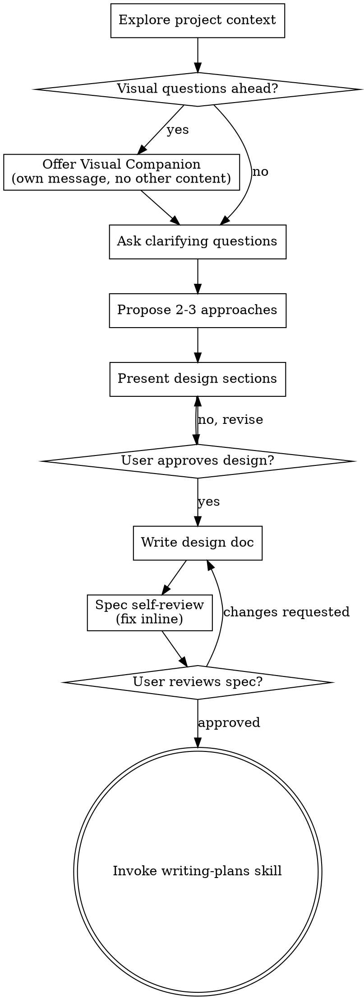

<!-- Generated by SpecStory, Markdown v2.1.0 -->

# 2026-04-23 22:29:29Z

<!-- Claude Code Session 10fbb58d-d853-4c00-ba4c-b562bcbac861 (2026-04-23 22:29:29Z) -->

_**User (2026-04-23 22:29:29Z)**_

<local-command-caveat>Caveat: The messages below were generated by the user while running local commands. DO NOT respond to these messages or otherwise consider them in your response unless the user explicitly asks you to.</local-command-caveat>

_**User (2026-04-23 22:29:29Z)**_

<command-name>/login</command-name>
            <command-message>login</command-message>
            <command-args></command-args>

_**User (2026-04-23 22:29:29Z)**_

<local-command-stdout>Login successful</local-command-stdout>

_**User (2026-04-23 22:30:28Z)**_

can you review the library of knnoledge plaease? I want to know if my documentation is well organized, like the Bibliotheque of klever or supervisor

---

_**Agent (claude-sonnet-4-6 2026-04-23 22:30:30Z)**_

_**Agent (claude-sonnet-4-6 2026-04-23 22:30:31Z)**_

<tool-use data-tool-type="read" data-tool-name="Read"><details>
<summary>Tool use: **Read**</summary>
 `/Users/gabrielamyot/.claude/library/INDEX.md`

```text
1	# Bibliothèque — User-Level Knowledge Library
2	
3	Cross-org operational knowledge: tools, workflows, standards, and patterns that apply regardless of which organization you're working in. This is the global layer. Org-specific domain knowledge lives in each org's own Bibliothèque (see pointers below).
4	
5	Start with this INDEX, then read selectively. Each section links to its files with one-line descriptions and load triggers.
6	
7	---
8	
9	## Org-Level Bibliothèques
10	
11	| Org | Entry Point | Scope |
12	|-----|-------------|-------|
13	| Klever | `~/Developer/grp-beklever-com/project-management/documentation/bibliotheque/INDEX.md` | Ad-tech, DSPs, vendors, Klever products, stack, BQ schemas, people, operations |
14	| Supervisr.AI | `~/Developer/supervisr-ai/project-management/documentation/bibliotheque/INDEX.md` | Lead lifecycle, EQS, compliance, dreampipe, Supervisr stack, operations |
15	
16	When a question is org-specific (Klever ad-tech, Supervisr lead pipeline), read the org bibliothèque. When it's about tooling, workflows, or cross-cutting standards, read here.
17	
18	---
19	
20	## context/ — On-Demand Context Files
21	
22	Loaded by trigger from `~/.claude/CLAUDE.md`. Never bulk-load; read only when the trigger matches.
23	
24	### Development Workflow
25	
26	| File | Trigger | Description |
27	|------|---------|-------------|
28	| [shipping-workflow.md](context/shipping-workflow.md) | Tagging, shipping, deploying, MRs, CI/CD | Tag, build, deploy, MR workflow across orgs |
29	| [java-standards.md](context/java-standards.md) | Writing/reviewing Java code | Mockito, testing, enforcement standards |
30	| [schema-validation-gate.md](context/schema-validation-gate.md) | Before wiring any BQ adapter | Verify actual BQ schema before coding |
31	| [documentation-standards-quick-ref.md](context/documentation-standards-quick-ref.md) | Writing/reviewing ADRs, placing docs | Three-layer doc model, ADR placement, migration checklist |
32	
33	### Agent Operations
34	
35	| File | Trigger | Description |
36	|------|---------|-------------|
37	| [context-engineering.md](context/context-engineering.md) | Long-running agents, compaction, context limits | Compaction strategies, note-taking, subagent architecture |
38	| [claude-md-authoring.md](context/claude-md-authoring.md) | Editing any CLAUDE.md file | DRY principle, satellite files, section ownership |
39	| [harness-self-management.md](context/harness-self-management.md) | Improving the harness, transcript mining, cost monitoring | Self-management ideas, batch API, cost optimization |
40	| [long-running-process-pattern.md](context/long-running-process-pattern.md) | Running multi-hour jobs from Claude Code | Nohup launcher scripts, tool timeout limits |
41	| [tools-catalog.md](context/tools-catalog.md) | Creating PRDs, tickets, contracts, changelogs, ADRs | Which tool produces which artifact |
42	| [swarm-diagnostics.md](context/swarm-diagnostics.md) | Complex multi-service debugging | Parallel investigation, blocker triage |
43	
44	### Jira & Ticketing
45	
46	| File | Trigger | Description |
47	|------|---------|-------------|
48	| [jira-skill-gotchas.md](context/jira-skill-gotchas.md) | Running `jira_skill.py` | Org slugs, subcommand names, ADF format, comment rules, deadline mode |
49	| [ticket-quality-standards.md](context/ticket-quality-standards.md) | Creating tickets, writing AC, reviewing quality | AC writing, closure protocols, bug fix standards |
50	| [stakeholder-response-pattern.md](context/stakeholder-response-pattern.md) | Stakeholder asks about feature business logic | Check Jira first, post via `/post-comment` |
51	
52	### Security & Access
53	
54	| File | Trigger | Description |
55	|------|---------|-------------|
56	| [security-audit-claude-code-config.md](context/security-audit-claude-code-config.md) | Security hardening, credential rotation | Priority fixes, permission audit findings |
57	| [klever-infra-access.md](context/klever-infra-access.md) | Granting GCP/GitLab access to Klever user | Cloud Identity group model, Marc-André gate |
58	| [klever-api-credentials.md](context/klever-api-credentials.md) | Using Placer API, adding new API integrations | Auth patterns, key storage. NO actual key values |
59	| [pr-panic-protocol.md](context/pr-panic-protocol.md) | User expresses alarm about a PR | 3-lookup rule, branch-names-lie, invariant flagging |
60	
61	### Service-Specific References
62	
63	| File | Trigger | Description |
64	|------|---------|-------------|
65	| [eqs-graphql-reference.md](context/eqs-graphql-reference.md) | Querying EQS GraphQL | Field names, filter syntax, comparators |
66	| [apollo-gateway-architecture.md](context/apollo-gateway-architecture.md) | Apollo Router managed federation | Subgraph URLs, DNS TXT env vars |
67	| [cloud-run-iam-diagnosis.md](context/cloud-run-iam-diagnosis.md) | Cloud Run 403/401 diagnosis | IAM vs app auth, audit logs, smoke tests |
68	| [retell-api-v2-reference.md](context/retell-api-v2-reference.md) | Calling Retell AI API | Pagination, broken filters, response format |
69	
70	---
71	
72	## inbox/ — Unindexed Nuggets Pending Promotion
73	
74	| File | Contents |
75	|------|----------|
76	| [2026-04-17-leo-ac-scaffolding-session.md](inbox/2026-04-17-leo-ac-scaffolding-session.md) | Jira mention format, scope-clarification template fix, Amal question scope, CONVERSION_NAME domain knowledge |
77	| [2026-04-21-debugging-persona-research-prompt.md](inbox/2026-04-21-debugging-persona-research-prompt.md) | Gemini Deep Research prompt for BMAD debugging persona + BMAD anatomy reference for build phase |
78	| [2026-04-21-dexter-persona-deep-research.md](inbox/2026-04-21-dexter-persona-deep-research.md) | Full Gemini research results: methodologies, cognitive biases, activation steps, voice design, anti-patterns |
79	
80	---
81	
82	## Quick Answers
83	
84	| Question | Where to look |
85	|----------|---------------|
86	| How do I ship a Supervisr service? | [shipping-workflow.md](context/shipping-workflow.md) |
87	| How do I post a Jira comment from a script? | [jira-skill-gotchas.md](context/jira-skill-gotchas.md) (ADF format, org slugs) |
88	| What Java testing standards apply? | [java-standards.md](context/java-standards.md) |
89	| How do I grant someone GCP access at Klever? | [klever-infra-access.md](context/klever-infra-access.md) |
90	| Where does domain knowledge for Klever live? | Klever Bibliothèque (see Org-Level pointer above) |
91	| Where does domain knowledge for Supervisr live? | Supervisr Bibliothèque (see Org-Level pointer above) |
92	
93	---
94	
95	## Meta
96	
97	| | |
98	|---|---|
99	| **Scope** | Cross-org tools, workflows, standards |
100	| **Philosophy** | Progressive disclosure: this INDEX → file read on trigger |
101	| **Update cadence** | Nuggets land in `inbox/`, promote on review |
102
```
</details></tool-use>

_**Agent (claude-sonnet-4-6 2026-04-23 22:30:36Z)**_

<tool-use data-tool-type="search" data-tool-name="Glob"><details>
<summary>Tool use: **Glob**</summary>
 path `/Users/gabrielamyot/.claude/library` pattern `**/*`

```text
/Users/gabrielamyot/.claude/library/context/security-audit-claude-code-config.md
/Users/gabrielamyot/.claude/library/context/stakeholder-response-pattern.md
/Users/gabrielamyot/.claude/library/context/schema-validation-gate.md
/Users/gabrielamyot/.claude/library/context/shipping-workflow.md
/Users/gabrielamyot/.claude/library/context/context-engineering.md
/Users/gabrielamyot/.claude/library/context/claude-md-authoring.md
/Users/gabrielamyot/.claude/library/context/tools-catalog.md
/Users/gabrielamyot/.claude/library/context/swarm-diagnostics.md
/Users/gabrielamyot/.claude/library/context/ticket-quality-standards.md
/Users/gabrielamyot/.claude/library/context/pr-panic-protocol.md
/Users/gabrielamyot/.claude/library/context/java-standards.md
/Users/gabrielamyot/.claude/library/context/retell-api-v2-reference.md
/Users/gabrielamyot/.claude/library/context/eqs-graphql-reference.md
/Users/gabrielamyot/.claude/library/context/cloud-run-iam-diagnosis.md
/Users/gabrielamyot/.claude/library/context/apollo-gateway-architecture.md
/Users/gabrielamyot/.claude/library/context/long-running-process-pattern.md
/Users/gabrielamyot/.claude/library/context/harness-self-management.md
/Users/gabrielamyot/.claude/library/context/klever-infra-access.md
/Users/gabrielamyot/.claude/library/inbox/2026-04-17-leo-ac-scaffolding-session.md
/Users/gabrielamyot/.claude/library/context/klever-api-credentials.md
/Users/gabrielamyot/.claude/library/context/documentation-standards-quick-ref.md
/Users/gabrielamyot/.claude/library/context/INDEX.md
/Users/gabrielamyot/.claude/library/context/workspace-map.yaml
/Users/gabrielamyot/.claude/library/context/jira-skill-gotchas.md
/Users/gabrielamyot/.claude/library/CATALOG.md
/Users/gabrielamyot/.claude/library/inbox/2026-04-21-dexter-persona-deep-research.md
/Users/gabrielamyot/.claude/library/INDEX.md
/Users/gabrielamyot/.claude/library/inbox/2026-04-21-kurt-persona-research-prompt.md
/Users/gabrielamyot/.claude/library/inbox/2026-04-21-debugging-persona-research-prompt.md
/Users/gabrielamyot/.claude/library/.DS_Store
```
</details></tool-use>

_**Agent (claude-sonnet-4-6 2026-04-23 22:30:36Z)**_

<tool-use data-tool-type="read" data-tool-name="Read"><details>
<summary>Tool use: **Read**</summary>
 `/Users/gabrielamyot/Developer/grp-beklever-com/project-management/documentation/bibliotheque/INDEX.md`

```text
1	# Bibliothèque — Klever Knowledge Library
2	
3	Klever is a Montreal-based programmatic advertising agency and technology company. It serves Canadian and North American advertisers across channels including CTV, DOOH, display, audio, and video, primarily through The Trade Desk (TTD) and Google DV360. Klever's proprietary products include the Klever Grid (ML bid optimization), the Proximity Portal (location-based audience insights and foot traffic measurement), the Klever Planner (proposal generation), and an emerging AI-powered Proximity Agent. The company operates a GCP-backed data platform (BigQuery, Cloud Functions, Dataform) that ingests daily data from DSPs, Salesforce, and location vendors.
4	
5	This library is a distilled, agent-ready knowledge base extracted from Klever's Notion wiki (1,551 pages across AdOps, Sales, Technology, and Strategy sections). Its purpose is to give any Claude session immediate, factual grounding on what Klever does, how it operates, what tools it uses, and who the key players are — without requiring a Notion login or bulk file loading. Start with this INDEX, then read selectively. Every section has its own INDEX.md with one-line descriptions and quick links.
6	
7	---
8	
9	## Start Here
10	
11	These three files orient any session fastest:
12	
13	| File | Why |
14	|---|---|
15	| [GLOSSARY.md](GLOSSARY.md) | 107 ad-tech and Klever-specific terms. Alphabetical. Every term has a definition and Klever context. Read before interpreting any ticket or report that uses programmatic jargon. |
16	| [product/capabilities-catalog.md](product/capabilities-catalog.md) | 46 capabilities across 12 categories with CPM ranges, formats, and use cases. The authoritative answer to "what does Klever sell?" |
17	| [stack/architecture-overview.md](stack/architecture-overview.md) | Backend services (Java microservices), database tier (MySQL + BigQuery), DSP integrations, GCP cost breakdown. Read before touching any backend ticket. |
18	
19	---
20	
21	## Section-by-Section Catalog
22	
23	### domain/ — Ad-Tech Industry Knowledge
24	
25	| File | Description |
26	|---|---|
27	| [domain/programmatic-advertising-3pcd.md](domain/programmatic-advertising-3pcd.md) | Third-party cookie deprecation: Klever's exposure, testing framework, mitigation strategy. Strategic context for any privacy-related work. |
28	| [domain/measurement/proximity-foot-traffic.md](domain/measurement/proximity-foot-traffic.md) | Geofencing and foot traffic measurement across Foursquare, Adsquare, In-Market, SEMCasting, Cuebiq. Device minimums, DSP setup steps, reporting delay timelines. |
29	| [domain/measurement/attribution-models.md](domain/measurement/attribution-models.md) | IBI (Inferred Brand Intent), Comscore, Lucid brand lift, pixel tracking, IP geolocation attribution. |
30	| [domain/targeting/political-advertising.md](domain/targeting/political-advertising.md) | Political campaign seasonality, Powers Interactive case study, DSP stack (TTD + StackAdapt), FEC compliance, voter file targeting procedures. |
31	| [domain/deals/pmps.md](domain/deals/pmps.md) | Private marketplace deals: Business Insider, Forbes, WSJ, Bloomberg, premium Canadian publishers. $20K–$100K+ deals with lead times, floor prices, non-cancelable policies. |
32	| [domain/deals/sensitive-categories.md](domain/deals/sensitive-categories.md) | Content restrictions for addiction services, political, adult, gambling, alcohol, pharma. Certification requirements, targeting limitations, compliance checklist. |
33	| [domain/channels/INDEX.md](domain/channels/INDEX.md) | Placeholder index for CTV, DOOH, Audio, Display, OLV, and Social channel pages. Individual files not yet distilled (see "What's not here"). |
34	
35	### vendors/ — Platforms and Data Providers
36	
37	| File | Description |
38	|---|---|
39	| [vendors/dsps-platforms.md](vendors/dsps-platforms.md) | TTD (Tier 1 primary), DV360 (Tier 1 co-primary), StackAdapt (secondary). Support SLAs, escalation contacts, multi-DSP budget allocation (TTD 60–70%, DV360 20–30%). |
40	| [vendors/location-data-providers.md](vendors/location-data-providers.md) | Foursquare (primary, 6-day delay), Adsquare (multi-DSP, 2–4 day delay), In-Market (reporting strength, 4-day delay), SEMCasting (400-day lookback), Cuebiq (Amazon DSP). Comparison matrix and activation timelines. |
41	| [vendors/placer/INDEX.md](vendors/placer/INDEX.md) | Placer.ai: full API docs (37 endpoints), usage guide (CLAUDE.md), vendor reference, API summary, glossary, FAQ. CBG-only granularity confirmed, no ZIP. |
42	| [vendors/goldfish/INDEX.md](vendors/goldfish/INDEX.md) | Goldfish Ads: DOOH billboard inventory API. Endpoint docs, data contract, integration pattern. Validated from KTP-522 spike. |
43	
44	### product/ — What Klever Builds and Sells
45	
46	| File | Description |
47	|---|---|
48	| [product/capabilities-catalog.md](product/capabilities-catalog.md) | Complete catalog: 46 capabilities across Video/CTV, Display, Audio, DOOH, Proximity, Data/Targeting, Measurement, and more. CPM ranges and creative requirements per capability. |
49	| [product/proximity-product-vision.md](product/proximity-product-vision.md) | Proximity platform: 4 pillars (Planning, Targeting, Insights, Measurement). Strategic framing for KTP-115 and related work. |
50	| [product/proximity-agent-vision.md](product/proximity-agent-vision.md) | Amal's 5-tool AI Proximity Agent vision: portal integration, chat interface, tool definitions. Input for KTP-115 planning. |
51	| [product/klever-grid.md](product/klever-grid.md) | Grid (Prometheus): ML bid optimization engine, KOA algorithm, A/B testing methodology, performance guarantees. |
52	| [product/klever-planner.md](product/klever-planner.md) | Klever Planner: intelligent proposal generation, campaign forecasting, media mix recommendations. |
53	| [product/proposal-builder.md](product/proposal-builder.md) | Proposal Builder product: Phase 1 objectives, acceptance criteria, user stories. Development context for sales tooling. |
54	| [product/netflix-platform.md](product/netflix-platform.md) | Netflix Ad-Supported Tier: premium CTV inventory, pricing structure, targeting controls. Klever's positioning. |
55	| [product/green-optimization.md](product/green-optimization.md) | Green Optimization Initiative: CO2-aware campaign optimization, showcase use case, strategic differentiation. |
56	
57	### stack/ — Technical Infrastructure
58	
59	| File | Description |
60	|---|---|
61	| [stack/architecture-overview.md](stack/architecture-overview.md) | All backend services (app-proximity-report, grp-drmpip, app-agent-hub, etc.), database tier, REST API patterns, GCP service inventory. |
62	| [stack/user-management.md](stack/user-management.md) | User Management service: permission component model (Dashboard, CMS, Proximity, Reporting, Explorer), Auth0 integration, entity hierarchy, API endpoints, known gaps, mock/demo bypass. |
63	| [stack/data-pipeline.md](stack/data-pipeline.md) | DDI microservice (legacy), Cloud Functions (event-driven replacement), Dataform transformations, Medallion architecture (Bronze/Silver/Gold). |
64	| [stack/bigquery/INDEX.md](stack/bigquery/INDEX.md) | BQ catalog entry point. Two ID systems (Klever INT64 vs DSP STRING), dataset map by purpose. GCP project: `prj-p-biz-report-fo53kywlio`. |
65	| [stack/gcp-infrastructure.md](stack/gcp-infrastructure.md) | GCP projects, billing breakdown (~$40K/year), cost optimization opportunities. |
66	| [stack/proximity-portal.md](stack/proximity-portal.md) | Proximity Portal technical docs: report features, data refresh schedule, known limitations. |
67	| [stack/deploy-reference.md](stack/deploy-reference.md) | SNAPSHOT deploy procedure for dev/pre/prod environments. |
68	| [stack/ai-tools.md](stack/ai-tools.md) | Approved AI tools at Klever, data privacy policies, usage guidance, security boundaries. |
69	| [stack/naming-conventions-campaigns.md](stack/naming-conventions-campaigns.md) | Campaign, ad group, and creative naming structure used for AI extraction and reporting accuracy. |
70	| [stack/adops-tech-support.md](stack/adops-tech-support.md) | Tech support procedures: HTML5 creative troubleshooting, domain safety validation, tag QA. |
71	| [stack/debugging-production-perf.md](stack/debugging-production-perf.md) | Production perf debugging: explain local≠prod gap first, framework telemetry culprits (OTEL/CrewAI), COS/konlet TTY gotcha, investigation protocol, KTP-445 case study. |
72	
73	### stack/bigquery/ — BigQuery Schema Catalog
74	
75	| File | Description |
76	|---|---|
77	| [stack/bigquery/portal-data-import.md](stack/bigquery/portal-data-import.md) | Cloud SQL mirror. Canonical advertiser/agency/user tables (447 advertisers, 119 agencies). Source of brand names. |
78	| [stack/bigquery/portal-dashboards-data.md](stack/bigquery/portal-dashboards-data.md) | Bridge layer: performance data with both Klever IDs and DSP IDs. The only populated table with both ID systems. |
79	| [stack/bigquery/klever-client-reporting.md](stack/bigquery/klever-client-reporting.md) | Normalized DSP performance + conversions. DSP IDs only. Includes ops sheet (Dashboard_processing). |
80	| [stack/bigquery/klever-data-aggregation.md](stack/bigquery/klever-data-aggregation.md) | Geo (653M rows), inventory (343M rows), creative (21M rows) aggregation tables. Fed by Dataform. |
81	| [stack/bigquery/klever-daily-data-import.md](stack/bigquery/klever-daily-data-import.md) | Raw TTD + DV360 daily imports. Largest tables: REDS feeds (2.4B impressions). |
82	| [stack/bigquery/klever-external-data.md](stack/bigquery/klever-external-data.md) | Master sheet, store mappings (Adsquare, Foursquare, InMarket, Drako), DMA locations, proximity settings. Key for proximity map configuration. |
83	| [stack/bigquery/third-party-data.md](stack/bigquery/third-party-data.md) | Foot traffic data: InMarket (373M historical rows), Drako (18M), Klever (880K). Store closures, acquisio mapping. |
84	| [stack/bigquery/klever-salesforce-data-import.md](stack/bigquery/klever-salesforce-data-import.md) | Salesforce CRM sync: accounts (5,435), opportunities (2,746), line items, DSP account mappings. |
85	| [stack/bigquery/klever-core-entities.md](stack/bigquery/klever-core-entities.md) | Intended entity store. All tables empty (0 rows). Schema exists but never populated — do not use as a data source. |
86	| [stack/bigquery/klever-dashboards.md](stack/bigquery/klever-dashboards.md) | TTD/DV360 conversion data at creative and daily grain. Powers interactive hourly reporting. |
87	| [stack/bigquery/dsp-resources-daily-import.md](stack/bigquery/dsp-resources-daily-import.md) | DSP resource snapshots: bidlists (1B rows), first-party data (55M), audiences (6M). Operational/targeting config, not performance data. |
88	| [stack/bigquery/client-external-data.md](stack/bigquery/client-external-data.md) | CM360 daily performance (3.9M rows), Scoota. Schema only — no client data. |
89	
90	### operations/ — Ad Ops Workflows and Processes
91	
92	| File | Description |
93	|---|---|
94	| [operations/adops-processes.md](operations/adops-processes.md) | Campaign QA checklist (PMP, new campaign, budget, pixel, targeting), reporting workflows (daily/weekly/monthly), vendor onboarding, blacklisting and brand safety procedures. |
95	| [operations/account-management.md](operations/account-management.md) | AM lifecycle: pre-proposal, onboarding, execution, renewal. Key roles, proposal workflow, IO templates. |
96	| [operations/finance-operations.md](operations/finance-operations.md) | Billing, invoicing, margin tracking, makegood requests, reconciliation procedures. |
97	| [operations/sales-process.md](operations/sales-process.md) | Sales workflow, RFP process, Grid Planner usage, proposal storytelling, client handoff to AM. |
98	| [operations/privacy-compliance.md](operations/privacy-compliance.md) | PIPEDA, Quebec Law 25, GDPR-adjacent requirements, consent management, sensitive data handling. |
99	| [operations/vendor-tools-inventory.md](operations/vendor-tools-inventory.md) | Full inventory of operational tools in use (DSPs, reporting, project management, analytics). |
100	| [operations/troubleshooting/INDEX.md](operations/troubleshooting/INDEX.md) | Troubleshooting index. Detailed playbook not yet distilled (see "What's not here"). |
101	
102	### people/ — Team and Organization
103	
104	| File | Description |
105	|---|---|
106	| [people/team-context.md](people/team-context.md) | Key people and ownership: Amal (PO Proximity), Mo (DBA/BQ views), Gabriel (lead dev Proximity MAP), Marc-Andre (tech lead), Kent (stakeholder). |
107	| [people/org-dynamics.md](people/org-dynamics.md) | Organizational structure, leadership, decision-making patterns, bus factors, technical ownership, contract/timing context. |
108	
109	### maps-proximity/ — Proximity Map Strategy
110	
111	| File | Description |
112	|---|---|
113	| [maps-proximity/workshop-ideas-inventory-2026-03-24.md](maps-proximity/workshop-ideas-inventory-2026-03-24.md) | AI Offsite Workshop (March 2026): 10 product candidates, team votes, build outcomes. Origin of Explorer, vertical skills, and map strategy. |
114	| [maps-proximity/vertical-skills-inventory.md](maps-proximity/vertical-skills-inventory.md) | Vertical-specific skills built at the workshop: Pharma, Legal/Crash, Sentiment, Census, Education. Data sources, outputs, maturity per vertical. |
115	| [maps-proximity/deployment-process.md](maps-proximity/deployment-process.md) | Proximity Map deployment process: environment checklist, feature flag wiring, rollout steps. |
116	| **Explorer** | Multi-city exploration tool. Route: `/explorer`. Uses city-config architecture (GeoJSON per city, on-demand loading). Permission component: "Explorer" in User Management. Renamed from "Proximity Explorer" (2026-04-09). Frontend spec lives in repo agent-os, not here. |
117	| **Demo Agency Pattern** | Klever agency 133 with Taco Chain (826) + FitConnect (827) in `klever_core_entities`. DSP="DEMO", salesforce_id=null. Replaces code-level mock mode. Used by demo.prod.beklever.com via Google SSO. |
118	| **Hardcoded Mock Dates** | `components/map/consts/mocks.tsx` exports `initialySelectedDay = "2025-06-01"` and `mockDataLatestDay = "2025-07-15"`. The map always loads this date window. NOT related to the data-source toggle (KTP-451). KTP-510 replaces these with a real date picker. Play/DistributionInTime animates within this window. |
119	| **North Star Mockups (KTP-466)** | Jira KTP-466 has 3 HTML attachment mockups: `northstar-all.html` (266KB combined), `proximity-flow-lines-mockup-v3.html` (45KB measurement), plus screenshot. These are THE design reference for the KTP-453 visual refresh epic (colors, fonts, nav, layout). Download before any UX implementation. |
120	
121	---
122	
123	## Quick Answers
124	
125	| Question | Where to look |
126	|---|---|
127	| What is TTD? | [GLOSSARY.md](GLOSSARY.md) under "The Trade Desk"; [vendors/dsps-platforms.md](vendors/dsps-platforms.md) |
128	| How do I call the Placer API? | [vendors/placer/CLAUDE.md](vendors/placer/CLAUDE.md) — usage guide; [vendors/placer/placer-ai.md](vendors/placer/placer-ai.md) — full reference |
129	| What are the Shrimp Basket / Artistry Brand store locations? | [vendors/placer/placer-ai.md](vendors/placer/placer-ai.md) — Current State table; BQ: `klever_external_data.normalized_klever_stores_mapping` WHERE ADVERTISER_ID='la8clii' |
130	| How do I call the Goldfish Ads API? | [vendors/goldfish/CLAUDE.md](vendors/goldfish/CLAUDE.md) — usage guide; [vendors/goldfish/goldfish-ads.md](vendors/goldfish/goldfish-ads.md) — full reference |
131	| What channels does Klever support? | [product/capabilities-catalog.md](product/capabilities-catalog.md) (full list with CPMs); domain/channels/ (individual files TODO) |
132	| What is CPIV? | [GLOSSARY.md](GLOSSARY.md) |
133	| What is IBI (Inferred Brand Intent)? | [GLOSSARY.md](GLOSSARY.md); [domain/measurement/attribution-models.md](domain/measurement/attribution-models.md) |
134	| How do I set up a proximity/foot traffic campaign? | [domain/measurement/proximity-foot-traffic.md](domain/measurement/proximity-foot-traffic.md); [vendors/location-data-providers.md](vendors/location-data-providers.md) |
135	| Which DSP should we use? | [vendors/dsps-platforms.md](vendors/dsps-platforms.md) → selection checklist and multi-DSP strategy |
136	| What BigQuery table has advertiser names? | [stack/bigquery/INDEX.md](stack/bigquery/INDEX.md) → `portal_data_import.user_management_advertiser` |
137	| How do I resolve a Klever advertiser ID to a DSP ID? | [stack/bigquery/INDEX.md](stack/bigquery/INDEX.md) → Two ID Systems section; bridge table: `portal_dashboards_data.advertisers_daily_performance` |
138	| What foot traffic vendors does Klever use? | [vendors/location-data-providers.md](vendors/location-data-providers.md); [domain/measurement/proximity-foot-traffic.md](domain/measurement/proximity-foot-traffic.md) |
139	| How does the data pipeline work? | [stack/data-pipeline.md](stack/data-pipeline.md); [stack/bigquery/INDEX.md](stack/bigquery/INDEX.md) |
140	| What backend services exist and what do they do? | [stack/architecture-overview.md](stack/architecture-overview.md) → Backend Services table |
141	| What is the Klever Grid (Prometheus)? | [product/klever-grid.md](product/klever-grid.md); [GLOSSARY.md](GLOSSARY.md) under "Grid" |
142	| How does political advertising work at Klever? | [domain/targeting/political-advertising.md](domain/targeting/political-advertising.md) |
143	| Who owns which product? | [people/team-context.md](people/team-context.md) |
144	| What PMPs are available? | [domain/deals/pmps.md](domain/deals/pmps.md) → publisher list with specs, floor prices, lead times |
145	| What are the campaign naming conventions? | [stack/naming-conventions-campaigns.md](stack/naming-conventions-campaigns.md) |
146	| What AI tools are approved at Klever? | [stack/ai-tools.md](stack/ai-tools.md) |
147	
148	---
149	
150	### sops/ — Agent Operating Procedures
151	
152	| File | Description |
153	|---|---|
154	| [sops/ticket-immutability.md](sops/ticket-immutability.md) | Jira is source of truth for AC. Agents may never modify ticket description or AC once in flight. Comments only. Investigation checklist for AC mismatch. |
155	| [sops/ticket-authoring.md](sops/ticket-authoring.md) | Jira description holds Why/What/Blockers/Figma only. Technical "How" stays local in `reports/architecture/implementation-plan.md`. Design mockups are inspiration, not spec — cut scope-creep elements by default. |
156	| [sops/autonomous-ticket-ship.md](sops/autonomous-ticket-ship.md) | Surprise-gift mode playbook: scaffold → clean repo gate → pre-AC dev check → commit per AC → handle local verify blockage → push + capture MR URL → morning handoff. Never create MRs, update Jira, or deploy autonomously. |
157	| [sops/frontend-worktree-pattern.md](sops/frontend-worktree-pattern.md) | When the main `app-front-portal` checkout is held by another worker, create a dedicated git worktree at `app-front-portal-ktpXXX` off `origin/dev`. Naming convention, REPO_MAPPING entry, cleanup procedure. |
158	| [sops/sprint-readiness-workflow.md](sops/sprint-readiness-workflow.md) | Per-ticket analysis pipeline (Jira fetch → Leo AC review → persona investigation → plan). Sprint-level outputs. Critical rules (check branches, verify hidden features, download attachments). |
159	| [sops/sprint-folder-structure.md](sops/sprint-folder-structure.md) | Sprint views use symlinks to raw ticket folders. Setup, rollover, required files per sprint. |
160	
161	---
162	
163	## What's Not Here
164	
165	**Channel pages are TODO.** The `domain/channels/` INDEX lists CTV, DOOH, Audio, Display, OLV, and Social pages but none have been distilled yet. For channel capability specs (formats, CPMs, use cases), use [product/capabilities-catalog.md](product/capabilities-catalog.md) as a substitute.
166	
167	**Client-specific content is excluded.** The original Notion export includes 116 client files. These are not distilled here to avoid PII and confidential data leaking into agent context. Exception: `stack/bigquery/client-external-data.md` documents schema only.
168	
169	**Troubleshooting playbooks are incomplete.** `operations/troubleshooting/` exists as a folder but the detailed adops-troubleshooting.md distillation has not been done.
170	
171	**Notion wiki raw export is still available.** For anything not covered here: `documentation/notion-wiki/export/`. Use `stack/bigquery/refresh-bq-catalog.sh` to regenerate BQ schema files from live metadata.
172	
173	**Re-export resilience.** If the Notion wiki is re-exported, `documentation/notion-wiki/MANIFEST.yaml` tracks what was distilled and the `bibliotheque-refresh` skill manages delta updates.
174	
175	---
176	
177	## Meta
178	
179	| | |
180	|---|---|
181	| **Source** | Notion wiki export (1,551 pages across AdOps, Sales, Technology, Strategy) |
182	| **Distilled** | March–April 2026 |
183	| **BQ catalog refreshed** | 2026-04-01 |
184	| **GCP project** | `prj-p-biz-report-fo53kywlio` |
185	| **Philosophy** | Progressive disclosure: this INDEX → section INDEX.md → selective file reads |
186	| **Update cadence** | Quarterly review; BQ catalog via `refresh-bq-catalog.sh` |
187
```
</details></tool-use>

_**Agent (claude-sonnet-4-6 2026-04-23 22:30:39Z)**_

_**Agent (claude-sonnet-4-6 2026-04-23 22:30:40Z)**_

<tool-use data-tool-type="read" data-tool-name="Read"><details>
<summary>Tool use: **Read**</summary>
 `/Users/gabrielamyot/Developer/supervisr-ai/project-management/documentation/bibliotheque/INDEX.md`

```text
1	# Supervisr Bibliothèque
2	
3	Cross-service knowledge library for the Supervisr AI platform. Distilled tribal knowledge, not raw docs.
4	
5	Last updated: 2026-04-21
6	
7	## How to Use This Library
8	
9	**Progressive disclosure:** Read this catalog first. Go to a section INDEX only when you need it. Read individual files only when the INDEX points you there. Never bulk-load.
10	
11	**Navigation pattern:** Symptom/question → this catalog → section INDEX → specific file.
12	
13	**Incident knowledge pattern:** Incidents produce three layers of knowledge. (1) Debugging nuggets extracted as reusable patterns, placed in the appropriate section (stack/, operations/). (2) Symptom pointers added to the "I Am Blocked by an Error" table above. (3) Full RCA with forensic detail, placed in `operations/rcas/`. Agents should resolve most questions from layers 1-2. Layer 3 is the drill-down for when the specific incident context matters.
14	
15	**What lives here vs. elsewhere:**
16	- **Here:** Cross-service knowledge, debugging patterns, operational gotchas, domain concepts. Things you learn the hard way.
17	- **Architecture docs (`documentation/architecture/`):** Formal system design, contracts, ADRs. Things you decide.
18	- **agent-os/ (per-repo):** Present-tense operational specs for that service. Things the service IS.
19	- **CLAUDE.md files:** Agent behavior rules. Things you must do (or not do).
20	
21	---
22	
23	## I Need to Understand Something
24	
25	| Question | Where to Look |
26	|----------|--------------|
27	| What does SBE/ERS/EQS/LLS/DAC/IAC mean? | [GLOSSARY.md](GLOSSARY.md) |
28	| What services exist and what do they do? | [stack/INDEX.md](stack/INDEX.md) or `documentation/architecture/INFRASTRUCTURE_OVERVIEW.md` |
29	| How does the lead pipeline flow? | [stack/interaction-disposition-flow.md](stack/interaction-disposition-flow.md) |
30	| What are the data models and contracts? | `documentation/architecture/contracts/DATA_MODEL_AND_MAPPING.md` |
31	| How does the compliance pipeline work? | `documentation/architecture/contracts/complianceEngine/` |
32	| What is the insurance lead domain? | [domain/INDEX.md](domain/INDEX.md) |
33	| How does the CoVisr AI chat work? | [stack/covisr-agentic-ai-stack.md](stack/covisr-agentic-ai-stack.md) |
34	| Who is on the team and what do they own? | [people/INDEX.md](people/INDEX.md) or `documentation/org-team.md` |
35	
36	## I Am Blocked by an Error
37	
38	| Symptom | Likely Cause | Go Here |
39	|---------|-------------|---------|
40	| Gateway → subgraph returns **401** | Dual-header conflict: `Authorization` + `userAuthorization` sent together | [stack/gateway-dual-header-401.md](stack/gateway-dual-header-401.md) |
41	| Service → gateway returns **400** | Missing `Content-Type: application/json` (CSRF) or using custom domain URL internally | [stack/service-to-service-400-content-type.md](stack/service-to-service-400-content-type.md) |
42	| Pipeline fails at `terraform init` | Terraform registry (`cicd.prod.datasophia.com`) maintenance window (~midnight-1AM EST) | [operations/cicd-registry-maintenance-window.md](operations/cicd-registry-maintenance-window.md) |
43	| Dashboard shows empty / no transcripts | Datastore key.name != interactionId | [stack/interactions-mv-schema-and-key.md](stack/interactions-mv-schema-and-key.md) |
44	| Dev Datastore MV wiped / empty | Rebuild from BigQuery sink | [operations/dev-datastore-recovery-from-bq.md](operations/dev-datastore-recovery-from-bq.md) |
45	| DAC pipeline ran on main/prod unexpectedly | Agent or script pushed to `main` instead of `dev` | [operations/rcas/2026-04-21-spv165-nightcrawl-prod-pipeline-incident.md](operations/rcas/2026-04-21-spv165-nightcrawl-prod-pipeline-incident.md) |
46	| Same pipeline failing 10+ times in a row | Infrastructure outage (registry, network) + no circuit breaker | [operations/rcas/2026-04-21-spv165-nightcrawl-prod-pipeline-incident.md](operations/rcas/2026-04-21-spv165-nightcrawl-prod-pipeline-incident.md) |
47	| Agent chasing wrong hypothesis, changing infra for app bug | LLM tunnel vision. Didn't ask "what changed?" | [stack/debugging-regression-first-question.md](stack/debugging-regression-first-question.md) |
48	
49	## I Need to Do Something
50	
51	| Task | Where to Look |
52	|------|--------------|
53	| Deploy a service | [operations/INDEX.md](operations/INDEX.md) or `~/.claude/library/context/shipping-workflow.md` |
54	| Take over a contractor's AI feature | [operations/ai-agent-feature-handoff-checklist.md](operations/ai-agent-feature-handoff-checklist.md) |
55	| Hand off an RCA to someone else | [operations/sops/rca-handoff.md](operations/sops/rca-handoff.md) |
56	
57	---
58	
59	## Sections
60	
61	Each section has its own INDEX.md with full contents. Read the section INDEX before diving into files.
62	
63	- **[domain/](domain/INDEX.md)** — Insurance lead lifecycle, compliance rules, warm transfers, partner onboarding. Go here when you need business context for why the system works the way it does.
64	- **[stack/](stack/INDEX.md)** — Service architecture, data flows, gateway behavior, Datastore schemas, BigQuery. Go here when debugging service interactions or understanding how data moves.
65	- **[operations/](operations/INDEX.md)** — Deployment, recovery procedures, CI/CD gotchas, SOPs, RCAs, incident patterns. Go here when something is broken or you need to ship/fix/recover.
66	- **[people/](people/INDEX.md)** — Team roster, partner contacts, org dynamics. Go here when you need to know who owns what or who to ask.
67	
68	## Inbox
69	
70	- **[inbox/](inbox/INDEX.md)** — Raw tribal knowledge captures awaiting curation. A librarian agent sifts and promotes entries to proper sections.
71	
72	## Meta
73	
74	- **[PROPOSALS.md](PROPOSALS.md)** — Future improvements to the Bibliothèque and context engineering (none executed yet)
75	- **[Documentation Standards](../process/documentation-standards.md)** — Three-layer model (Bibliothèque / docs/ / agent-os/), ADR format, cross-service linking, CLAUDE.md routing
76	
77	## Contributing
78	
79	After adding a file to any section:
80	1. Update that section's INDEX.md with a one-line description
81	2. If the entry answers a common question or symptom, add a row to the appropriate table above
82	3. Update "Last updated" date
83
```
</details></tool-use>

_**Agent (claude-sonnet-4-6 2026-04-23 22:30:40Z)**_

<tool-use data-tool-type="read" data-tool-name="Read"><details>
<summary>Tool use: **Read**</summary>
 `/Users/gabrielamyot/.claude/library/CATALOG.md`

```text
1	# Bibliothèque Catalog — User Level
2	
3	Last updated: 2026-04-18
4	
5	Entry point: [INDEX.md](INDEX.md)
6	
7	## Org-Level Bibliothèques
8	
9	| Org | Path | Glossary | Sections |
10	|-----|------|----------|----------|
11	| Klever | `~/Developer/grp-beklever-com/project-management/documentation/bibliotheque/` | 107 terms | domain, vendors, product, stack, operations, people, maps-proximity, sops |
12	| Supervisr.AI | `~/Developer/supervisr-ai/project-management/documentation/bibliotheque/` | Yes | domain, vendors, product, stack, operations, people |
13	
14	## context/ — On-demand context files for agent sessions
15	
16	| File | Purpose | Load Trigger |
17	|------|---------|-------------|
18	| shipping-workflow.md | Tag, build, deploy, MR workflow | Tagging, shipping, deploying, merge requests, CI/CD |
19	| java-standards.md | Mockito, testing, enforcement standards | Writing or reviewing Java code |
20	| context-engineering.md | Compaction, note-taking, subagent architecture | Long-running agents, compaction, context limits |
21	| claude-md-authoring.md | DRY principle, satellite files, section ownership | Editing any CLAUDE.md file |
22	| tools-catalog.md | Which tool produces which artifact | Creating PRDs, tickets, contracts, changelogs, ADRs |
23	| swarm-diagnostics.md | Multi-service debugging, parallel investigation | Complex multi-service debugging, blocker triage |
24	| stakeholder-response-pattern.md | Check Jira, post via `/post-comment` | Stakeholder asks about feature business logic |
25	| schema-validation-gate.md | Verify BQ schema before coding | Before wiring any BQ adapter |
26	| ticket-quality-standards.md | AC writing, closure protocols, bug fix standards | Creating tickets, writing AC, reviewing quality |
27	| security-audit-claude-code-config.md | Priority fixes, permission audit findings | Security hardening, credential rotation |
28	| pr-panic-protocol.md | 3-lookup rule, invariant flagging | User expresses alarm about PR contamination/security/data loss |
29	| jira-skill-gotchas.md | Org slugs, subcommands, ADF format, header rule | Running `jira_skill.py` |
30	| retell-api-v2-reference.md | Pagination, broken filters, response format | Calling Retell AI API |
31	| eqs-graphql-reference.md | Field names, filter syntax, comparators | Querying EQS GraphQL |
32	| cloud-run-iam-diagnosis.md | IAM vs app auth, audit logs, smoke tests | Cloud Run 403/401 diagnosis |
33	| apollo-gateway-architecture.md | Subgraph URLs, DNS TXT env vars | Apollo Router managed federation |
34	| long-running-process-pattern.md | Nohup launcher, tool timeout limits | Running multi-hour jobs |
35	| harness-self-management.md | Cost config, transcript mining, batch API | Improving the harness |
36	| klever-infra-access.md | Cloud Identity group model, Marc-André gate | Granting GCP/GitLab access at Klever |
37	| klever-api-credentials.md | Auth patterns, key storage (no values) | Using Placer API, adding API integrations |
38	| documentation-standards-quick-ref.md | Three-layer doc model, ADR placement, migration checklist | Writing/reviewing ADRs, placing docs |
39	| workspace-map.yaml | Org roots, repo paths, harness locations | Navigating orgs/projects, starting tickets |
40	
41	## inbox/ — Unindexed nuggets pending promotion
42	
43	| File | Contents | Promote to |
44	|------|----------|------------|
45	| 2026-04-17-leo-ac-scaffolding-session.md | Jira mention format, scope-clarification template fix, Amal question scope, CONVERSION_NAME domain knowledge | jira-skill-gotchas.md, project-management CLAUDE.md, Klever bibliothèque |
46	| 2026-04-21-debugging-persona-research-prompt.md | Gemini Deep Research prompt for BMAD debugging persona, BMAD persona anatomy analysis | New BMAD persona file + skill-proposals/2026-04-21-debugging-agent.md |
47	
48	---
49	
50	## Topic Cross-Reference
51	
52	- **PR review / adversarial review:** `pr-panic-protocol.md` (panic flow), `ticket-quality-standards.md` (closure protocols)
53	- **Jira workflows:** `jira-skill-gotchas.md` (skill usage), project-level memory entries (sprint moves, closing comments, transitions, deadline mode)
54	- **Harness cost + self-management:** `harness-self-management.md` (ideas A/B/C), skill proposals in `~/.claude/skill-proposals/`
55	- **Klever domain:** Klever Bibliothèque → ad-tech, DSPs, BQ schemas, products, people
56	- **Supervisr domain:** Supervisr Bibliothèque → lead lifecycle, EQS, compliance, dreampipe
57
```
</details></tool-use>

_**Agent (claude-sonnet-4-6 2026-04-23 22:31:00Z)**_

Good picture. Here's my assessment:

---

## Library Review

### Global Library (`~/.claude/library/`) — Good, one gap

**Strengths:**
- Clean three-layer separation (context/ on-demand, inbox/, CATALOG.md)
- Trigger-based loading in INDEX.md works well
- CATALOG.md cross-reference table is a nice navigational bonus
- Inbox with "Promote to" column is solid discipline

**Gap: `context/INDEX.md` is a ghost file.** It exists (`library/context/INDEX.md` in the glob output) but doesn't appear in the main INDEX.md or CATALOG.md. Either it's stale/empty or it should be linked. Worth checking.

**Gap: inbox has 3 files, CATALOG.md only lists 2.** `2026-04-21-kurt-persona-research-prompt.md` is in inbox/ but missing from the CATALOG.md and INDEX.md tables.

---

### Klever Bibliothèque — Excellent

Best of the three. Standouts:
- "Start Here" fast-orient block (GLOSSARY + capabilities + architecture)
- Inline quick-answer table with specific BQ table names
- `maps-proximity/` has inline inline facts embedded directly in the INDEX (Demo Agency Pattern, Hardcoded Mock Dates, North Star Mockups) — very practical
- `sops/` section is rare and valuable
- "What's Not Here" section prevents wasted lookups

One minor issue: the `maps-proximity/` section mixes file links and inline bullets inconsistently.

---

### Supervisr Bibliothèque — Good, slightly behind Klever

**Strengths:**
- "I Am Blocked by an Error" symptom table is the best pattern across all three. Dexter should read this before any debug session.
- "I Need to Do Something" task table is clean
- Clear meta section on contributing

**Gap vs Klever:** No "Start Here" fast-orient block. A new session has no equivalent of "read these 3 files first." Klever's GLOSSARY + capabilities + architecture trio saves a lot of groping.

**Gap:** `inbox/INDEX.md` exists but Supervisr's INDEX doesn't show its contents (unlike Klever which surfaced inbox in global CATALOG). Minor.

---

## Priority Fixes (ranked)

| # | Fix | Where | Cost |
|---|-----|--------|------|
| 1 | Add `kurt-persona-research-prompt.md` to CATALOG.md + INDEX.md inbox table | `~/.claude/library/` | 5 min |
| 2 | Check `context/INDEX.md` — delete or link it | `~/.claude/library/context/` | 2 min |
| 3 | Add "Start Here" block to Supervisr INDEX (3 key files to orient fast) | Supervisr bibliothèque | 15 min |
| 4 | Add inbox contents to Supervisr INDEX (like CATALOG.md does for global) | Supervisr bibliothèque | 10 min |

Overall: **Klever is the gold standard.** Global library is clean but has two indexing gaps. Supervisr is functional but missing the fast-orient pattern that makes Klever so easy to enter cold.

Want me to fix any of these?

---

_**User (2026-04-23 22:31:44Z)**_

lets plan a restructuring of the doc here at shared onfigs

---

_**Agent (claude-sonnet-4-6 2026-04-23 22:31:46Z)**_

_**Agent (claude-sonnet-4-6 2026-04-23 22:31:47Z)**_

<tool-use data-tool-type="generic" data-tool-name="Skill"><details>
<summary>Tool use: **Skill**</summary>

**Input:**

- skill: `superpowers:brainstorming`

</details></tool-use>

---

_**User (2026-04-23 22:31:47Z)**_

Base directory for this skill: /Users/gabrielamyot/.claude/plugins/cache/claude-plugins-official/superpowers/5.0.7/skills/brainstorming

# Brainstorming Ideas Into Designs

Help turn ideas into fully formed designs and specs through natural collaborative dialogue.

Start by understanding the current project context, then ask questions one at a time to refine the idea. Once you understand what you're building, present the design and get user approval.

<HARD-GATE>
Do NOT invoke any implementation skill, write any code, scaffold any project, or take any implementation action until you have presented a design and the user has approved it. This applies to EVERY project regardless of perceived simplicity.
</HARD-GATE>

## Anti-Pattern: "This Is Too Simple To Need A Design"

Every project goes through this process. A todo list, a single-function utility, a config change — all of them. "Simple" projects are where unexamined assumptions cause the most wasted work. The design can be short (a few sentences for truly simple projects), but you MUST present it and get approval.

## Checklist

You MUST create a task for each of these items and complete them in order:

1. **Explore project context** — check files, docs, recent commits
2. **Offer visual companion** (if topic will involve visual questions) — this is its own message, not combined with a clarifying question. See the Visual Companion section below.
3. **Ask clarifying questions** — one at a time, understand purpose/constraints/success criteria
4. **Propose 2-3 approaches** — with trade-offs and your recommendation
5. **Present design** — in sections scaled to their complexity, get user approval after each section
6. **Write design doc** — save to `docs/superpowers/specs/YYYY-MM-DD-<topic>-design.md` and commit
7. **Spec self-review** — quick inline check for placeholders, contradictions, ambiguity, scope (see below)
8. **User reviews written spec** — ask user to review the spec file before proceeding
9. **Transition to implementation** — invoke writing-plans skill to create implementation plan

## Process Flow



**The terminal state is invoking writing-plans.** Do NOT invoke frontend-design, mcp-builder, or any other implementation skill. The ONLY skill you invoke after brainstorming is writing-plans.

## The Process

**Understanding the idea:**

- Check out the current project state first (files, docs, recent commits)
- Before asking detailed questions, assess scope: if the request describes multiple independent subsystems (e.g., "build a platform with chat, file storage, billing, and analytics"), flag this immediately. Don't spend questions refining details of a project that needs to be decomposed first.
- If the project is too large for a single spec, help the user decompose into sub-projects: what are the independent pieces, how do they relate, what order should they be built? Then brainstorm the first sub-project through the normal design flow. Each sub-project gets its own spec → plan → implementation cycle.
- For appropriately-scoped projects, ask questions one at a time to refine the idea
- Prefer multiple choice questions when possible, but open-ended is fine too
- Only one question per message - if a topic needs more exploration, break it into multiple questions
- Focus on understanding: purpose, constraints, success criteria

**Exploring approaches:**

- Propose 2-3 different approaches with trade-offs
- Present options conversationally with your recommendation and reasoning
- Lead with your recommended option and explain why

**Presenting the design:**

- Once you believe you understand what you're building, present the design
- Scale each section to its complexity: a few sentences if straightforward, up to 200-300 words if nuanced
- Ask after each section whether it looks right so far
- Cover: architecture, components, data flow, error handling, testing
- Be ready to go back and clarify if something doesn't make sense

**Design for isolation and clarity:**

- Break the system into smaller units that each have one clear purpose, communicate through well-defined interfaces, and can be understood and tested independently
- For each unit, you should be able to answer: what does it do, how do you use it, and what does it depend on?
- Can someone understand what a unit does without reading its internals? Can you change the internals without breaking consumers? If not, the boundaries need work.
- Smaller, well-bounded units are also easier for you to work with - you reason better about code you can hold in context at once, and your edits are more reliable when files are focused. When a file grows large, that's often a signal that it's doing too much.

**Working in existing codebases:**

- Explore the current structure before proposing changes. Follow existing patterns.
- Where existing code has problems that affect the work (e.g., a file that's grown too large, unclear boundaries, tangled responsibilities), include targeted improvements as part of the design - the way a good developer improves code they're working in.
- Don't propose unrelated refactoring. Stay focused on what serves the current goal.

## After the Design

**Documentation:**

- Write the validated design (spec) to `docs/superpowers/specs/YYYY-MM-DD-<topic>-design.md`
  - (User preferences for spec location override this default)
- Use elements-of-style:writing-clearly-and-concisely skill if available
- Commit the design document to git

**Spec Self-Review:**
After writing the spec document, look at it with fresh eyes:

1. **Placeholder scan:** Any "TBD", "TODO", incomplete sections, or vague requirements? Fix them.
2. **Internal consistency:** Do any sections contradict each other? Does the architecture match the feature descriptions?
3. **Scope check:** Is this focused enough for a single implementation plan, or does it need decomposition?
4. **Ambiguity check:** Could any requirement be interpreted two different ways? If so, pick one and make it explicit.

Fix any issues inline. No need to re-review — just fix and move on.

**User Review Gate:**
After the spec review loop passes, ask the user to review the written spec before proceeding:

> "Spec written and committed to `<path>`. Please review it and let me know if you want to make any changes before we start writing out the implementation plan."

Wait for the user's response. If they request changes, make them and re-run the spec review loop. Only proceed once the user approves.

**Implementation:**

- Invoke the writing-plans skill to create a detailed implementation plan
- Do NOT invoke any other skill. writing-plans is the next step.

## Key Principles

- **One question at a time** - Don't overwhelm with multiple questions
- **Multiple choice preferred** - Easier to answer than open-ended when possible
- **YAGNI ruthlessly** - Remove unnecessary features from all designs
- **Explore alternatives** - Always propose 2-3 approaches before settling
- **Incremental validation** - Present design, get approval before moving on
- **Be flexible** - Go back and clarify when something doesn't make sense

## Visual Companion

A browser-based companion for showing mockups, diagrams, and visual options during brainstorming. Available as a tool — not a mode. Accepting the companion means it's available for questions that benefit from visual treatment; it does NOT mean every question goes through the browser.

**Offering the companion:** When you anticipate that upcoming questions will involve visual content (mockups, layouts, diagrams), offer it once for consent:
> "Some of what we're working on might be easier to explain if I can show it to you in a web browser. I can put together mockups, diagrams, comparisons, and other visuals as we go. This feature is still new and can be token-intensive. Want to try it? (Requires opening a local URL)"

**This offer MUST be its own message.** Do not combine it with clarifying questions, context summaries, or any other content. The message should contain ONLY the offer above and nothing else. Wait for the user's response before continuing. If they decline, proceed with text-only brainstorming.

**Per-question decision:** Even after the user accepts, decide FOR EACH QUESTION whether to use the browser or the terminal. The test: **would the user understand this better by seeing it than reading it?**

- **Use the browser** for content that IS visual — mockups, wireframes, layout comparisons, architecture diagrams, side-by-side visual designs
- **Use the terminal** for content that is text — requirements questions, conceptual choices, tradeoff lists, A/B/C/D text options, scope decisions

A question about a UI topic is not automatically a visual question. "What does personality mean in this context?" is a conceptual question — use the terminal. "Which wizard layout works better?" is a visual question — use the browser.

If they agree to the companion, read the detailed guide before proceeding:
`skills/brainstorming/visual-companion.md`


---

_**Agent (claude-sonnet-4-6 2026-04-23 22:31:49Z)**_

_**Agent (claude-sonnet-4-6 2026-04-23 22:31:49Z)**_

<tool-use data-tool-type="unknown" data-tool-name="ToolSearch"><details>
<summary>Tool use: **ToolSearch**</summary>

**Input:**

- max_results: `1`
- query: `select:TaskCreate`

**Result:**

```

```
</details></tool-use>

_**Agent (claude-sonnet-4-6 2026-04-23 22:31:51Z)**_

_**Agent (claude-sonnet-4-6 2026-04-23 22:31:52Z)**_

<tool-use data-tool-type="unknown" data-tool-name="TaskCreate"><details>
<summary>Tool use: **TaskCreate**</summary>
Understand current layout of ~/.claude-shared-config before proposing restructuring

```text
Task #1 created successfully: Explore shared-config structure
```
</details></tool-use>

_**Agent (claude-sonnet-4-6 2026-04-23 22:31:58Z)**_

<tool-use data-tool-type="shell" data-tool-name="Bash"><details>
<summary>Tool use: **Bash**</summary>
List all files in shared-config

`find /Users/gabrielamyot/.claude-shared-config -not -path '*/.git/*' -not -name '.DS_Store' | sort`

```text
<persisted-output>
Output too large (213.2KB). Full output saved to: /Users/gabrielamyot/.claude/projects/-Users-gabrielamyot--claude-shared-config/10fbb58d-d853-4c00-ba4c-b562bcbac861/tool-results/besi4k8ad.txt

Preview (first 2KB):
/Users/gabrielamyot/.claude-shared-config
/Users/gabrielamyot/.claude-shared-config/.claude
/Users/gabrielamyot/.claude-shared-config/.claude/CLAUDE.local.md
/Users/gabrielamyot/.claude-shared-config/.claude/skills
/Users/gabrielamyot/.claude-shared-config/.claude/skills/playwright-cli
/Users/gabrielamyot/.claude-shared-config/.claude/skills/playwright-cli/SKILL.md
/Users/gabrielamyot/.claude-shared-config/.claude/skills/playwright-cli/references
/Users/gabrielamyot/.claude-shared-config/.claude/skills/playwright-cli/references/element-attributes.md
/Users/gabrielamyot/.claude-shared-config/.claude/skills/playwright-cli/references/playwright-tests.md
/Users/gabrielamyot/.claude-shared-config/.claude/skills/playwright-cli/references/request-mocking.md
/Users/gabrielamyot/.claude-shared-config/.claude/skills/playwright-cli/references/running-code.md
/Users/gabrielamyot/.claude-shared-config/.claude/skills/playwright-cli/references/session-management.md
/Users/gabrielamyot/.claude-shared-config/.claude/skills/playwright-cli/references/storage-state.md
/Users/gabrielamyot/.claude-shared-config/.claude/skills/playwright-cli/references/test-generation.md
/Users/gabrielamyot/.claude-shared-config/.claude/skills/playwright-cli/references/tracing.md
/Users/gabrielamyot/.claude-shared-config/.claude/skills/playwright-cli/references/video-recording.md
/Users/gabrielamyot/.claude-shared-config/.git
/Users/gabrielamyot/.claude-shared-config/.gitignore
/Users/gabrielamyot/.claude-shared-config/.playwright
/Users/gabrielamyot/.claude-shared-config/.specstory
/Users/gabrielamyot/.claude-shared-config/.specstory/.project.json
/Users/gabrielamyot/.claude-shared-config/.specstory/cli
/Users/gabrielamyot/.claude-shared-config/.specstory/cli/config.toml
/Users/gabrielamyot/.claude-shared-config/.specstory/history
/Users/gabrielamyot/.claude-shared-config/.specstory/history/2026-02-21_15-39-09Z-i-would-like-you.md
...
</persisted-output>
```
</details></tool-use>

_**Agent (claude-sonnet-4-6 2026-04-23 22:32:02Z)**_

<tool-use data-tool-type="shell" data-tool-name="Bash"><details>
<summary>Tool use: **Bash**</summary>
List files excluding git/specstory/playwright noise

`find /Users/gabrielamyot/.claude-shared-config -not -path '*/.git/*' -not -name '.DS_Store' -not -path '*/.specstory/*' -not -path '*/.playwright/*' | sort`

```text
<persisted-output>
Output too large (210.1KB). Full output saved to: /Users/gabrielamyot/.claude/projects/-Users-gabrielamyot--claude-shared-config/10fbb58d-d853-4c00-ba4c-b562bcbac861/tool-results/b2t03tbbs.txt

Preview (first 2KB):
/Users/gabrielamyot/.claude-shared-config
/Users/gabrielamyot/.claude-shared-config/.claude
/Users/gabrielamyot/.claude-shared-config/.claude/CLAUDE.local.md
/Users/gabrielamyot/.claude-shared-config/.claude/skills
/Users/gabrielamyot/.claude-shared-config/.claude/skills/playwright-cli
/Users/gabrielamyot/.claude-shared-config/.claude/skills/playwright-cli/SKILL.md
/Users/gabrielamyot/.claude-shared-config/.claude/skills/playwright-cli/references
/Users/gabrielamyot/.claude-shared-config/.claude/skills/playwright-cli/references/element-attributes.md
/Users/gabrielamyot/.claude-shared-config/.claude/skills/playwright-cli/references/playwright-tests.md
/Users/gabrielamyot/.claude-shared-config/.claude/skills/playwright-cli/references/request-mocking.md
/Users/gabrielamyot/.claude-shared-config/.claude/skills/playwright-cli/references/running-code.md
/Users/gabrielamyot/.claude-shared-config/.claude/skills/playwright-cli/references/session-management.md
/Users/gabrielamyot/.claude-shared-config/.claude/skills/playwright-cli/references/storage-state.md
/Users/gabrielamyot/.claude-shared-config/.claude/skills/playwright-cli/references/test-generation.md
/Users/gabrielamyot/.claude-shared-config/.claude/skills/playwright-cli/references/tracing.md
/Users/gabrielamyot/.claude-shared-config/.claude/skills/playwright-cli/references/video-recording.md
/Users/gabrielamyot/.claude-shared-config/.git
/Users/gabrielamyot/.claude-shared-config/.gitignore
/Users/gabrielamyot/.claude-shared-config/.playwright
/Users/gabrielamyot/.claude-shared-config/.specstory
/Users/gabrielamyot/.claude-shared-config/CLAUDE.md
/Users/gabrielamyot/.claude-shared-config/KNOWLEDGE_BASE.md
/Users/gabrielamyot/.claude-shared-config/README.md
/Users/gabrielamyot/.claude-shared-config/SKILL_CATALOG.md
/Users/gabrielamyot/.claude-shared-config/TOOL_DESCRIPTION_AUDIT_2026-04-03.md
/Users/gabrielamyot/.claude-shared-config/TOOL_MISUSE_ANALYSIS_2026-04-03.md
/Users/gabrielamyot/.claude-shared-config/agents
...
</persisted-output>
```
</details></tool-use>

_**Agent (claude-sonnet-4-6 2026-04-23 22:32:05Z)**_

<tool-use data-tool-type="shell" data-tool-name="Bash"><details>
<summary>Tool use: **Bash**</summary>
List relevant files only

`find /Users/gabrielamyot/.claude-shared-config -not -path '*/.git/*' -not -name '.DS_Store' -not -path '*/.specstory/*' -not -path '*/.playwright/*' -not -path '*/plugins/*' -not -path '*/node_modules/*' | sort`

```text
<persisted-output>
Output too large (40.3KB). Full output saved to: /Users/gabrielamyot/.claude/projects/-Users-gabrielamyot--claude-shared-config/10fbb58d-d853-4c00-ba4c-b562bcbac861/tool-results/bgsvxnid2.txt

Preview (first 2KB):
/Users/gabrielamyot/.claude-shared-config
/Users/gabrielamyot/.claude-shared-config/.claude
/Users/gabrielamyot/.claude-shared-config/.claude/CLAUDE.local.md
/Users/gabrielamyot/.claude-shared-config/.claude/skills
/Users/gabrielamyot/.claude-shared-config/.claude/skills/playwright-cli
/Users/gabrielamyot/.claude-shared-config/.claude/skills/playwright-cli/SKILL.md
/Users/gabrielamyot/.claude-shared-config/.claude/skills/playwright-cli/references
/Users/gabrielamyot/.claude-shared-config/.claude/skills/playwright-cli/references/element-attributes.md
/Users/gabrielamyot/.claude-shared-config/.claude/skills/playwright-cli/references/playwright-tests.md
/Users/gabrielamyot/.claude-shared-config/.claude/skills/playwright-cli/references/request-mocking.md
/Users/gabrielamyot/.claude-shared-config/.claude/skills/playwright-cli/references/running-code.md
/Users/gabrielamyot/.claude-shared-config/.claude/skills/playwright-cli/references/session-management.md
/Users/gabrielamyot/.claude-shared-config/.claude/skills/playwright-cli/references/storage-state.md
/Users/gabrielamyot/.claude-shared-config/.claude/skills/playwright-cli/references/test-generation.md
/Users/gabrielamyot/.claude-shared-config/.claude/skills/playwright-cli/references/tracing.md
/Users/gabrielamyot/.claude-shared-config/.claude/skills/playwright-cli/references/video-recording.md
/Users/gabrielamyot/.claude-shared-config/.git
/Users/gabrielamyot/.claude-shared-config/.gitignore
/Users/gabrielamyot/.claude-shared-config/.playwright
/Users/gabrielamyot/.claude-shared-config/.specstory
/Users/gabrielamyot/.claude-shared-config/CLAUDE.md
/Users/gabrielamyot/.claude-shared-config/KNOWLEDGE_BASE.md
/Users/gabrielamyot/.claude-shared-config/README.md
/Users/gabrielamyot/.claude-shared-config/SKILL_CATALOG.md
/Users/gabrielamyot/.claude-shared-config/TOOL_DESCRIPTION_AUDIT_2026-04-03.md
/Users/gabrielamyot/.claude-shared-config/TOOL_MISUSE_ANALYSIS_2026-04-03.md
/Users/gabrielamyot/.claude-shared-config/agents
...
</persisted-output>
```
</details></tool-use>

_**Agent (claude-sonnet-4-6 2026-04-23 22:32:09Z)**_

<tool-use data-tool-type="shell" data-tool-name="Bash"><details>
<summary>Tool use: **Bash**</summary>
Read filtered file list

`cat /Users/gabrielamyot/.claude/projects/-Users-gabrielamyot--claude-shared-config/10fbb58d-d853-4c00-ba4c-b562bcbac861/tool-results/bgsvxnid2.txt | grep -v 'plugins\|node_modules\|\.git\|\.specstory\|\.playwright' | head -200`

```text
/Users/gabrielamyot/.claude-shared-config
/Users/gabrielamyot/.claude-shared-config/.claude
/Users/gabrielamyot/.claude-shared-config/.claude/CLAUDE.local.md
/Users/gabrielamyot/.claude-shared-config/.claude/skills
/Users/gabrielamyot/.claude-shared-config/.claude/skills/playwright-cli
/Users/gabrielamyot/.claude-shared-config/.claude/skills/playwright-cli/SKILL.md
/Users/gabrielamyot/.claude-shared-config/.claude/skills/playwright-cli/references
/Users/gabrielamyot/.claude-shared-config/.claude/skills/playwright-cli/references/element-attributes.md
/Users/gabrielamyot/.claude-shared-config/.claude/skills/playwright-cli/references/playwright-tests.md
/Users/gabrielamyot/.claude-shared-config/.claude/skills/playwright-cli/references/request-mocking.md
/Users/gabrielamyot/.claude-shared-config/.claude/skills/playwright-cli/references/running-code.md
/Users/gabrielamyot/.claude-shared-config/.claude/skills/playwright-cli/references/session-management.md
/Users/gabrielamyot/.claude-shared-config/.claude/skills/playwright-cli/references/storage-state.md
/Users/gabrielamyot/.claude-shared-config/.claude/skills/playwright-cli/references/test-generation.md
/Users/gabrielamyot/.claude-shared-config/.claude/skills/playwright-cli/references/tracing.md
/Users/gabrielamyot/.claude-shared-config/.claude/skills/playwright-cli/references/video-recording.md
/Users/gabrielamyot/.claude-shared-config/CLAUDE.md
/Users/gabrielamyot/.claude-shared-config/KNOWLEDGE_BASE.md
/Users/gabrielamyot/.claude-shared-config/README.md
/Users/gabrielamyot/.claude-shared-config/SKILL_CATALOG.md
/Users/gabrielamyot/.claude-shared-config/TOOL_DESCRIPTION_AUDIT_2026-04-03.md
/Users/gabrielamyot/.claude-shared-config/TOOL_MISUSE_ANALYSIS_2026-04-03.md
/Users/gabrielamyot/.claude-shared-config/agents
/Users/gabrielamyot/.claude-shared-config/agents/autopilot-config.yaml
/Users/gabrielamyot/.claude-shared-config/agents/bmad-party-autopilot.md
/Users/gabrielamyot/.claude-shared-config/agents/bmad-party.md
/Users/gabrielamyot/.claude-shared-config/agents/colleague-review.md
/Users/gabrielamyot/.claude-shared-config/agents/dev-crawl.md
/Users/gabrielamyot/.claude-shared-config/agents/dexter.md
/Users/gabrielamyot/.claude-shared-config/agents/mother-base-housekeeper.md
/Users/gabrielamyot/.claude-shared-config/agents/night-crawl.md
/Users/gabrielamyot/.claude-shared-config/agents/pickup-ticket.md
/Users/gabrielamyot/.claude-shared-config/agents/post-comment.md
/Users/gabrielamyot/.claude-shared-config/agents/pr-response-sweep.md
/Users/gabrielamyot/.claude-shared-config/agents/push-adr.md
/Users/gabrielamyot/.claude-shared-config/agents/review-responder.md
/Users/gabrielamyot/.claude-shared-config/agents/sprint-crawl.md
/Users/gabrielamyot/.claude-shared-config/agents/story-quality-gate.md
/Users/gabrielamyot/.claude-shared-config/agents/supervisr-autopilot.md
/Users/gabrielamyot/.claude-shared-config/agents/supervisr-ship.md
/Users/gabrielamyot/.claude-shared-config/agents/ticket-scan.md
/Users/gabrielamyot/.claude-shared-config/commands
/Users/gabrielamyot/.claude-shared-config/commands/create-prd.md
/Users/gabrielamyot/.claude-shared-config/commands/estimate.md
/Users/gabrielamyot/.claude-shared-config/commands/generate-tasks.md
/Users/gabrielamyot/.claude-shared-config/commands/lean.md
/Users/gabrielamyot/.claude-shared-config/commands/process-task-list.md
/Users/gabrielamyot/.claude-shared-config/commands/tdd.md
/Users/gabrielamyot/.claude-shared-config/commands/update-ai-dev-tasks.md
/Users/gabrielamyot/.claude-shared-config/custom-tools
/Users/gabrielamyot/.claude-shared-config/custom-tools/pupeteers
/Users/gabrielamyot/.claude-shared-config/custom-tools/pupeteers/README.md
/Users/gabrielamyot/.claude-shared-config/custom-tools/pupeteers/resume_claude.sh
/Users/gabrielamyot/.claude-shared-config/hooks
/Users/gabrielamyot/.claude-shared-config/hooks/auto-index.sh
/Users/gabrielamyot/.claude-shared-config/hooks/auto-operationalize-cmd.sh
/Users/gabrielamyot/.claude-shared-config/hooks/auto-operationalize-prompt.md
/Users/gabrielamyot/.claude-shared-config/hooks/auto-operationalize.sh
/Users/gabrielamyot/.claude-shared-config/hooks/claude-md-guard.sh
/Users/gabrielamyot/.claude-shared-config/hooks/config-protect.sh
/Users/gabrielamyot/.claude-shared-config/hooks/context-monitor-config.json
/Users/gabrielamyot/.claude-shared-config/hooks/context-monitor.sh
/Users/gabrielamyot/.claude-shared-config/hooks/file-guard.sh
/Users/gabrielamyot/.claude-shared-config/hooks/library-shelving-guard.sh
/Users/gabrielamyot/.claude-shared-config/hooks/on-exit.sh
/Users/gabrielamyot/.claude-shared-config/hooks/peon-ping
/Users/gabrielamyot/.claude-shared-config/hooks/peon-ping/.last_update_check
/Users/gabrielamyot/.claude-shared-config/hooks/peon-ping/.state.json
/Users/gabrielamyot/.claude-shared-config/hooks/peon-ping/.update_available
/Users/gabrielamyot/.claude-shared-config/hooks/peon-ping/VERSION
/Users/gabrielamyot/.claude-shared-config/hooks/peon-ping/adapters
/Users/gabrielamyot/.claude-shared-config/hooks/peon-ping/adapters/antigravity.sh
/Users/gabrielamyot/.claude-shared-config/hooks/peon-ping/adapters/codex.sh
/Users/gabrielamyot/.claude-shared-config/hooks/peon-ping/adapters/copilot.sh
/Users/gabrielamyot/.claude-shared-config/hooks/peon-ping/adapters/cursor.sh
/Users/gabrielamyot/.claude-shared-config/hooks/peon-ping/adapters/gemini.sh
/Users/gabrielamyot/.claude-shared-config/hooks/peon-ping/adapters/kilo.sh
/Users/gabrielamyot/.claude-shared-config/hooks/peon-ping/adapters/kiro.sh
/Users/gabrielamyot/.claude-shared-config/hooks/peon-ping/adapters/openclaw.sh
/Users/gabrielamyot/.claude-shared-config/hooks/peon-ping/adapters/opencode
/Users/gabrielamyot/.claude-shared-config/hooks/peon-ping/adapters/opencode.sh
/Users/gabrielamyot/.claude-shared-config/hooks/peon-ping/adapters/opencode/package-lock.json
/Users/gabrielamyot/.claude-shared-config/hooks/peon-ping/adapters/opencode/package.json
/Users/gabrielamyot/.claude-shared-config/hooks/peon-ping/adapters/opencode/peon-ping-internals.ts
/Users/gabrielamyot/.claude-shared-config/hooks/peon-ping/adapters/opencode/peon-ping.ts
/Users/gabrielamyot/.claude-shared-config/hooks/peon-ping/adapters/opencode/setup-icon.sh
/Users/gabrielamyot/.claude-shared-config/hooks/peon-ping/adapters/opencode/tsconfig.json
/Users/gabrielamyot/.claude-shared-config/hooks/peon-ping/adapters/opencode/vitest.config.ts
/Users/gabrielamyot/.claude-shared-config/hooks/peon-ping/adapters/windsurf.sh
/Users/gabrielamyot/.claude-shared-config/hooks/peon-ping/completions.bash
/Users/gabrielamyot/.claude-shared-config/hooks/peon-ping/completions.fish
/Users/gabrielamyot/.claude-shared-config/hooks/peon-ping/config.json
/Users/gabrielamyot/.claude-shared-config/hooks/peon-ping/docs
/Users/gabrielamyot/.claude-shared-config/hooks/peon-ping/docs/peon-icon.png
/Users/gabrielamyot/.claude-shared-config/hooks/peon-ping/mcp
/Users/gabrielamyot/.claude-shared-config/hooks/peon-ping/mcp/README.md
/Users/gabrielamyot/.claude-shared-config/hooks/peon-ping/mcp/package-lock.json
/Users/gabrielamyot/.claude-shared-config/hooks/peon-ping/mcp/package.json
/Users/gabrielamyot/.claude-shared-config/hooks/peon-ping/mcp/peon-mcp.js
/Users/gabrielamyot/.claude-shared-config/hooks/peon-ping/packs
/Users/gabrielamyot/.claude-shared-config/hooks/peon-ping/peon.sh
/Users/gabrielamyot/.claude-shared-config/hooks/peon-ping/relay.sh
/Users/gabrielamyot/.claude-shared-config/hooks/peon-ping/scripts
/Users/gabrielamyot/.claude-shared-config/hooks/peon-ping/scripts/hook-handle-use.ps1
/Users/gabrielamyot/.claude-shared-config/hooks/peon-ping/scripts/hook-handle-use.sh
/Users/gabrielamyot/.claude-shared-config/hooks/peon-ping/scripts/mac-overlay.js
/Users/gabrielamyot/.claude-shared-config/hooks/peon-ping/scripts/notify.sh
/Users/gabrielamyot/.claude-shared-config/hooks/peon-ping/scripts/pack-download.sh
/Users/gabrielamyot/.claude-shared-config/hooks/peon-ping/scripts/peon-play
/Users/gabrielamyot/.claude-shared-config/hooks/peon-ping/scripts/peon-play.swift
/Users/gabrielamyot/.claude-shared-config/hooks/peon-ping/scripts/remote-hook.sh
/Users/gabrielamyot/.claude-shared-config/hooks/peon-ping/scripts/win-play.ps1
/Users/gabrielamyot/.claude-shared-config/hooks/peon-ping/trainer
/Users/gabrielamyot/.claude-shared-config/hooks/peon-ping/trainer/manifest.json
/Users/gabrielamyot/.claude-shared-config/hooks/peon-ping/trainer/sounds
/Users/gabrielamyot/.claude-shared-config/hooks/peon-ping/trainer/sounds/complete
/Users/gabrielamyot/.claude-shared-config/hooks/peon-ping/trainer/sounds/complete/goal_complete.mp3
/Users/gabrielamyot/.claude-shared-config/hooks/peon-ping/trainer/sounds/complete/impressed.mp3
/Users/gabrielamyot/.claude-shared-config/hooks/peon-ping/trainer/sounds/complete/three_hundred.mp3
/Users/gabrielamyot/.claude-shared-config/hooks/peon-ping/trainer/sounds/complete/zug_zug.mp3
/Users/gabrielamyot/.claude-shared-config/hooks/peon-ping/trainer/sounds/log
/Users/gabrielamyot/.claude-shared-config/hooks/peon-ping/trainer/sounds/log/approve.mp3
/Users/gabrielamyot/.claude-shared-config/hooks/peon-ping/trainer/sounds/log/not_bad.mp3
/Users/gabrielamyot/.claude-shared-config/hooks/peon-ping/trainer/sounds/log/okie_dokie.mp3
/Users/gabrielamyot/.claude-shared-config/hooks/peon-ping/trainer/sounds/log/proud.mp3
/Users/gabrielamyot/.claude-shared-config/hooks/peon-ping/trainer/sounds/log/work_work.mp3
/Users/gabrielamyot/.claude-shared-config/hooks/peon-ping/trainer/sounds/remind
/Users/gabrielamyot/.claude-shared-config/hooks/peon-ping/trainer/sounds/remind/code_review_hard.mp3
/Users/gabrielamyot/.claude-shared-config/hooks/peon-ping/trainer/sounds/remind/human_weak.mp3
/Users/gabrielamyot/.claude-shared-config/hooks/peon-ping/trainer/sounds/remind/just_sitting.mp3
/Users/gabrielamyot/.claude-shared-config/hooks/peon-ping/trainer/sounds/remind/no_let_lazy.mp3
/Users/gabrielamyot/.claude-shared-config/hooks/peon-ping/trainer/sounds/remind/sit_too_long.mp3
/Users/gabrielamyot/.claude-shared-config/hooks/peon-ping/trainer/sounds/remind/something_need_doing.mp3
/Users/gabrielamyot/.claude-shared-config/hooks/peon-ping/trainer/sounds/remind/type_type_type.mp3
/Users/gabrielamyot/.claude-shared-config/hooks/peon-ping/trainer/sounds/remind/work_on_muscles.mp3
/Users/gabrielamyot/.claude-shared-config/hooks/peon-ping/trainer/sounds/session_start
/Users/gabrielamyot/.claude-shared-config/hooks/peon-ping/trainer/sounds/session_start/human_back.mp3
/Users/gabrielamyot/.claude-shared-config/hooks/peon-ping/trainer/sounds/session_start/know_the_rules.mp3
/Users/gabrielamyot/.claude-shared-config/hooks/peon-ping/trainer/sounds/session_start/new_day.mp3
/Users/gabrielamyot/.claude-shared-config/hooks/peon-ping/trainer/sounds/slacking
/Users/gabrielamyot/.claude-shared-config/hooks/peon-ping/trainer/sounds/slacking/disappointed.mp3
/Users/gabrielamyot/.claude-shared-config/hooks/peon-ping/trainer/sounds/slacking/falling_behind.mp3
/Users/gabrielamyot/.claude-shared-config/hooks/peon-ping/trainer/sounds/slacking/half_day.mp3
/Users/gabrielamyot/.claude-shared-config/hooks/peon-ping/trainer/sounds/slacking/not_that_kind.mp3
/Users/gabrielamyot/.claude-shared-config/hooks/peon-ping/uninstall.sh
/Users/gabrielamyot/.claude-shared-config/hooks/pre-compact-guard.sh
/Users/gabrielamyot/.claude-shared-config/hooks/session-init.sh
/Users/gabrielamyot/.claude-shared-config/hooks/spec-guard.sh
/Users/gabrielamyot/.claude-shared-config/hooks/toggle-protection.sh
/Users/gabrielamyot/.claude-shared-config/hooks/usage-cache
/Users/gabrielamyot/.claude-shared-config/hooks/usage-cache/update-usage.sh
/Users/gabrielamyot/.claude-shared-config/library
/Users/gabrielamyot/.claude-shared-config/library/CATALOG.md
/Users/gabrielamyot/.claude-shared-config/library/architecture
/Users/gabrielamyot/.claude-shared-config/library/architecture/INDEX.md
/Users/gabrielamyot/.claude-shared-config/library/architecture/decisions
/Users/gabrielamyot/.claude-shared-config/library/architecture/decisions/memory-management-disable-auto-consolidate-context.md
/Users/gabrielamyot/.claude-shared-config/library/architecture/decisions/persona-context-dynamic-loading-from-agent-os.md
/Users/gabrielamyot/.claude-shared-config/library/architecture/patterns
/Users/gabrielamyot/.claude-shared-config/library/architecture/patterns/gemini-cache-stability-working-memory-externalization.md
/Users/gabrielamyot/.claude-shared-config/library/architecture/patterns/minions-isolated-environments-blueprint-interleaving.md
/Users/gabrielamyot/.claude-shared-config/library/architecture/patterns/persona-context-repo-discovery-graceful-degradation.md
/Users/gabrielamyot/.claude-shared-config/library/architecture/patterns/pre-flight-heuristics-hierarchical-coordination.md
/Users/gabrielamyot/.claude-shared-config/library/architecture/vision
/Users/gabrielamyot/.claude-shared-config/library/architecture/vision/agent-harness-known-failure-catalog.yaml
/Users/gabrielamyot/.claude-shared-config/library/architecture/vision/agent-harness-north-star-industry-patterns-gap-analysis.md
/Users/gabrielamyot/.claude-shared-config/library/architecture/vision/agent-harness-phased-roadmap-ralph-loop-to-cloud.md
/Users/gabrielamyot/.claude-shared-config/library/archive
/Users/gabrielamyot/.claude-shared-config/library/archive/INDEX.md
/Users/gabrielamyot/.claude-shared-config/library/archive/retired-agents
/Users/gabrielamyot/.claude-shared-config/library/archive/retired-agents/code-reviewer-architect-scalability.md
/Users/gabrielamyot/.claude-shared-config/library/archive/retired-agents/code-reviewer-devops-infrastructure.md
/Users/gabrielamyot/.claude-shared-config/library/archive/retired-agents/code-reviewer-frontend-react-typescript.md
/Users/gabrielamyot/.claude-shared-config/library/archive/retired-agents/code-reviewer-general-expert.md
/Users/gabrielamyot/.claude-shared-config/library/archive/retired-agents/code-reviewer-security-vulnerabilities.md
/Users/gabrielamyot/.claude-shared-config/library/archive/retired-agents/code-reviewer-team-lead-mentorship.md
/Users/gabrielamyot/.claude-shared-config/library/archive/retired-agents/code-reviewer-team-orchestrator.md
/Users/gabrielamyot/.claude-shared-config/library/archive/retired-agents/typescript-error-fixer-systematic.md
/Users/gabrielamyot/.claude-shared-config/library/archive/superpowers-plugin
/Users/gabrielamyot/.claude-shared-config/library/archive/superpowers-plugin/INSTALL.md
/Users/gabrielamyot/.claude-shared-config/library/archive/superpowers-plugin/README.md
/Users/gabrielamyot/.claude-shared-config/library/archive/superpowers-plugin/RELEASE-NOTES.md
/Users/gabrielamyot/.claude-shared-config/library/archive/superpowers-plugin/code-reviewer-agent.md
/Users/gabrielamyot/.claude-shared-config/library/archive/superpowers-plugin/commands
/Users/gabrielamyot/.claude-shared-config/library/archive/superpowers-plugin/commands/brainstorm.md
/Users/gabrielamyot/.claude-shared-config/library/archive/superpowers-plugin/commands/execute-plan.md
/Users/gabrielamyot/.claude-shared-config/library/archive/superpowers-plugin/commands/write-plan.md
/Users/gabrielamyot/.claude-shared-config/library/archive/superpowers-plugin/examples
/Users/gabrielamyot/.claude-shared-config/library/archive/superpowers-plugin/examples/claude-md-testing-validation.md
/Users/gabrielamyot/.claude-shared-config/library/archive/superpowers-plugin/hooks.json
/Users/gabrielamyot/.claude-shared-config/library/archive/superpowers-plugin/initialize-skills.sh
/Users/gabrielamyot/.claude-shared-config/library/archive/superpowers-plugin/marketplace.json
/Users/gabrielamyot/.claude-shared-config/library/archive/superpowers-plugin/plugin.json
/Users/gabrielamyot/.claude-shared-config/library/archive/superpowers-plugin/session-start.sh
/Users/gabrielamyot/.claude-shared-config/library/archive/superpowers-plugin/superpowers-bootstrap.md
/Users/gabrielamyot/.claude-shared-config/library/archive/superpowers-plugin/supervisr-autopilot-guide.md
/Users/gabrielamyot/.claude-shared-config/library/archive/superpowers-plugin/systematic-debugging-creation-log.md
/Users/gabrielamyot/.claude-shared-config/library/archive/superpowers-plugin/test-cases
/Users/gabrielamyot/.claude-shared-config/library/archive/superpowers-plugin/test-cases/systematic-debugging-academic.md
/Users/gabrielamyot/.claude-shared-config/library/archive/superpowers-plugin/test-cases/systematic-debugging-pressure-1.md
```
</details></tool-use>

_**Agent (claude-sonnet-4-6 2026-04-23 22:32:14Z)**_

<tool-use data-tool-type="shell" data-tool-name="Bash"><details>
<summary>Tool use: **Bash**</summary>
List library structure without archive noise

`find /Users/gabrielamyot/.claude-shared-config/library -not -path '*/.git/*' -not -name '.DS_Store' | sort | grep -v 'archive\|superpowers-plugin'`

```text
error: could not lock config file /Users/gabrielamyot/.gitconfig: File exists
/Users/gabrielamyot/.claude-shared-config/library
/Users/gabrielamyot/.claude-shared-config/library/CATALOG.md
/Users/gabrielamyot/.claude-shared-config/library/architecture
/Users/gabrielamyot/.claude-shared-config/library/architecture/INDEX.md
/Users/gabrielamyot/.claude-shared-config/library/architecture/decisions
/Users/gabrielamyot/.claude-shared-config/library/architecture/decisions/memory-management-disable-auto-consolidate-context.md
/Users/gabrielamyot/.claude-shared-config/library/architecture/decisions/persona-context-dynamic-loading-from-agent-os.md
/Users/gabrielamyot/.claude-shared-config/library/architecture/patterns
/Users/gabrielamyot/.claude-shared-config/library/architecture/patterns/gemini-cache-stability-working-memory-externalization.md
/Users/gabrielamyot/.claude-shared-config/library/architecture/patterns/minions-isolated-environments-blueprint-interleaving.md
/Users/gabrielamyot/.claude-shared-config/library/architecture/patterns/persona-context-repo-discovery-graceful-degradation.md
/Users/gabrielamyot/.claude-shared-config/library/architecture/patterns/pre-flight-heuristics-hierarchical-coordination.md
/Users/gabrielamyot/.claude-shared-config/library/architecture/vision
/Users/gabrielamyot/.claude-shared-config/library/architecture/vision/agent-harness-known-failure-catalog.yaml
/Users/gabrielamyot/.claude-shared-config/library/architecture/vision/agent-harness-north-star-industry-patterns-gap-analysis.md
/Users/gabrielamyot/.claude-shared-config/library/architecture/vision/agent-harness-phased-roadmap-ralph-loop-to-cloud.md
/Users/gabrielamyot/.claude-shared-config/library/context
/Users/gabrielamyot/.claude-shared-config/library/context/INDEX.md
/Users/gabrielamyot/.claude-shared-config/library/context/autopilot-session-state.md
/Users/gabrielamyot/.claude-shared-config/library/context/claude-md-authoring.md
/Users/gabrielamyot/.claude-shared-config/library/context/context-engineering.md
/Users/gabrielamyot/.claude-shared-config/library/context/gemini-cli-reference.md
/Users/gabrielamyot/.claude-shared-config/library/context/java-standards.md
/Users/gabrielamyot/.claude-shared-config/library/context/shipping-workflow.md
/Users/gabrielamyot/.claude-shared-config/library/context/swarm-diagnostics.md
/Users/gabrielamyot/.claude-shared-config/library/context/ticket-initialization.md
/Users/gabrielamyot/.claude-shared-config/library/context/ticket-quality-standards.md
/Users/gabrielamyot/.claude-shared-config/library/context/tools-catalog.md
/Users/gabrielamyot/.claude-shared-config/library/context/workspace-map.yaml
/Users/gabrielamyot/.claude-shared-config/library/operations
/Users/gabrielamyot/.claude-shared-config/library/operations/INDEX.md
/Users/gabrielamyot/.claude-shared-config/library/operations/known-issues
/Users/gabrielamyot/.claude-shared-config/library/operations/known-issues/pickup-ticket-phase6-missing-jira-comments.md
/Users/gabrielamyot/.claude-shared-config/library/operations/known-issues/test-harness-false-completion-path-divergence.md
/Users/gabrielamyot/.claude-shared-config/library/operations/setup-snapshot-plugins-agents-skills-backlog.md
/Users/gabrielamyot/.claude-shared-config/library/operations/supervisr-auth0-topology-m2m-apps.md
/Users/gabrielamyot/.claude-shared-config/library/operations/supervisr-datastore-topology-environments.md
/Users/gabrielamyot/.claude-shared-config/library/operations/supervisr-infrastructure-guardrails.md
/Users/gabrielamyot/.claude-shared-config/library/operations/supervisr-service-graph-deployment.md
/Users/gabrielamyot/.claude-shared-config/library/operations/supervisr-test-harness-gotchas.md
/Users/gabrielamyot/.claude-shared-config/library/operations/troubleshooting
/Users/gabrielamyot/.claude-shared-config/library/operations/troubleshooting/git-iap-push-device-not-configured-tty-fix.md
/Users/gabrielamyot/.claude-shared-config/library/practices
/Users/gabrielamyot/.claude-shared-config/library/practices/INDEX.md
/Users/gabrielamyot/.claude-shared-config/library/practices/collaboration
/Users/gabrielamyot/.claude-shared-config/library/practices/collaboration/code-reviewer-persona-guidelines.md
/Users/gabrielamyot/.claude-shared-config/library/practices/collaboration/dispatching-parallel-agents-coordination.md
/Users/gabrielamyot/.claude-shared-config/library/practices/collaboration/receiving-code-review-incorporating-feedback.md
/Users/gabrielamyot/.claude-shared-config/library/practices/collaboration/requesting-code-review-preparation-guide.md
/Users/gabrielamyot/.claude-shared-config/library/practices/collaboration/sharing-skills-distribution-patterns.md
/Users/gabrielamyot/.claude-shared-config/library/practices/debugging
/Users/gabrielamyot/.claude-shared-config/library/practices/debugging/find-polluter.sh
/Users/gabrielamyot/.claude-shared-config/library/practices/debugging/root-cause-tracing-investigation-artifacts.md
/Users/gabrielamyot/.claude-shared-config/library/practices/debugging/systematic-debugging-failure-trace-hypothesis.md
/Users/gabrielamyot/.claude-shared-config/library/practices/development
/Users/gabrielamyot/.claude-shared-config/library/practices/development/condition-based-waiting-async-patterns.md
/Users/gabrielamyot/.claude-shared-config/library/practices/development/finishing-development-branch-cleanup-merge.md
/Users/gabrielamyot/.claude-shared-config/library/practices/development/subagent-driven-development-specialized-tasks.md
/Users/gabrielamyot/.claude-shared-config/library/practices/development/test-driven-development-red-green-refactor.md
/Users/gabrielamyot/.claude-shared-config/library/practices/development/using-git-worktrees-isolated-branches.md
/Users/gabrielamyot/.claude-shared-config/library/practices/planning
/Users/gabrielamyot/.claude-shared-config/library/practices/planning/brainstorming-ideation-problem-framing.md
/Users/gabrielamyot/.claude-shared-config/library/practices/planning/executing-pre-written-plans.md
/Users/gabrielamyot/.claude-shared-config/library/practices/planning/writing-effective-implementation-plans.md
/Users/gabrielamyot/.claude-shared-config/library/practices/quality
/Users/gabrielamyot/.claude-shared-config/library/practices/quality/code-review-priority-checklist.md
/Users/gabrielamyot/.claude-shared-config/library/practices/quality/defense-in-depth-layered-security-patterns.md
/Users/gabrielamyot/.claude-shared-config/library/practices/standards
/Users/gabrielamyot/.claude-shared-config/library/practices/standards/commit-message-conventional-format.md
/Users/gabrielamyot/.claude-shared-config/library/practices/standards/typescript-lint-fix-workflow.md
/Users/gabrielamyot/.claude-shared-config/library/practices/testing
/Users/gabrielamyot/.claude-shared-config/library/practices/testing/testing-anti-patterns-and-refactoring.md
/Users/gabrielamyot/.claude-shared-config/library/practices/testing/testing-skills-with-subagent-harnesses.md
/Users/gabrielamyot/.claude-shared-config/library/practices/testing/verification-before-completion-protocols.md
/Users/gabrielamyot/.claude-shared-config/library/practices/workflows
/Users/gabrielamyot/.claude-shared-config/library/practices/workflows/lean-workflow-minimal-process-rapid-iteration.md
/Users/gabrielamyot/.claude-shared-config/library/practices/workflows/tdd-workflow-test-first-quality-gates.md
/Users/gabrielamyot/.claude-shared-config/library/practices/writing
/Users/gabrielamyot/.claude-shared-config/library/practices/writing/anthropic-best-practices-prompt-design.md
/Users/gabrielamyot/.claude-shared-config/library/practices/writing/persuasion-principles-communication.md
/Users/gabrielamyot/.claude-shared-config/library/practices/writing/writing-skills-persuasion-clarity-structure.md
/Users/gabrielamyot/.claude-shared-config/library/process
/Users/gabrielamyot/.claude-shared-config/library/process/INDEX.md
/Users/gabrielamyot/.claude-shared-config/library/process/product-requirements-document-creation.md
/Users/gabrielamyot/.claude-shared-config/library/process/task-generation-from-prd-two-phase.md
/Users/gabrielamyot/.claude-shared-config/library/process/task-list-management-progress-protocol.md
/Users/gabrielamyot/.claude-shared-config/library/research
/Users/gabrielamyot/.claude-shared-config/library/research/INDEX.md
/Users/gabrielamyot/.claude-shared-config/library/research/agent-systems
/Users/gabrielamyot/.claude-shared-config/library/research/agent-systems/paradigm-shifts-context-engineering-deterministic-gates-multi-agent.md
/Users/gabrielamyot/.claude-shared-config/library/research/memory-systems
/Users/gabrielamyot/.claude-shared-config/library/research/memory-systems/ai-agent-memory-architectures-patterns-survey.md
/Users/gabrielamyot/.claude-shared-config/library/research/memory-systems/embedding-databases-vs-indexed-file-structures.md
/Users/gabrielamyot/.claude-shared-config/library/research/memory-systems/future-exploration-multi-index-graph-hybrid-evaluation.md
/Users/gabrielamyot/.claude-shared-config/library/research/memory-systems/query-mapping-document-semantic-memory-retrieval.md
/Users/gabrielamyot/.claude-shared-config/library/research/security
/Users/gabrielamyot/.claude-shared-config/library/research/security/config-protection-threat-model-prompt-hooks.md
/Users/gabrielamyot/.claude-shared-config/library/research/strategic-planning
/Users/gabrielamyot/.claude-shared-config/library/research/strategic-planning/navigation-guide-reading-order.md
/Users/gabrielamyot/.claude-shared-config/library/research/strategic-planning/opus-4-1-feedback-strategic-recommendations.md
/Users/gabrielamyot/.claude-shared-config/library/research/strategic-planning/phase-0-detailed-execution-roadmap.md
/Users/gabrielamyot/.claude-shared-config/library/research/strategic-planning/ticket-ac-workflow-future-improvements.md
/Users/gabrielamyot/.claude-shared-config/library/research/strategic-planning/ultrathink-goal-alignment-risk-mitigation-timeline.md
```
</details></tool-use>

_**Agent (claude-sonnet-4-6 2026-04-23 22:32:14Z)**_

<tool-use data-tool-type="shell" data-tool-name="Bash"><details>
<summary>Tool use: **Bash**</summary>
Top-level and skills listing

`ls /Users/gabrielamyot/.claude-shared-config/ && echo "---" && ls /Users/gabrielamyot/.claude-shared-config/skills/ 2>/dev/null | head -30`

```text
CLAUDE.md
KNOWLEDGE_BASE.md
README.md
SKILL_CATALOG.md
TOOL_DESCRIPTION_AUDIT_2026-04-03.md
TOOL_MISUSE_ANALYSIS_2026-04-03.md
agents
commands
custom-tools
hooks
library
plugins
settings.json
skills
tools
---
agent-debate-review
agent-os:audit-docs
archive
batch-pr-consolidation
bibliotheque-librarian
bibliotheque-refresh
bmad-debrief
challenge
context-audit
create-tickets
dev-reset
doc-standards-migrate
gab-operationalize
gcloud
gitlab
inbox-writer
index-context
jira
klever-placer-api
location-scraper
mb-doc-housekeeping
morning-brief
morning-primer
operationalize-audit
peon-ping-config
peon-ping-log
peon-ping-toggle
peon-ping-use
post-comment
pr-review
```
</details></tool-use>

_**Agent (claude-sonnet-4-6 2026-04-23 22:32:19Z)**_

<tool-use data-tool-type="shell" data-tool-name="Bash"><details>
<summary>Tool use: **Bash**</summary>
More skills and tools listing

`ls /Users/gabrielamyot/.claude-shared-config/skills/ | tail -30 && echo "---SKILLS INBOX---" && ls /Users/gabrielamyot/.claude-shared-config/skills/inbox/ 2>/dev/null && echo "---TOOLS---" && ls /Users/gabrielamyot/.claude-shared-config/tools/ 2>/dev/null`

```text
Exit code 1
operationalize-audit
peon-ping-config
peon-ping-log
peon-ping-toggle
peon-ping-use
post-comment
pr-review
pre-flight
pre-ship-check
push-adr
ralph-loop-blocked-external
ralph-loop-preflight
scout-probe
slack
slack-pr-listener
spillover-scan
sprint-close
status-index
supervisr-release
supervisr-review
supervisr-service-manager
supervisr-validate
templates
test-adversarial
test-harness
ticket-from-rca-pipeline
ticket-init
tribal-knowledge
validate-repo-links
vendor-question-escalation
---SKILLS INBOX---
```
</details></tool-use>

_**Agent (claude-sonnet-4-6 2026-04-23 22:32:19Z)**_

<tool-use data-tool-type="shell" data-tool-name="Bash"><details>
<summary>Tool use: **Bash**</summary>
Read root-level doc files

`cat /Users/gabrielamyot/.claude-shared-config/KNOWLEDGE_BASE.md | head -60 && echo "---" && cat /Users/gabrielamyot/.claude-shared-config/SKILL_CATALOG.md | head -40`

```text
error: could not lock config file /Users/gabrielamyot/.gitconfig: File exists
# Knowledge Base

Entry point for the context-engineering master agent's library.

## How to Navigate

1. **Start here** → read `library/CATALOG.md` for the full floor plan and topic cross-reference
2. **Know the floor** → read `library/{floor}/INDEX.md` for section-level summaries
3. **Know the section** → read the specific file by its self-documenting name
4. **On-demand context** (CLAUDE.md triggers) → read `library/context/INDEX.md`

## Directory Map

| Path | Purpose |
|------|---------|
| `library/` | The knowledge library. 84 documents + 11 context files across 7 sections. |
| `library/CATALOG.md` | Master catalog: floor plan, topic cross-references, librarian protocol |
| `library/context/` | On-demand context files loaded by CLAUDE.md trigger rules |

## Library Sections

| Section | Books | Domain |
|---------|------:|--------|
| `library/architecture/` | 9 | ADRs, design patterns, vision docs |
| `library/research/` | 11 | Deep research, strategic analysis, surveys |
| `library/practices/` | 28 | Development, testing, debugging, writing, quality, standards |
| `library/process/` | 3 | PRD creation, task generation, task management |
| `library/operations/` | 4 | Setup, troubleshooting, known issues |
| `library/archive/` | 29 | Retired agents, plugin snapshots, historical artifacts |
| `library/context/` | 11 | On-demand context: workspace map, shipping, Java, tickets, tools |
---
# Skill & Agent Catalog

Quick reference for what to use when. Organized by intent.

---

## I want to review code

| Intent | Tool | Type |
|--------|------|------|
| Review my own PR/MR before shipping | `/pr-review` | skill (wraps pr-review-toolkit) |
| Deep multi-agent review (standalone) | `/pr-review-toolkit:review-pr` | plugin |
| Review teammates' GitHub PRs | `colleague-review` | agent |
| Quick standards check mid-dev (Supervisr) | `/supervisr-review` | skill |
| Challenge test validity | `/test-adversarial` | skill |
| Challenge ideas/work/design decisions | `/challenge` | skill |

## I want to ship

| Intent | Tool | Type |
|--------|------|------|
| Full pipeline (validate → review → release → deploy → Jira) | `supervisr-ship` | agent |
| Just validate (compile, tests, AC) | `/supervisr-validate` | skill |
| Just tag + build + schema publish | `/supervisr-release` | skill |
| Pre-ship readiness across all services in epic | `/pre-ship-check` | skill |

## I want to check ticket quality

| Intent | Tool | Type |
|--------|------|------|
| AC health check (is this ticket ready?) | `ticket-scan` | agent |
| Full quality cascade (Leo → Winston → Amelia) | `story-quality-gate` | agent |
| Close sprint tickets with evidence | `/sprint-close` | skill |
| Aggregate test gaps from closed tickets | `/spillover-scan` | skill |

## I want to test

| Intent | Tool | Type |
|--------|------|------|
| Run local harness manually | `/test-harness` | skill |
```
</details></tool-use>

_**Agent (claude-sonnet-4-6 2026-04-23 22:32:21Z)**_

<tool-use data-tool-type="read" data-tool-name="Read"><details>
<summary>Tool use: **Read**</summary>
 `./library/CATALOG.md`

```text
1	# Library Catalog
2	
3	Master index for the context-engineering knowledge base.
4	95 documents across 7 sections. Every filename is self-documenting: domain, purpose, and key concepts are encoded in the name.
5	
6	**Navigation pattern:** Read this catalog, pick a floor, read its INDEX.md, then selectively read individual files. Never bulk-load.
7	
8	---
9	
10	## Floor Plan
11	
12	| Floor | Section | Books | What lives here |
13	|-------|---------|------:|-----------------|
14	| **architecture/** | decisions, patterns, vision | 9 | ADRs, architecture patterns, north-star vision docs |
15	| **research/** | agent-systems, memory-systems, strategic-planning, security | 11 | Raw research papers, deep analysis, strategic plans |
16	| **practices/** | development, testing, debugging, collaboration, writing, planning, quality, standards, workflows | 28 | How-to guides, methodologies, checklists, workflow definitions |
17	| **process/** | — | 3 | PRD creation, task generation, task management protocols |
18	| **operations/** | troubleshooting, known-issues | 8 | Supervisr infra topology (Datastore, Auth0, services), guardrails, test harness, troubleshooting |
19	| **archive/** | retired-agents, superpowers-plugin | 29 | Retired agents, plugin snapshots, test cases, historical artifacts |
20	| **context/** | — | 11 | On-demand context files loaded by CLAUDE.md triggers (workspace map, shipping, Java, tickets, tools) |
21	
22	---
23	
24	## Topic Cross-Reference
25	
26	Use this when you know WHAT you need but not WHERE it lives.
27	
28	### Agent Architecture
29	- North star: `architecture/vision/agent-harness-north-star-industry-patterns-gap-analysis.md`
30	- Roadmap: `architecture/vision/agent-harness-phased-roadmap-ralph-loop-to-cloud.md`
31	- Failure modes: `architecture/vision/agent-harness-known-failure-catalog.yaml`
32	- Deep research (39 KB): `research/agent-systems/paradigm-shifts-context-engineering-deterministic-gates-multi-agent.md`
33	- Pattern (Minions): `architecture/patterns/minions-isolated-environments-blueprint-interleaving.md`
34	- Pattern (Gemini): `architecture/patterns/gemini-cache-stability-working-memory-externalization.md`
35	- Pattern (Pre-flight): `architecture/patterns/pre-flight-heuristics-hierarchical-coordination.md`
36	
37	### Memory Systems
38	- ADR: `architecture/decisions/memory-management-disable-auto-consolidate-context.md`
39	- Survey (22 KB): `research/memory-systems/ai-agent-memory-architectures-patterns-survey.md`
40	- Embedding vs Files (34 KB): `research/memory-systems/embedding-databases-vs-indexed-file-structures.md`
41	- QMD concept: `research/memory-systems/query-mapping-document-semantic-memory-retrieval.md`
42	- Future directions: `research/memory-systems/future-exploration-multi-index-graph-hybrid-evaluation.md`
43	
44	### Context Engineering
45	- Persona loading ADR: `architecture/decisions/persona-context-dynamic-loading-from-agent-os.md`
46	- Persona SBE: `architecture/patterns/persona-context-repo-discovery-graceful-degradation.md`
47	- Principles (on-demand): `../context/context-engineering.md`
48	- CLAUDE.md authoring (on-demand): `../context/claude-md-authoring.md`
49	
50	### Code Quality
51	- Review checklist: `practices/quality/code-review-priority-checklist.md`
52	- Reviewer persona: `practices/collaboration/code-reviewer-persona-guidelines.md`
53	- Review requesting: `practices/collaboration/requesting-code-review-preparation-guide.md`
54	- Review receiving: `practices/collaboration/receiving-code-review-incorporating-feedback.md`
55	- Defense-in-depth: `practices/quality/defense-in-depth-layered-security-patterns.md`
56	- Commit format: `practices/standards/commit-message-conventional-format.md`
57	
58	### Testing
59	- TDD methodology: `practices/development/test-driven-development-red-green-refactor.md`
60	- TDD workflow: `practices/workflows/tdd-workflow-test-first-quality-gates.md`
61	- Anti-patterns: `practices/testing/testing-anti-patterns-and-refactoring.md`
62	- Skill testing: `practices/testing/testing-skills-with-subagent-harnesses.md`
63	- Verification: `practices/testing/verification-before-completion-protocols.md`
64	
65	### Debugging
66	- Systematic methodology: `practices/debugging/systematic-debugging-failure-trace-hypothesis.md`
67	- Root cause analysis: `practices/debugging/root-cause-tracing-investigation-artifacts.md`
68	- Find-polluter utility: `practices/debugging/find-polluter.sh`
69	
70	### Writing and Communication
71	- Writing skills (622 lines): `practices/writing/writing-skills-persuasion-clarity-structure.md`
72	- Anthropic best practices (1150 lines): `practices/writing/anthropic-best-practices-prompt-design.md`
73	- Persuasion principles: `practices/writing/persuasion-principles-communication.md`
74	
75	### Strategic Planning
76	- Reading order: `research/strategic-planning/navigation-guide-reading-order.md`
77	- Strategic analysis (793 lines): `research/strategic-planning/ultrathink-goal-alignment-risk-mitigation-timeline.md`
78	- Phase 0 plan (1507 lines): `research/strategic-planning/phase-0-detailed-execution-roadmap.md`
79	- Model feedback: `research/strategic-planning/opus-4-1-feedback-strategic-recommendations.md`
80	
81	### Development Workflow
82	- Plan writing: `practices/planning/writing-effective-implementation-plans.md`
83	- Plan execution: `practices/planning/executing-pre-written-plans.md`
84	- Branch finishing: `practices/development/finishing-development-branch-cleanup-merge.md`
85	- Git worktrees: `practices/development/using-git-worktrees-isolated-branches.md`
86	- Lean workflow: `practices/workflows/lean-workflow-minimal-process-rapid-iteration.md`
87	- Parallel agents: `practices/collaboration/dispatching-parallel-agents-coordination.md`
88	- Subagent dev: `practices/development/subagent-driven-development-specialized-tasks.md`
89	
90	### Infrastructure & Operations
91	- Datastore topology (all envs): `operations/supervisr-datastore-topology-environments.md`
92	- Auth0 tenants and M2M apps: `operations/supervisr-auth0-topology-m2m-apps.md`
93	- Infrastructure guardrails (incident-driven): `operations/supervisr-infrastructure-guardrails.md`
94	- Service graph and deployment: `operations/supervisr-service-graph-deployment.md`
95	- Test harness gotchas: `operations/supervisr-test-harness-gotchas.md`
96	
97	### Operational Context (loaded via CLAUDE.md triggers)
98	See `context/INDEX.md` for the full trigger map. These are small, self-contained files designed for just-in-time loading.
99	
100	Key files:
101	- Workspace navigation: `context/workspace-map.yaml`
102	- Shipping/deploy: `context/shipping-workflow.md`
103	- Java standards: `context/java-standards.md`
104	- Context engineering: `context/context-engineering.md`
105	- Ticket quality: `context/ticket-quality-standards.md`
106	- CLAUDE.md authoring: `context/claude-md-authoring.md`
107	
108	---
109	
110	## Librarian Protocol
111	
112	When adding new books:
113	1. Choose the correct floor and section based on content type
114	2. Name the file: `{domain}-{purpose}-{key-concepts}.md` (lowercase, hyphens)
115	3. Update the section's `INDEX.md` with a one-liner
116	4. If cross-cutting, add to the Topic Cross-Reference above
117	5. Run `/index-context library/` to regenerate indexes if bulk additions were made
118
```
</details></tool-use>

_**Agent (claude-sonnet-4-6 2026-04-23 22:32:50Z)**_

_**Agent (claude-sonnet-4-6 2026-04-23 22:32:51Z)**_

<tool-use data-tool-type="unknown" data-tool-name="ToolSearch"><details>
<summary>Tool use: **ToolSearch**</summary>

**Input:**

- max_results: `1`
- query: `select:TaskUpdate`

**Result:**

```

```
</details></tool-use>

_**Agent (claude-sonnet-4-6 2026-04-23 22:32:58Z)**_

_**Agent (claude-sonnet-4-6 2026-04-23 22:32:58Z)**_

<tool-use data-tool-type="unknown" data-tool-name="TaskUpdate"><details>
<summary>Tool use: **TaskUpdate**</summary>

```text
Updated task #1 status
```
</details></tool-use>

_**Agent (claude-sonnet-4-6 2026-04-23 22:33:06Z)**_

Good. I have a clear picture. Here's what I found before asking questions:

**Current structure at shared-config:**
- `agents/`, `skills/`, `hooks/`, `commands/`, `plugins/` — runtime artifacts, well-organized
- `library/` — knowledge base with 7 sections (architecture, research, practices, process, operations, archive, context), ~95 docs, with CATALOG.md as master index
- Root level: `KNOWLEDGE_BASE.md`, `README.md`, `SKILL_CATALOG.md` + two stale dated audit files (`TOOL_DESCRIPTION_AUDIT_2026-04-03.md`, `TOOL_MISUSE_ANALYSIS_2026-04-03.md`)

Issues I can already see:
1. Root-level clutter (3 navigation files + 2 stale audit files)
2. `library/operations/` is almost entirely Supervisr-specific but lives in a universal shared config
3. The `library/` here and `~/.claude/library/` appear to be different locations serving different purposes — the boundary is unclear

Before proposing approaches, one question:

**What triggered this review right now?** Is the main pain a specific frustration (e.g., "I can never find X", "new sessions are confused about where to look"), or is it more that the structure has organically grown and needs a deliberate audit before it gets worse?

---

_**User (2026-05-02 16:17:03Z)**_

implement as many features you want on top of this make sure it makes sense you have three minutes of free tokens let's go

---

_**Agent (claude-sonnet-4-6 2026-05-02 16:17:20Z)**_

_**Agent (claude-sonnet-4-6 2026-05-02 16:17:20Z)**_

Going. Parallel reads first.

_**Agent (claude-sonnet-4-6 2026-05-02 16:17:22Z)**_

<tool-use data-tool-type="read" data-tool-name="Read"><details>
<summary>Tool use: **Read**</summary>
 `./library/context/INDEX.md`

```text
1	# Context Files Index
2	
3	On-demand context files loaded by CLAUDE.md trigger rules. Now part of the library at `library/context/`. Each file is self-contained, loaded only when its trigger condition matches.
4	
5	## Trigger Map
6	
7	| File | Trigger | Summary |
8	|------|---------|---------|
9	| `workspace-map.yaml` | Navigating orgs/projects, starting tickets | Org/project roots, paths, conventions for Personal, Klever, Supervisr |
10	| `shipping-workflow.md` | Tagging, shipping, deploying, MRs, CI/CD | Pre-tag checklist, version format, JIB build, full deploy sequence |
11	| `java-standards.md` | Writing/reviewing Java code | Mockito strictness, test naming, structure, helper methods |
12	| `claude-md-authoring.md` | Editing any CLAUDE.md file | Token budget, deduplication, extraction rules, scope guidelines |
13	| `context-engineering.md` | Long-running agents, compaction, context limits | Three levers (compaction, notes, sub-agents), mental models, mitigations |
14	| `ticket-initialization.md` | Initializing tickets, organizing folders | Phase 1 (Jira fetch), Phase 2 (work init with reports scaffold) |
15	| `ticket-quality-standards.md` | Creating tickets, writing AC, reviewing quality | User story format, BDD acceptance criteria, litmus test |
16	| `gemini-cli-reference.md` | Using Gemini CLI for codebase analysis | File/directory inclusion with @ notation, usage examples |
17	| `tools-catalog.md` | Creating PRDs, tickets, contracts, changelogs | Project management tools and ADR template locations |
18	| `swarm-diagnostics.md` | Multi-service debugging, parallel investigation | Failure chain mapping, parallel haiku agents, Opus synthesis |
19	| `autopilot-session-state.md` | Resuming supervisr-autopilot work | Branch, commits, 10-phase architecture status, design decisions |
20
```
</details></tool-use>

_**Agent (claude-sonnet-4-6 2026-05-02 16:17:22Z)**_

<tool-use data-tool-type="read" data-tool-name="Read"><details>
<summary>Tool use: **Read**</summary>
 `./KNOWLEDGE_BASE.md`

```text
1	# Knowledge Base
2	
3	Entry point for the context-engineering master agent's library.
4	
5	## How to Navigate
6	
7	1. **Start here** → read `library/CATALOG.md` for the full floor plan and topic cross-reference
8	2. **Know the floor** → read `library/{floor}/INDEX.md` for section-level summaries
9	3. **Know the section** → read the specific file by its self-documenting name
10	4. **On-demand context** (CLAUDE.md triggers) → read `library/context/INDEX.md`
11	
12	## Directory Map
13	
14	| Path | Purpose |
15	|------|---------|
16	| `library/` | The knowledge library. 84 documents + 11 context files across 7 sections. |
17	| `library/CATALOG.md` | Master catalog: floor plan, topic cross-references, librarian protocol |
18	| `library/context/` | On-demand context files loaded by CLAUDE.md trigger rules |
19	
20	## Library Sections
21	
22	| Section | Books | Domain |
23	|---------|------:|--------|
24	| `library/architecture/` | 9 | ADRs, design patterns, vision docs |
25	| `library/research/` | 11 | Deep research, strategic analysis, surveys |
26	| `library/practices/` | 28 | Development, testing, debugging, writing, quality, standards |
27	| `library/process/` | 3 | PRD creation, task generation, task management |
28	| `library/operations/` | 4 | Setup, troubleshooting, known issues |
29	| `library/archive/` | 29 | Retired agents, plugin snapshots, historical artifacts |
30	| `library/context/` | 11 | On-demand context: workspace map, shipping, Java, tickets, tools |
31
```
</details></tool-use>

_**Agent (claude-sonnet-4-6 2026-05-02 16:17:22Z)**_

<tool-use data-tool-type="read" data-tool-name="Read"><details>
<summary>Tool use: **Read**</summary>
 `./library/operations/INDEX.md`

```text
1	# Operations
2	
3	Running the system: setup, troubleshooting, infrastructure reference, and known issues.
4	
5	## Files
6	
7	| File | Summary |
8	|------|---------|
9	| `setup-snapshot-plugins-agents-skills-backlog.md` | Current setup: 9 plugins, 16 agents, 35+ skills, 8 hook types. Priority optimization backlog. |
10	| `supervisr-datastore-topology-environments.md` | Cross-service Datastore map: databases, namespaces, GCP projects per environment (dev/UAT/prod/R&D). Includes operational tools (nuke, extract). |
11	| `supervisr-auth0-topology-m2m-apps.md` | Auth0 tenants, M2M apps (leadAdmin, Clarifying sellers), JWT claims, and authentication guardrails per environment. |
12	| `supervisr-infrastructure-guardrails.md` | Hard-won rules: Cloud Armor, auth on shared envs, service code integrity, R&D isolation, JIB builds, PubSub self-provisioning. Every rule from a real incident. |
13	| `supervisr-service-graph-deployment.md` | Service topology (10 services), DAC repo mappings, full deploy sequence (tag → JIB → DAC pipeline), partner context (Clarifying). |
14	| `supervisr-test-harness-gotchas.md` | DTU architecture, shell scripting pitfalls, Datastore emulator quirks, GraphQL API gotchas, harness lifecycle rules. |
15	
16	## Sections
17	
18	### troubleshooting/ — Known problems with solutions
19	| File | Summary |
20	|------|---------|
21	| `git-iap-push-device-not-configured-tty-fix.md` | Git push behind IAP fails: "device not configured". Root cause: TTY needed for credential helper. Fix: push from local terminal. |
22	
23	### known-issues/ — Open problems without full solutions
24	| File | Summary |
25	|------|---------|
26	| `pickup-ticket-phase6-missing-jira-comments.md` | pickup-ticket agent skips `jira/comments/` in Phase 6; misses spec clarifications |
27	| `test-harness-false-completion-path-divergence.md` | False completion anti-pattern: agent shortcuts verification using alternate code path (9 KB analysis) |
28
```
</details></tool-use>

_**Agent (claude-sonnet-4-6 2026-05-02 16:17:22Z)**_

<tool-use data-tool-type="read" data-tool-name="Read"><details>
<summary>Tool use: **Read**</summary>
 `./library/architecture/INDEX.md`

```text
1	# Architecture
2	
3	How systems are designed. ADRs, patterns, and vision documents.
4	
5	## Sections
6	
7	### decisions/
8	Architectural Decision Records. Each captures a specific design choice with context, alternatives considered, and rationale.
9	
10	| File | Summary |
11	|------|---------|
12	| `memory-management-disable-auto-consolidate-context.md` | Disable Claude auto-memory, consolidate into file-based context strategy |
13	| `persona-context-dynamic-loading-from-agent-os.md` | Load persona context dynamically from agent-os and CLAUDE.md (not baked-in) |
14	
15	### patterns/
16	Reusable architecture patterns. Each describes a structural approach with trade-offs.
17	
18	| File | Summary |
19	|------|---------|
20	| `minions-isolated-environments-blueprint-interleaving.md` | Minions pattern: isolated agent environments, blueprint interleaving, multi-tier validation |
21	| `gemini-cache-stability-working-memory-externalization.md` | Gemini-derived: cache stability, working memory externalization, intent governance |
22	| `pre-flight-heuristics-hierarchical-coordination.md` | Pre-flight heuristics, context optimization, hierarchical coordination, hard-coded nodes |
23	| `persona-context-repo-discovery-graceful-degradation.md` | SBE: repo agent-os discovery, org-level contracts, graceful degradation when no agent-os |
24	
25	### vision/
26	North-star documents. Living architecture, roadmaps, and known failure modes.
27	
28	| File | Summary |
29	|------|---------|
30	| `agent-harness-north-star-industry-patterns-gap-analysis.md` | Living architecture: 9 industry patterns, 7 principles, 15 agents, 40+ skills, gap analysis (241 lines) |
31	| `agent-harness-phased-roadmap-ralph-loop-to-cloud.md` | 3-phase roadmap: ralph-loop primitive, semantic tools, cloud (155 lines) |
32	| `agent-harness-known-failure-catalog.yaml` | Known failures: GitLab down, context exhaustion, port conflicts, stale creds (with fallbacks) |
33
```
</details></tool-use>

_**Agent (claude-sonnet-4-6 2026-05-02 16:17:25Z)**_

<tool-use data-tool-type="read" data-tool-name="Read"><details>
<summary>Tool use: **Read**</summary>
 `./library/practices/INDEX.md`

```text
1	# Practices
2	
3	How to do things well. Methodologies, checklists, workflows, and standards. 28 books across 9 sections.
4	
5	## Sections
6	
7	### development/ — Core development patterns
8	| File | Summary |
9	|------|---------|
10	| `test-driven-development-red-green-refactor.md` | TDD methodology: test-first, red-green-refactor cycle, quality gates (364 lines) |
11	| `subagent-driven-development-specialized-tasks.md` | Delegating specialized work to subagents for focused execution (189 lines) |
12	| `condition-based-waiting-async-patterns.md` | Asynchronous waiting patterns for conditional task execution (120 lines) |
13	| `finishing-development-branch-cleanup-merge.md` | Branch completion: cleanup checklist, testing, merge protocol (200 lines) |
14	| `using-git-worktrees-isolated-branches.md` | Git worktree usage for parallel isolated branch work (213 lines) |
15	
16	### testing/ — Testing practices and anti-patterns
17	| File | Summary |
18	|------|---------|
19	| `testing-anti-patterns-and-refactoring.md` | Common anti-patterns (flaky tests, over-mocking) and how to fix them (302 lines) |
20	| `testing-skills-with-subagent-harnesses.md` | Validating skill definitions using subagent-based test harnesses (387 lines) |
21	| `verification-before-completion-protocols.md` | Verification protocols to confirm task completion quality (139 lines) |
22	
23	### debugging/ — Failure investigation
24	| File | Summary |
25	|------|---------|
26	| `systematic-debugging-failure-trace-hypothesis.md` | Methodology: failure trace analysis, hypothesis formation, verification (295 lines) |
27	| `root-cause-tracing-investigation-artifacts.md` | Root cause analysis: investigation patterns, artifact collection (174 lines) |
28	| `find-polluter.sh` | Shell utility: identifies problem-causing commits or changes (63 lines) |
29	
30	### collaboration/ — Working with others
31	| File | Summary |
32	|------|---------|
33	| `requesting-code-review-preparation-guide.md` | How to prepare and request code reviews effectively (105 lines) |
34	| `receiving-code-review-incorporating-feedback.md` | How to receive, triage, and incorporate review feedback (209 lines) |
35	| `code-reviewer-persona-guidelines.md` | Code reviewer persona definition and review guidelines (146 lines) |
36	| `sharing-skills-distribution-patterns.md` | Skill sharing: packaging, distribution, versioning patterns (194 lines) |
37	| `dispatching-parallel-agents-coordination.md` | Coordinating multiple parallel agents: dispatch, collect, synthesize (180 lines) |
38	
39	### writing/ — Communication and prompt engineering
40	| File | Summary |
41	|------|---------|
42	| `writing-skills-persuasion-clarity-structure.md` | Comprehensive: persuasion, clarity, structure, tone adaptation (622 lines) |
43	| `anthropic-best-practices-prompt-design.md` | Anthropic's best practices for effective prompt and instruction design (1150 lines) |
44	| `persuasion-principles-communication.md` | Persuasion and communication principles for AI contexts (187 lines) |
45	
46	### planning/ — Plan creation and execution
47	| File | Summary |
48	|------|---------|
49	| `writing-effective-implementation-plans.md` | How to write clear, actionable implementation plans (116 lines) |
50	| `executing-pre-written-plans.md` | Executing plans: tracking, adaptation, completion criteria (76 lines) |
51	| `brainstorming-ideation-problem-framing.md` | Ideation techniques: creative exploration, problem reframing (54 lines) |
52	
53	### quality/ — Quality assurance and security
54	| File | Summary |
55	|------|---------|
56	| `code-review-priority-checklist.md` | Priority order: correctness > test independence > coverage > security > perf > maintainability |
57	| `defense-in-depth-layered-security-patterns.md` | Layered security: fail-safes, input validation boundaries, trust zones (127 lines) |
58	
59	### standards/ — Coding standards and conventions
60	| File | Summary |
61	|------|---------|
62	| `commit-message-conventional-format.md` | Conventional commit format (`type:message`) with examples (57 lines) |
63	| `typescript-lint-fix-workflow.md` | TypeScript and lint error fixing: discovery, systematic fix, verification (140 lines) |
64	
65	### workflows/ — Activatable development modes
66	| File | Summary |
67	|------|---------|
68	| `tdd-workflow-test-first-quality-gates.md` | TDD mode: test-first discipline, quality gate enforcement (142 lines) |
69	| `lean-workflow-minimal-process-rapid-iteration.md` | Lean mode: minimal overhead, rapid iteration, waste elimination (138 lines) |
70
```
</details></tool-use>

_**Agent (claude-sonnet-4-6 2026-05-02 16:17:25Z)**_

<tool-use data-tool-type="read" data-tool-name="Read"><details>
<summary>Tool use: **Read**</summary>
 `./library/research/INDEX.md`

```text
1	# Research
2	
3	Raw research, deep analysis, and strategic planning documents. Heavy reading. These inform architecture decisions but are not prescriptive.
4	
5	## Sections
6	
7	### agent-systems/
8	Research on agentic system design, multi-agent topologies, and optimization paradigms.
9	
10	| File | Size | Summary |
11	|------|------|---------|
12	| `paradigm-shifts-context-engineering-deterministic-gates-multi-agent.md` | 39 KB | Comprehensive: context engineering, deterministic gates, tool curation, multi-agent topologies, evolutionary harnesses, latent space probing |
13	
14	### memory-systems/
15	Research on how agents should store, retrieve, and manage memory.
16	
17	| File | Size | Summary |
18	|------|------|---------|
19	| `ai-agent-memory-architectures-patterns-survey.md` | 22 KB | Survey of AI agent memory architectures and implementation patterns |
20	| `embedding-databases-vs-indexed-file-structures.md` | 34 KB | Comparative analysis: embedding databases vs indexed file structures for agentic memory |
21	| `query-mapping-document-semantic-memory-retrieval.md` | 1 KB | QMD concept: semantic search interface for structured memory retrieval |
22	| `future-exploration-multi-index-graph-hybrid-evaluation.md` | 3 KB | Backlog: multi-index systems, graph-based retrieval, hybrid approaches, evaluation frameworks |
23	
24	### strategic-planning/
25	High-level strategic analysis and phased implementation plans for the overall platform.
26	
27	| File | Size | Summary |
28	|------|------|---------|
29	| `navigation-guide-reading-order.md` | 349 L | Start here: reading order, time estimates, what each document covers |
30	| `ultrathink-goal-alignment-risk-mitigation-timeline.md` | 793 L | Strategic analysis: goal misalignment, two-phase approach, 16-week timeline, framework rationale |
31	| `phase-0-detailed-execution-roadmap.md` | 1507 L | Phase 0 complete: 10 sections, execution steps, dependencies, verification criteria |
32	| `opus-4-1-feedback-strategic-recommendations.md` | 96 L | Opus 4.1 model feedback on strategy and architecture |
33	| `ticket-ac-workflow-future-improvements.md` | 97 L | Future AC workflow: proposed improvements to ticket definition and verification |
34	
35	### security/
36	Security research: threat models, protection mechanisms, attack surfaces.
37	
38	| File | Summary |
39	|------|---------|
40	| `config-protection-threat-model-prompt-hooks.md` | Threat model for config file protection via prompt-based hooks |
41
```
</details></tool-use>

_**Agent (claude-sonnet-4-6 2026-05-02 16:17:25Z)**_

<tool-use data-tool-type="read" data-tool-name="Read"><details>
<summary>Tool use: **Read**</summary>
 `./library/process/INDEX.md`

```text
1	# Process
2	
3	How work flows from idea to execution. PRD creation, task breakdown, and task management.
4	
5	## Files
6	
7	| File | Summary |
8	|------|---------|
9	| `product-requirements-document-creation.md` | PRD creation guide: clarifying questions process, structure template, powers `/create-prd` |
10	| `task-generation-from-prd-two-phase.md` | Two-phase task generation from PRD: high-level breakdown then sub-tasks, powers `/generate-tasks` |
11	| `task-list-management-progress-protocol.md` | Task tracking: `[~]` in-progress, `[x]` done markers, sub-task sequencing, powers `/process-task-list` |
12
```
</details></tool-use>

_**Agent (claude-sonnet-4-6 2026-05-02 16:17:39Z)**_

_**Agent (claude-sonnet-4-6 2026-05-02 16:17:40Z)**_

Good picture. Executing:

1. `library/INDEX.md` — biggest gap (Klever/Supervisr pattern, "I Need To..." tables)
2. Move stale audit files to `library/archive/`
3. Create `library/inbox/INDEX.md`
4. Upgrade `KNOWLEDGE_BASE.md`
5. Update `CATALOG.md`

_**Agent (claude-sonnet-4-6 2026-05-02 16:17:41Z)**_

<tool-use data-tool-type="read" data-tool-name="Read"><details>
<summary>Tool use: **Read**</summary>
 `./library/archive/INDEX.md`

```text
1	# Archive
2	
3	Historical artifacts. Retired agent definitions, plugin snapshots, test cases. Kept for pattern mining and reference, not active use.
4	
5	## Sections
6	
7	### retired-agents/ — Agent definitions no longer in production
8	Code-reviewer variants superseded by `pr-review-toolkit` plugin agents. The orchestrator pattern influenced `supervisr-review`.
9	
10	| File | Summary |
11	|------|---------|
12	| `code-reviewer-general-expert.md` | General expert reviewer: quality, security, best practices |
13	| `code-reviewer-architect-scalability.md` | Principal engineer: architecture, scalability, maintainability |
14	| `code-reviewer-frontend-react-typescript.md` | Frontend specialist: React, TypeScript components, UI logic |
15	| `code-reviewer-team-lead-mentorship.md` | Team lead: dynamics, onboarding, mentorship focus |
16	| `code-reviewer-security-vulnerabilities.md` | Security specialist: vulnerabilities, auth patterns, data handling |
17	| `code-reviewer-devops-infrastructure.md` | DevOps: infrastructure, deployment, monitoring, CI/CD |
18	| `code-reviewer-team-orchestrator.md` | Meta-reviewer: dispatches to all specialized reviewers above |
19	| `typescript-error-fixer-systematic.md` | TypeScript compiler and ESLint systematic resolution |
20	
21	### superpowers-plugin/ — Snapshot of the superpowers Claude Code plugin
22	Plugin config, hooks, scripts, test cases, and tutorials. The skill content has been extracted to `practices/`.
23	
24	| File | Summary |
25	|------|---------|
26	| `README.md` | Plugin overview: features, installation, usage |
27	| `RELEASE-NOTES.md` | Version history across multiple releases (451 lines) |
28	| `supervisr-autopilot-guide.md` | Autopilot agent complete guide: 10-phase architecture (642 lines) |
29	| `code-reviewer-agent.md` | Plugin's code reviewer agent definition |
30	| `using-superpowers-tutorial.md` | Tutorial for using the superpowers plugin |
31	| `plugin.json` | Plugin manifest |
32	| `marketplace.json` | Marketplace listing metadata |
33	| `hooks.json` | Hook configuration |
34	| `session-start.sh` | Session initialization hook script |
35	| `initialize-skills.sh` | Skill loading script |
36	| `INSTALL.md` | Installation guide |
37	| `superpowers-bootstrap.md` | Bootstrap configuration |
38	| `systematic-debugging-creation-log.md` | Debugging skill iteration history |
39	| `test-cases/` | 4 test scenarios for systematic debugging skill |
40	| `examples/` | Example CLAUDE.md for skill validation |
41	| `commands/` | 3 command stubs (write-plan, execute-plan, brainstorm) |
42
```
</details></tool-use>

_**Agent (claude-sonnet-4-6 2026-05-02 16:17:45Z)**_

<tool-use data-tool-type="read" data-tool-name="Read"><details>
<summary>Tool use: **Read**</summary>
 `./TOOL_DESCRIPTION_AUDIT_2026-04-03.md`

```text
1	# Tool & Skill Description Audit — 2026-04-03
2	
3	## Scope
4	45 skills, 16 agents, 11 plugins across local config, Supervisr, and Klever orgs.
5
```
</details></tool-use>

_**Agent (claude-sonnet-4-6 2026-05-02 16:17:45Z)**_

<tool-use data-tool-type="read" data-tool-name="Read"><details>
<summary>Tool use: **Read**</summary>
 `./TOOL_MISUSE_ANALYSIS_2026-04-03.md`

```text
1	# Claude Code Tool Misuse Analysis
2	## Session History: 2026-03-27 to 2026-04-03 (Last 7 Days)
3	
4	---
5
```
</details></tool-use>

_**Agent (claude-sonnet-4-6 2026-05-02 16:17:47Z)**_

Now writing. All parallel.

_**Agent (claude-sonnet-4-6 2026-05-02 16:18:20Z)**_

<tool-use data-tool-type="write" data-tool-name="Write"><details>
<summary>Tool use: **Write**</summary>

```md
# Agent Harness Library

Cross-org, cross-project knowledge base for the Claude agent harness. Distilled operational knowledge, architecture decisions, engineering practices, and infrastructure reference. This is the universal layer — things that apply regardless of org.

**Org-specific knowledge lives elsewhere:**
- Klever: `~/Developer/grp-beklever-com/project-management/documentation/bibliotheque/INDEX.md`
- Supervisr.AI: `~/Developer/supervisr-ai/project-management/documentation/bibliotheque/INDEX.md`
- Global on-demand context: `~/.claude/library/INDEX.md`

**Navigation pattern:** Read this INDEX → go to a section INDEX → read individual files. Never bulk-load.

Last updated: 2026-05-02

---

## I Need to Understand Something

| Question | Where to Look |
|----------|--------------|
| What is the overall agent harness architecture? | [architecture/vision/agent-harness-north-star-industry-patterns-gap-analysis.md](architecture/vision/agent-harness-north-star-industry-patterns-gap-analysis.md) |
| What is the phased roadmap for the harness? | [architecture/vision/agent-harness-phased-roadmap-ralph-loop-to-cloud.md](architecture/vision/agent-harness-phased-roadmap-ralph-loop-to-cloud.md) |
| What agents, skills, and plugins are installed? | [operations/setup-snapshot-plugins-agents-skills-backlog.md](operations/setup-snapshot-plugins-agents-skills-backlog.md) |
| How should I think about agent memory? | [research/memory-systems/INDEX.md](research/INDEX.md) — 4 files covering architectures, embedding vs files, QMD |
| What context engineering patterns apply? | [context/context-engineering.md](context/context-engineering.md) |
| What are known failure modes of the harness? | [architecture/vision/agent-harness-known-failure-catalog.yaml](architecture/vision/agent-harness-known-failure-catalog.yaml) |
| How do I write effective plans? | [practices/planning/writing-effective-implementation-plans.md](practices/planning/writing-effective-implementation-plans.md) |
| What testing practices apply? | [practices/testing/INDEX.md](practices/INDEX.md) |
| What is the strategic direction for the platform? | [research/strategic-planning/navigation-guide-reading-order.md](research/strategic-planning/navigation-guide-reading-order.md) — start here |

---

## I Am Blocked by an Error or Situation

| Symptom | Likely Cause | Go Here |
|---------|-------------|---------|
| Git push behind IAP fails with "device not configured" | TTY needed for credential helper, not available in agent context | [operations/troubleshooting/git-iap-push-device-not-configured-tty-fix.md](operations/troubleshooting/git-iap-push-device-not-configured-tty-fix.md) |
| Agent reports task complete but test/behavior path is wrong | False completion anti-pattern: agent found alternate code path | [operations/known-issues/test-harness-false-completion-path-divergence.md](operations/known-issues/test-harness-false-completion-path-divergence.md) |
| pickup-ticket agent missing spec clarifications from Jira | Phase 6 skips `jira/comments/` — known gap | [operations/known-issues/pickup-ticket-phase6-missing-jira-comments.md](operations/known-issues/pickup-ticket-phase6-missing-jira-comments.md) |
| Tests pass locally but fail in unexpected ways | Testing anti-patterns: over-mocking, flaky setup | [practices/testing/testing-anti-patterns-and-refactoring.md](practices/testing/testing-anti-patterns-and-refactoring.md) |
| Long agent session losing coherence / drifting | Context window pressure or compaction drift | [context/context-engineering.md](context/context-engineering.md) |
| Supervisr Datastore wiped or wrong data | Env topology confusion | [operations/supervisr-datastore-topology-environments.md](operations/supervisr-datastore-topology-environments.md) |
| Auth/M2M issues on Supervisr services | Wrong tenant or M2M app | [operations/supervisr-auth0-topology-m2m-apps.md](operations/supervisr-auth0-topology-m2m-apps.md) |

---

## I Need to Do Something

| Task | Where to Look |
|------|--------------|
| Debug a hard problem systematically | [practices/debugging/systematic-debugging-failure-trace-hypothesis.md](practices/debugging/systematic-debugging-failure-trace-hypothesis.md) |
| Write a good implementation plan | [practices/planning/writing-effective-implementation-plans.md](practices/planning/writing-effective-implementation-plans.md) |
| Execute an existing plan | [practices/planning/executing-pre-written-plans.md](practices/planning/executing-pre-written-plans.md) |
| Dispatch parallel agents effectively | [practices/collaboration/dispatching-parallel-agents-coordination.md](practices/collaboration/dispatching-parallel-agents-coordination.md) |
| Review code with depth | [practices/collaboration/requesting-code-review-preparation-guide.md](practices/collaboration/requesting-code-review-preparation-guide.md) |
| Finish and merge a feature branch | [practices/development/finishing-development-branch-cleanup-merge.md](practices/development/finishing-development-branch-cleanup-merge.md) |
| Write and ship a skill | [practices/development/subagent-driven-development-specialized-tasks.md](practices/development/subagent-driven-development-specialized-tasks.md) |
| Create a PRD | [process/product-requirements-document-creation.md](process/product-requirements-document-creation.md) |
| Set up CLAUDE.md for a new repo | [context/claude-md-authoring.md](context/claude-md-authoring.md) |
| Navigate to the right org/project | [context/workspace-map.yaml](context/workspace-map.yaml) |
| Ship a Supervisr service | [context/shipping-workflow.md](context/shipping-workflow.md) |

---

## Sections

Each section has its own INDEX.md with full contents. Read the section INDEX before diving into files.

- **[architecture/](architecture/INDEX.md)** — ADRs, architecture patterns, north-star vision. Read when designing or evaluating structural decisions.
- **[research/](research/INDEX.md)** — Deep research: agent systems, memory architectures, strategic planning, security. Heavy reading; informs decisions but not prescriptive.
- **[practices/](practices/INDEX.md)** — How to do things well: development, testing, debugging, collaboration, writing, planning, quality, standards, workflows. 28 files.
- **[process/](process/INDEX.md)** — How work flows: PRD creation, task generation, task management. Powers `/create-prd`, `/generate-tasks`, `/process-task-list`.
- **[operations/](operations/INDEX.md)** — Infrastructure reference: Supervisr topology (Datastore, Auth0, services), guardrails, test harness, troubleshooting, known issues.
- **[context/](context/INDEX.md)** — On-demand context files loaded by CLAUDE.md trigger rules. Do not bulk-load. Each file is self-contained.
- **[archive/](archive/INDEX.md)** — Retired agents, plugin snapshots, historical artifacts. Pattern mine only.
- **[inbox/](inbox/INDEX.md)** — Raw captures awaiting promotion. Land nuggets here; promote on review.

---

## Contributing

After adding a file to any section:
1. Update that section's INDEX.md with a one-line summary
2. If it answers a common question, add a row to the appropriate table above
3. If cross-cutting, add to CATALOG.md Topic Cross-Reference
4. Update "Last updated" date above

Librarian protocol (naming): `{domain}-{purpose}-{key-concepts}.md` — lowercase, hyphens, no dates in filenames.

```

```text
File created successfully at: /Users/gabrielamyot/.claude-shared-config/library/INDEX.md
```
</details></tool-use>

_**Agent (claude-sonnet-4-6 2026-05-02 16:18:31Z)**_

<tool-use data-tool-type="shell" data-tool-name="Bash"><details>
<summary>Tool use: **Bash**</summary>
Create inbox directory

`mkdir -p /Users/gabrielamyot/.claude-shared-config/library/inbox`

```text
/Users/gabrielamyot/.claude-shared-config/library/inbox
```
</details></tool-use>

_**Agent (claude-sonnet-4-6 2026-05-02 16:18:38Z)**_

<tool-use data-tool-type="write" data-tool-name="Write"><details>
<summary>Tool use: **Write**</summary>

```md
# Inbox — Unindexed Knowledge Pending Promotion

Raw captures: session learnings, tribal knowledge, research snippets, and operational findings that haven't been reviewed and placed yet. Land here first. Promote to the right section on review.

**Promotion checklist:**
1. Identify target section (architecture, practices, operations, research, process)
2. Name file: `{domain}-{purpose}-{key-concepts}.md`
3. Move to target section
4. Update target section's INDEX.md
5. Add to CATALOG.md if cross-cutting
6. Remove from this index

---

## Pending Files

| File | Contents | Promote To |
|------|----------|------------|
| *(empty — inbox is clean)* | | |

---

## Notes

Inbox files are NOT loaded by CLAUDE.md triggers. They are not searchable by topic. They are not cross-referenced. That is the point — they are unfinished. Run `/bibliotheque-librarian` to process them.

```

```text
File created successfully at: /Users/gabrielamyot/.claude-shared-config/library/inbox/INDEX.md
```
</details></tool-use>

_**Agent (claude-sonnet-4-6 2026-05-02 16:18:41Z)**_

Now move the two stale audit files and update the archive index:

_**Agent (claude-sonnet-4-6 2026-05-02 16:18:56Z)**_

<tool-use data-tool-type="shell" data-tool-name="Bash"><details>
<summary>Tool use: **Bash**</summary>
Move stale audit files to archive with proper lowercase names

`mv /Users/gabrielamyot/.claude-shared-config/TOOL_DESCRIPTION_AUDIT_2026-04-03.md /Users/gabrielamyot/.claude-shared-config/library/archive/tool-description-audit-2026-04-03.md && mv /Users/gabrielamyot/.claude-shared-config/TOOL_MISUSE_ANALYSIS_2026-04-03.md /Users/gabrielamyot/.claude-shared-config/library/archive/tool-misuse-analysis-session-history-2026-04-03.md`

```text
/Users/gabrielamyot/.claude-shared-config/TOOL_DESCRIPTION_AUDIT_2026-04-03.md -> /Users/gabrielamyot/.claude-shared-config/library/archive/tool-description-audit-2026-04-03.md
/Users/gabrielamyot/.claude-shared-config/TOOL_MISUSE_ANALYSIS_2026-04-03.md -> /Users/gabrielamyot/.claude-shared-config/library/archive/tool-misuse-analysis-session-history-2026-04-03.md
```
</details></tool-use>

_**Agent (claude-sonnet-4-6 2026-05-02 16:19:03Z)**_

<tool-use data-tool-type="write" data-tool-name="Edit"><details>
<summary>Tool use: **Edit**</summary>

```text
The file /Users/gabrielamyot/.claude-shared-config/library/archive/INDEX.md has been updated successfully.
```
</details></tool-use>

_**Agent (claude-sonnet-4-6 2026-05-02 16:19:07Z)**_

Now upgrade `KNOWLEDGE_BASE.md`:

_**Agent (claude-sonnet-4-6 2026-05-02 16:19:13Z)**_

<tool-use data-tool-type="write" data-tool-name="Write"><details>
<summary>Tool use: **Write**</summary>

```md
# Knowledge Base

Entry point for the agent harness library. 95+ documents across 8 sections.

## Start Here

**→ [`library/INDEX.md`](library/INDEX.md)** — The main navigational home. Has "I Need to Understand / I Am Blocked / I Need to Do" quick-lookup tables and section catalog.

## Navigation Pattern

1. Read `library/INDEX.md` — find your question in the quick-lookup tables
2. Follow to a section INDEX — `library/{section}/INDEX.md`
3. Read the specific file

Never bulk-load. Progressive disclosure only.

## Library Sections at a Glance

| Section | What lives here |
|---------|----------------|
| `library/architecture/` | ADRs, patterns, north-star vision |
| `library/research/` | Deep research: memory, agent systems, strategy |
| `library/practices/` | Dev, testing, debugging, writing, planning, quality |
| `library/process/` | PRD, task generation, task management |
| `library/operations/` | Infra reference, Supervisr topology, known issues |
| `library/context/` | On-demand CLAUDE.md trigger files |
| `library/archive/` | Retired agents, plugin snapshots, historical audits |
| `library/inbox/` | Unprocessed nuggets pending promotion |

## Master Catalog

For the full floor plan and topic cross-reference, read [`library/CATALOG.md`](library/CATALOG.md).

```

```text
The file /Users/gabrielamyot/.claude-shared-config/KNOWLEDGE_BASE.md has been updated successfully.
```
</details></tool-use>

_**Agent (claude-sonnet-4-6 2026-05-02 16:19:18Z)**_

Now update CATALOG.md — fix the doc count, add inbox, update last-updated:

_**Agent (claude-sonnet-4-6 2026-05-02 16:19:19Z)**_

<tool-use data-tool-type="read" data-tool-name="Read"><details>
<summary>Tool use: **Read**</summary>
 `./library/CATALOG.md`

```text
1	# Library Catalog
2	
3	Master index for the context-engineering knowledge base.
4	95 documents across 7 sections. Every filename is self-documenting: domain, purpose, and key concepts are encoded in the name.
5	
6	**Navigation pattern:** Read this catalog, pick a floor, read its INDEX.md, then selectively read individual files. Never bulk-load.
7	
8	---
9	
10	## Floor Plan
11	
12	| Floor | Section | Books | What lives here |
13	|-------|---------|------:|-----------------|
14	| **architecture/** | decisions, patterns, vision | 9 | ADRs, architecture patterns, north-star vision docs |
15	| **research/** | agent-systems, memory-systems, strategic-planning, security | 11 | Raw research papers, deep analysis, strategic plans |
16	| **practices/** | development, testing, debugging, collaboration, writing, planning, quality, standards, workflows | 28 | How-to guides, methodologies, checklists, workflow definitions |
17	| **process/** | — | 3 | PRD creation, task generation, task management protocols |
18	| **operations/** | troubleshooting, known-issues | 8 | Supervisr infra topology (Datastore, Auth0, services), guardrails, test harness, troubleshooting |
19	| **archive/** | retired-agents, superpowers-plugin | 29 | Retired agents, plugin snapshots, test cases, historical artifacts |
20	| **context/** | — | 11 | On-demand context files loaded by CLAUDE.md triggers (workspace map, shipping, Java, tickets, tools) |
21	
22	---
23	
24	## Topic Cross-Reference
25	
26	Use this when you know WHAT you need but not WHERE it lives.
27	
28	### Agent Architecture
29	- North star: `architecture/vision/agent-harness-north-star-industry-patterns-gap-analysis.md`
30	- Roadmap: `architecture/vision/agent-harness-phased-roadmap-ralph-loop-to-cloud.md`
```
</details></tool-use>

_**Agent (claude-sonnet-4-6 2026-05-02 16:19:27Z)**_

<tool-use data-tool-type="write" data-tool-name="Edit"><details>
<summary>Tool use: **Edit**</summary>

```text
The file /Users/gabrielamyot/.claude-shared-config/library/CATALOG.md has been updated successfully.
```
</details></tool-use>

_**Agent (claude-sonnet-4-6 2026-05-02 16:19:32Z)**_

Now add inbox to the CATALOG's librarian protocol section:

_**Agent (claude-sonnet-4-6 2026-05-02 16:19:32Z)**_

<tool-use data-tool-type="read" data-tool-name="Read"><details>
<summary>Tool use: **Read**</summary>
 `./library/CATALOG.md`

```text
108	- Ticket quality: `context/ticket-quality-standards.md`
109	- CLAUDE.md authoring: `context/claude-md-authoring.md`
110	
111	---
112	
113	## Cross-Wiki Network
114	
115	This library is one of four wikis following the LLM Wiki pattern. Cross-wiki links use `[[wiki-id::page-name]]`.
116	
117	**Registry:** `WIKI_REGISTRY.yaml` (in this directory)
118	
119	| Wiki ID | Location | Domain |
120	|---------|----------|--------|
121	| `harness` | This library | Cross-org harness, agent architecture, development practices |
122	| `klever` | `~/Developer/grp-beklever-com/project-management/documentation/bibliotheque/` | Klever ad-tech, vendors, BigQuery, proximity map |
123	| `supervisr` | `~/Developer/supervisr-ai/project-management/documentation/bibliotheque/` | Supervisr insurance, lead lifecycle, compliance |
124	| `personal` | `~/Developer/gabriel-amyot/project-management/documentation/bibliotheque/` | Personal projects, Mission Control |
125	
126	---
127	
128	## Librarian Protocol
129	
130	When adding new books:
131	1. Choose the correct floor and section based on content type
132	2. Name the file: `{domain}-{purpose}-{key-concepts}.md` (lowercase, hyphens)
133	3. Add YAML frontmatter: `title`, `type`, `aliases`, `created`, `tags`
134	4. Add `[[wikilinks]]` to 3-5 related pages within this wiki
135	5. For cross-cutting topics, use `[[wiki-id::page-name]]` to link other wikis
136	6. Update the section's `INDEX.md` with a one-liner
137	7. If cross-cutting, add to the Topic Cross-Reference above
138	8. Run `/index-context library/` to regenerate indexes if bulk additions were made
139
```
</details></tool-use>

_**Agent (claude-sonnet-4-6 2026-05-02 16:19:39Z)**_

<tool-use data-tool-type="write" data-tool-name="Edit"><details>
<summary>Tool use: **Edit**</summary>

```text
The file /Users/gabrielamyot/.claude-shared-config/library/CATALOG.md has been updated successfully.
```
</details></tool-use>

_**Agent (claude-sonnet-4-6 2026-05-02 16:19:44Z)**_

Now verify the root of shared-config is clean:

_**Agent (claude-sonnet-4-6 2026-05-02 16:19:55Z)**_

<tool-use data-tool-type="shell" data-tool-name="Bash"><details>
<summary>Tool use: **Bash**</summary>
List root-level non-hidden files

`ls /Users/gabrielamyot/.claude-shared-config/ | grep -v '^\.' `

```text
CLAUDE.md
KNOWLEDGE_BASE.md
README.md
SKILL_CATALOG.md
agents
commands
custom-tools
hooks
library
plugins
settings.json
skills
tools
```
</details></tool-use>

_**Agent (claude-sonnet-4-6 2026-05-02 16:19:57Z)**_

Root is clean. Let me verify the library structure looks right:

_**Agent (claude-sonnet-4-6 2026-05-02 16:20:05Z)**_

<tool-use data-tool-type="shell" data-tool-name="Bash"><details>
<summary>Tool use: **Bash**</summary>
Verify library structure

`ls /Users/gabrielamyot/.claude-shared-config/library/`

```text
ALIASES.md
CATALOG.md
INDEX.md
LOG.md
SCHEMA.md
WIKI_REGISTRY.yaml
architecture
archive
context
inbox
operations
practices
process
research
```
</details></tool-use>

_**Agent (claude-sonnet-4-6 2026-05-02 16:20:10Z)**_

_**Agent (claude-sonnet-4-6 2026-05-02 16:20:10Z)**_

There are `ALIASES.md`, `LOG.md`, `SCHEMA.md`, `WIKI_REGISTRY.yaml` I missed. Quick check:

_**Agent (claude-sonnet-4-6 2026-05-02 16:20:14Z)**_

<tool-use data-tool-type="shell" data-tool-name="Bash"><details>
<summary>Tool use: **Bash**</summary>
Peek at undiscovered library root files

`head -3 /Users/gabrielamyot/.claude-shared-config/library/ALIASES.md && echo "---" && head -3 /Users/gabrielamyot/.claude-shared-config/library/LOG.md && echo "---" && head -3 /Users/gabrielamyot/.claude-shared-config/library/SCHEMA.md`

```text
# Aliases — Harness Wiki

Wikilink disambiguation table. Maps short aliases to file paths for `[[alias]]` resolution.
---
# Wiki Log — Harness Library

Chronological record of wiki operations. Append-only.
---
# SCHEMA.md — Harness Wiki

This file defines the conventions for the cross-org harness knowledge base. The existing CATALOG.md serves as the floor plan and topic cross-reference. This SCHEMA.md adds the LLM Wiki metadata layer.
```
</details></tool-use>

_**Agent (claude-sonnet-4-6 2026-05-02 16:20:17Z)**_

Wiki infrastructure files. They belong in the library but aren't referenced anywhere. Add them to CATALOG.md:

_**Agent (claude-sonnet-4-6 2026-05-02 16:20:21Z)**_

<tool-use data-tool-type="write" data-tool-name="Edit"><details>
<summary>Tool use: **Edit**</summary>

```text
The file /Users/gabrielamyot/.claude-shared-config/library/CATALOG.md has been updated successfully.
```
</details></tool-use>

_**Agent (claude-sonnet-4-6 2026-05-02 16:20:31Z)**_

Done. Here's what was done:

---

**Changes made:**

| Change | What | Why |
|--------|------|-----|
| **Created `library/INDEX.md`** | Klever/Supervisr-style entry point with 3 quick-lookup tables ("I Need to Understand", "I Am Blocked", "I Need to Do") | Biggest gap — no fast navigation home existed |
| **Created `library/inbox/INDEX.md`** | Inbox section matching Klever/Supervisr pattern | Nowhere to drop raw captures without cluttering sections |
| **Moved 2 stale audit files** | `TOOL_DESCRIPTION_AUDIT_2026-04-03.md` + `TOOL_MISUSE_ANALYSIS_2026-04-03.md` → `library/archive/` (renamed lowercase, no dates in path) | Root clutter; these are historical snapshots |
| **Updated `library/archive/INDEX.md`** | Added "audits/" section with entries for the two moved files | Index integrity |
| **Upgraded `KNOWLEDGE_BASE.md`** | Points to `library/INDEX.md` as primary entry point, clean section table | Was thin and pointed past the new INDEX |
| **Updated `library/CATALOG.md`** | Corrected doc count (97, 8 sections), added inbox row, added Library Meta Files table (ALIASES, LOG, SCHEMA, WIKI_REGISTRY), simplified librarian protocol | Was stale, missing inbox, hidden wiki files undiscovered |

Root is now clean: `CLAUDE.md`, `KNOWLEDGE_BASE.md`, `README.md`, `SKILL_CATALOG.md` + dirs. No loose dated files.
