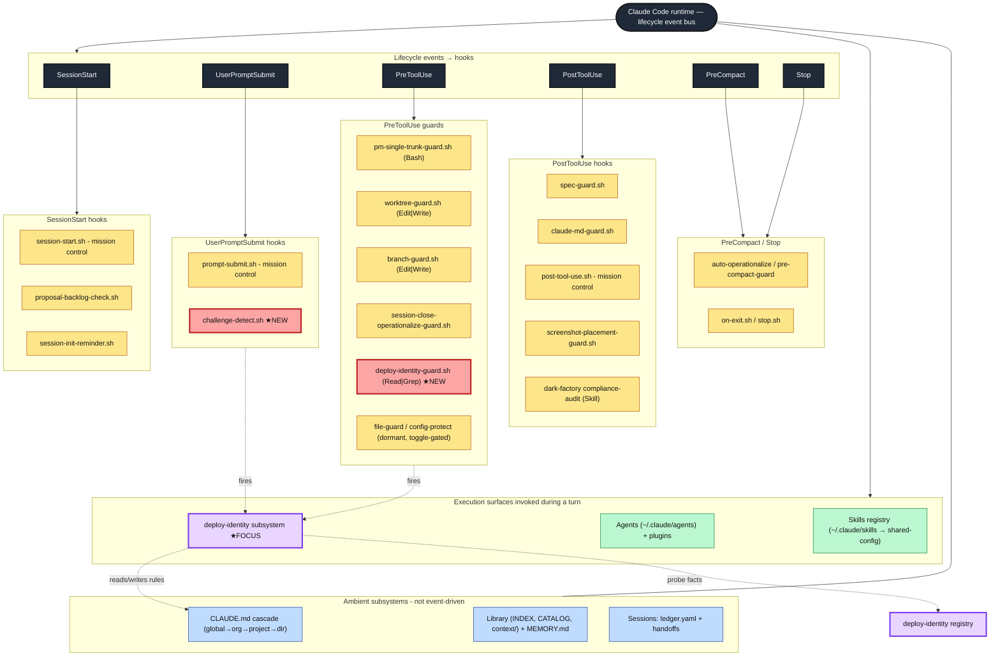
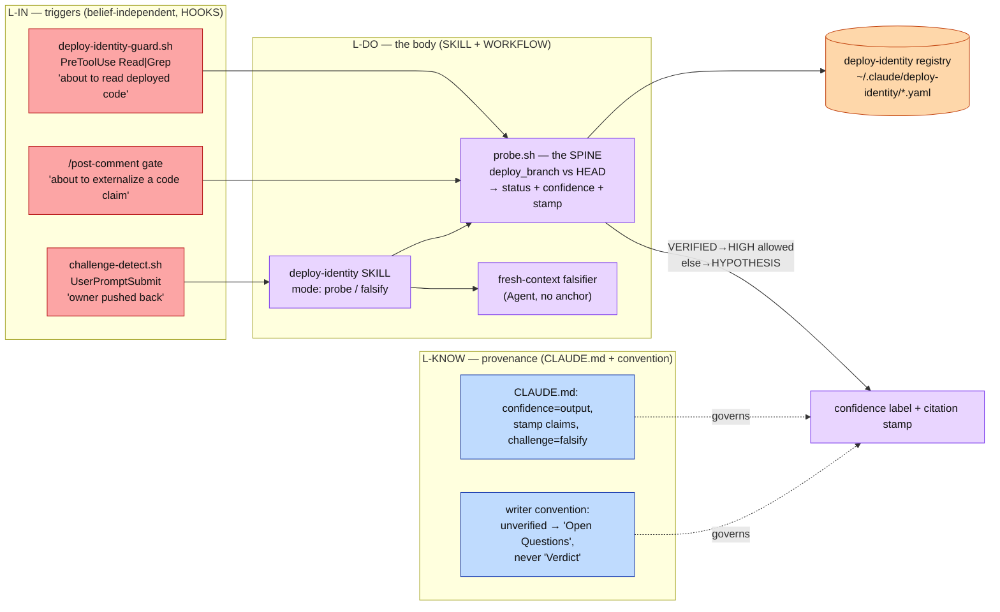
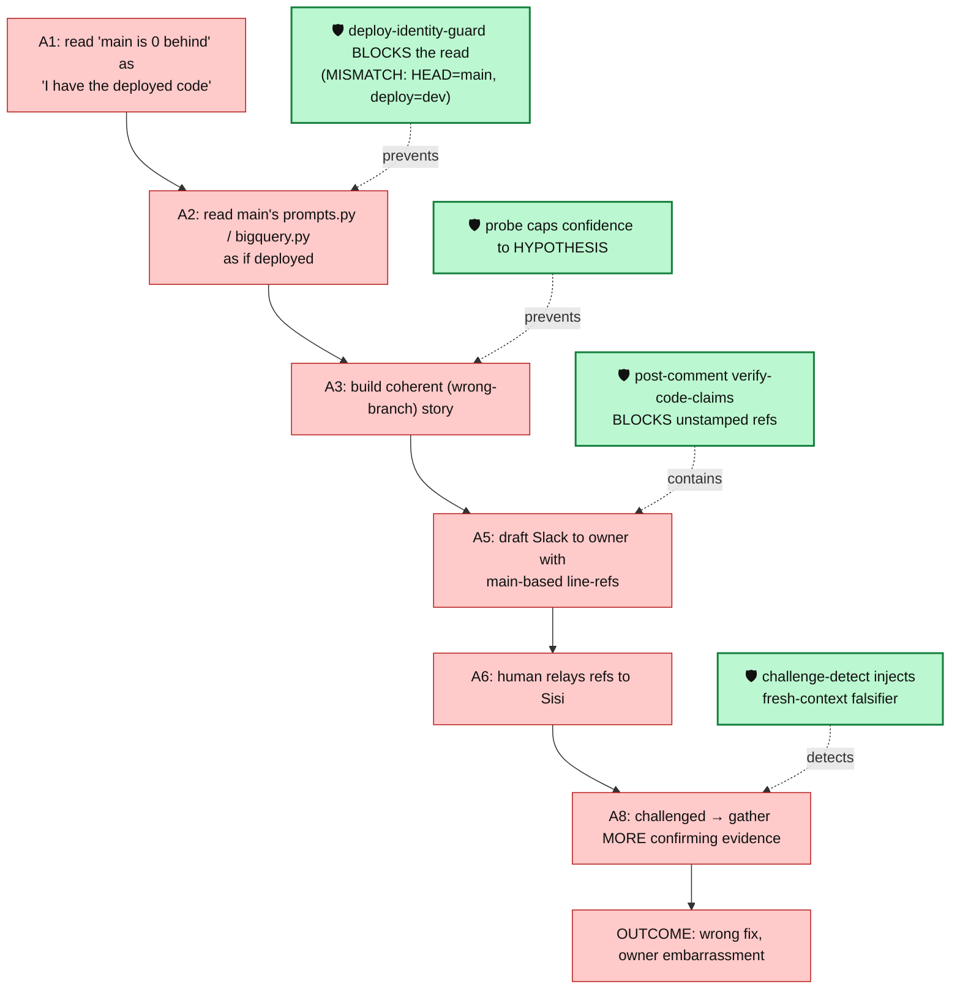
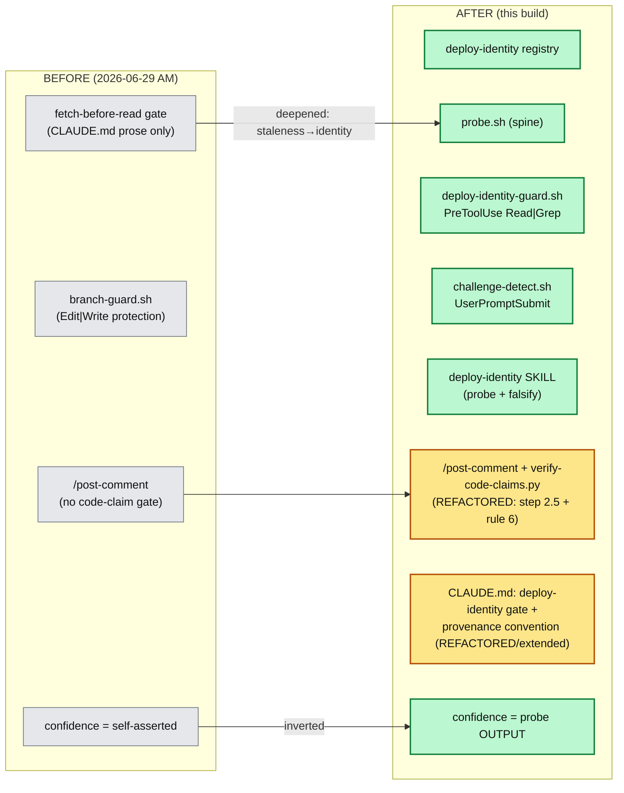
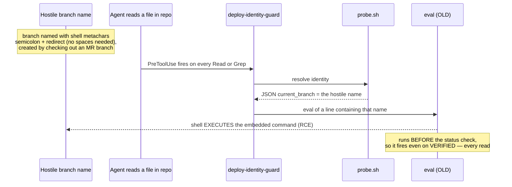
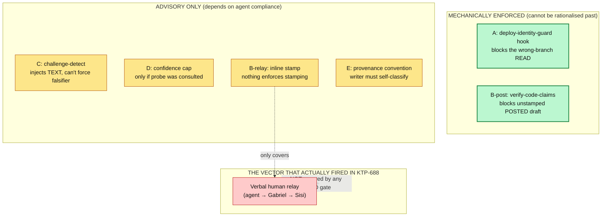
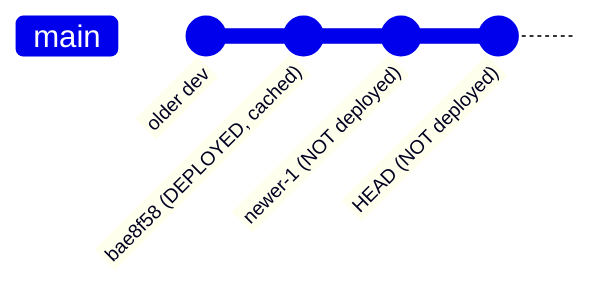
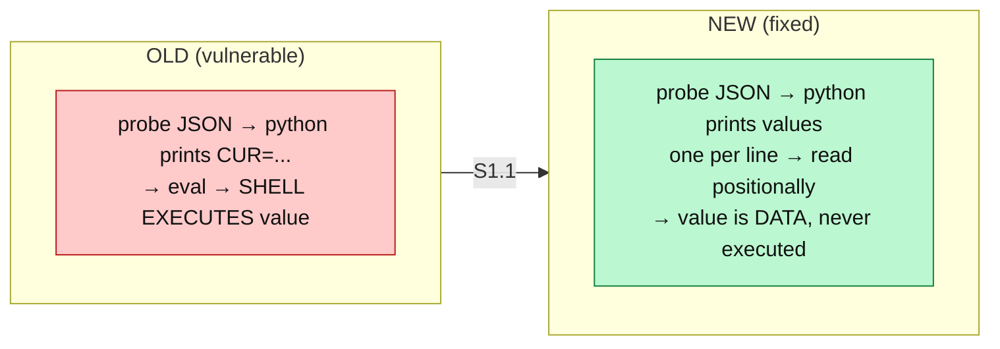

# The Harness — An Architecture Textbook

> A didactic, reusable guide to Gabriel's Claude Code harness: how it is wired, how its subsystems
> interlock, and — using the **deploy-identity / investigate-handle** subsystem as the worked example —
> how a subsystem is designed, what trade-offs it encodes, and where it is still weak.
>
> **Status:** living document. Self-documenting by design — weaknesses, hard constraints, and
> architectural trade-offs are written *into* the text, not hidden.
> **First written:** 2026-06-29 (out of the KTP-688 wrong-branch post-mortem + the build that followed).
> **Reuse:** the mermaid diagrams are labelled **D1–D9**; copy any block. Triggers for loading this file:
> "harness architecture", "how does my harness work", "subsystem diagram", "hook lifecycle", "deploy-identity".

## How to read this book

| If you want… | Read |
|---|---|
| The mental model + vocabulary | Chapter 1 |
| The whole-harness map, every subsystem | Chapter 2 (diagram **D1**) |
| One subsystem fully deconstructed | Chapter 3 (deploy-identity) |
| The honest list of what's broken/weak, drawn out | Chapter 4 |
| Concrete fixes (≥2 per issue) with before/after | Chapter 5 |
| Constraints, trade-offs, ADR pointers, file manifest | Appendix |

---

# Chapter 1 — Introduction & Methodology

## 1.1 What "the harness" is

The harness is **everything around the model that shapes what the agent does** without being part of
a single conversation. Claude Code (the runtime) emits **lifecycle events**; the harness hangs
behaviour off those events. Five distinct mechanism *types* do all the work:

| Mechanism | Belief-dependent? | Fires by | Can it *force* behaviour? |
|---|---|---|---|
| **Hook** (shell script on a lifecycle event) | **No** — mechanical | the runtime, on an event match | **Yes** — can block a tool call |
| **Skill** (markdown + scripts, invoked) | Partly — agent must choose to run it (unless a hook fires it) | the agent or a hook | No (it's instructions + tools) |
| **Agent** (sub-agent with its own context) | Fresh context = a *new* belief state | dispatch | Indirectly (independent judgement) |
| **CLAUDE.md rule** (auto-loaded prose) | **Yes** — the agent must heed it | always in context | No — disposition only |
| **Library / context file** (on-demand prose) | Yes | loaded by trigger | No |

The single most important distinction in this book is the first column: **belief-dependent vs
belief-independent**. A CLAUDE.md rule is only as good as the agent's willingness and ability to follow
it *in the moment*. A hook does not care what the agent believes.

## 1.2 The case study that drives the book: KTP-688

On 2026-06-29 the agent diagnosed a BI-agent bug by reading the `main` branch of `app-agent-hub` and
asserting about **deployed** code that actually runs the `dev` branch — 93 commits apart, opposite
architecture. It handed wrong line-refs to Gabriel, who relayed them to the code owner (Sisi). She
rejected them. The agent had been **confidently wrong**.

The forensic RCA (Dexter) found the defining feature was not one missing check but that
**prevention, containment, and detection all failed open at the same time**. That phrase is the spine
of the methodology below.

## 1.3 Methodology — the four principles the subsystem (and this analysis) are built on

1. **You cannot gate on the faculty that is broken.** The failure was *miscalibrated HIGH confidence*.
   A handle that fires "when the agent feels unsure" would never have fired. → **Triggers must be
   topic/action based and live in hooks**, observable from outside the agent's belief.
2. **Confidence is an OUTPUT, not an INPUT.** Don't let the agent assert HIGH and then maybe-verify.
   Compute the confidence label *from* a deterministic probe. HIGH is *granted*, never *claimed*.
3. **Defense-in-depth across the three failure modes** — prevention (stop the wrong frame forming),
   containment (stop a wrong claim leaving), detection (catch it after challenge). If any one layer
   holds, the catastrophe is averted or contained.
4. **Be honest about what is enforceable.** Dispositions (a prompt asking the agent to self-falsify)
   cannot be enforced under pressure. Put the real backstop on a *mechanical* edge or a *fresh-context*
   agent. Where a layer is only advisory, **say so** — in the docs and in this book.

## 1.4 How the adversarial pass in Chapter 4 was run

The same methodology was turned on the build itself. The rule "**tests that find nothing are
suspect**" applied: every unit test of the new hooks passed on the first try with benign inputs — a
signal to distrust, not to celebrate. A fresh adversarial pass with *hostile* inputs (a maliciously
named git branch) immediately broke it (Chapter 4, Issue 1). Proof over coherence: each finding below
was reproduced, not merely argued.

---

# Chapter 2 — Bird's-Eye View: the subsystems flyover

The harness is an **event bus** (the Claude Code runtime) with mechanisms bolted to six lifecycle
events, plus three "ambient" subsystems (knowledge, registry, session-state) that are not event-driven.

## D1 — The whole-harness map



### Reading D1

- **The bus** (dark) is the runtime. It owns *when* things fire; the harness owns *what*.
- **Yellow** boxes are existing hooks. **Red bordered** boxes are the two hooks this build added.
- **Green** is execution (skills/agents). **Purple** is the focus subsystem of this book.
- **Blue** is the ambient knowledge layer: rules the agent always carries, the on-demand library, and
  the cross-session ledger.

### The subsystems, one line each

| Subsystem | Job | Belief-independent? |
|---|---|---|
| **PreToolUse guards** | block dangerous tool calls (wrong branch, protected file, single-trunk) | **Yes** (hooks) |
| **UserPromptSubmit hooks** | inject context based on the incoming prompt | **Yes** (hooks) |
| **Session lifecycle** | continuity across context death (init/pickup/handoff/report-back/check + ledger) | mixed |
| **Knowledge layer** | CLAUDE.md rules (always) + library (on-demand) + MEMORY.md | **No** (disposition) |
| **Skills/Agents** | the work: build, review, ship, investigate, etc. | mixed |
| **deploy-identity (focus)** | verify which branch deploys before claiming about deployed code | hooks=yes, skill/rules=no |

---

# Chapter 3 — Subsystem Deconstructed: deploy-identity / the investigate-handle

## 3.1 The problem it exists to solve (recap)

"Is the code I'm about to read / cite / send the code that **actually deploys**?" The fetch-before-read
gate that pre-dated it answered a *different* question — *"is my local branch current?"* — and that gap
is the whole incident. `git rev-list HEAD..origin/main = 0` proves "my main is current"; it says
nothing about whether main is what deploys. On `app-agent-hub`, `main` is the default branch but `dev`
deploys — the inverse of the DAC norm.

## 3.2 The design: three layers, one body, fired by hooks

The design (Winston + Dexter, converged) refused to cram everything into one self-invoked skill. It
split into **three layers** with clean separation of concerns.

### D2 — The three layers (L-IN triggers / L-DO body / L-KNOW provenance)



**The spine is `probe.sh`.** Everything consumes it. It is deterministic (no LLM judgement): read the
registry → resolve the deployed commit → `git branch -r --contains <sha>` → compare to HEAD → emit
`status` (VERIFIED / MISMATCH / CANT_VERIFY / NO_REGISTRY), a **confidence** label, and a **citation
stamp**. Confidence is therefore an *output of git facts*, immune to how coherent the story feels.

## 3.3 How it would have intercepted the catastrophe

### D3 — The KTP-688 causal chain, with the new interception points overlaid



**Defense-in-depth shape:** FA prevents the frame; FD denies it HIGH confidence; FB contains the leak;
FC catches it on challenge. In the incident, the equivalents of all four were absent → all failed open.

## 3.4 What we changed / added / refactored

### D4 — Before vs after (new = green, refactored = amber, pre-existing = grey)



**Plain English of the change:** the pre-existing protection was *prose* (fetch-before-read) and an
*edit-time* guard (branch-guard blocks writes on bad branches). Neither covered **reads** that become
**claims about deployed code**. The build adds a read-time mechanical gate + a deterministic probe +
two new triggers + an external-claim gate, and *inverts* the confidence model from self-asserted to
probe-derived. The only thing genuinely refactored (not net-new) is `/post-comment` (one gate step
added) and the global CLAUDE.md (one rule block extended).

---

# Chapter 4 — The Weaknesses, Drawn Out

This chapter is deliberately unflattering. Each issue is reproduced, then drawn so its *negative effect
on the harness* is visible. Severity: 🔴 P1 (shipped defect), 🟠 P2 (overclaim / correctness),
🟡 P3 (coverage / process).

## 4.1 🔴 Issue 1 — Command injection in the guard hook (CONFIRMED, fixed live)

The first version of `deploy-identity-guard.sh` parsed probe output with `eval`, sanitising only `"`
and `$`. Git **legally allows** `;`, backticks, `&&`, `|` in branch names. The `eval` ran on *every*
probe result, **before** the status filter.

### D5 — The injection path (and why it's worse than it looks)



**Negative effect on the harness:** a *security control* became a *remote-code-execution surface* that
ran on essentially every file read, for ~the duration it was live. The irony is the lesson: benign
unit tests were green; a hostile input broke it on the first try. **This is KTP-688 recursion — "I
tested it" was coherence, not verification.**

## 4.2 🟠 Issue 2 — Enforced vs advisory: the build report overclaimed

The build report's "would have caught it" table treats *firing* as *preventing*. In truth only **two**
layers are mechanically enforced; the rest are dispositions the agent can rationalise past.

### D6 — Coverage matrix: what actually stops the bug vs what merely suggests



**Negative effect:** the dangerous illusion that "five layers protect us." The vector that *caused* the
incident — verbal relay — is covered only by an *unenforced* stamping convention. A reader of the build
report would over-trust the system.

## 4.3 🟠 Issue 3 — Stale cache produces false VERIFIED

`probe.sh` checks "is the deployed SHA an **ancestor** of HEAD," not "HEAD == deployed SHA." The
`app-agent-hub` registry pins `deployed_sha` as a **cache** (the service is on COS, nightly-down). When
`dev` advances past the cached sha, reading current `dev` returns **VERIFIED / HIGH-allowed** even
though you are reading code **newer than what deploys**.

### D7 — The ancestor trap



> Reading at `HEAD` → probe finds `bae8f58` is an ancestor → **VERIFIED**. But `newer-1` and `HEAD`
> are **not deployed**. You can cite undeployed code as deployed with HIGH confidence.
> **Mitigation already present:** the stamp carries the actual sha (`[VERIFIED against dev@bae8f58]`),
> so a careful reader sees it — but the *label* overstates.

## 4.4 🟡 Issue 4 — Coverage gaps (analytical)

```mermaid
flowchart LR
    classDef gap fill:#fecaca,stroke:#b91c1c,color:#111;
    g1["Bash reads bypass A<br/>git show / cat / sed not matched"]:::gap
    g2["B regex only catches path.ext:NN<br/>prose & bare-file claims slip"]:::gap
    g3["'\"' in branch name breaks probe JSON<br/>→ hook FAILS OPEN (silent allow)"]:::gap
    g4["coverage = registered repos<br/>only app-agent-hub exists; no discovery"]:::gap
```

**Negative effect:** each is a quiet hole. g3 is notable: the guard *silently disables itself* on
malformed probe output — the same "fail open" pathology the whole subsystem exists to fight.

## 4.5 🟡 Issue 5 — Process failures (mine, this session)

- Marked the handoff/ledger **completed** before any adversarial pass, live verification, or commit
  (the "Ready for Prod is not Done" ceiling). Reverted to `initiated`.
- Did not proactively run `/crit` or a fresh-context review before declaring done — the user had to ask.
- A P1 lived in the active config between "done" and the review.

---

# Chapter 5 — Solutions (≥2 per issue) and How They Fix It

## 5.1 Issue 1 — Injection

| # | Solution | How it fixes | Status |
|---|---|---|---|
| **S1.1** | **Remove `eval`**: print probe fields one-per-line, read positionally. Data is never executed. | Eliminates the code-execution path entirely (strongest: removes the class, not the instance). | ✅ **DONE** |
| **S1.2** | **Harden `probe.sh` to emit JSON via `python json.dumps`** instead of hand-built string. | Kills the sibling bug where `"` in a value breaks the JSON line (Issue 4 g3) and removes any quoting ambiguity for *all* consumers. | ⏳ recommended |
| **S1.3** | **Validate branch name against a safe charset** before use (defense-in-depth). | Even if a future consumer re-introduces `eval`, a hostile name is rejected first. | optional |

### D8 — Before/after of the fix



## 5.2 Issue 2 — Enforced vs advisory

| # | Solution | How it fixes |
|---|---|---|
| **S2.1** | **Truth-in-labelling**: reclassify in the build report + this book — "A + post-comment token are HARD; B-relay/C/D are ADVISORY." | Removes the over-trust illusion; readers calibrate correctly. (Applied in D6.) |
| **S2.2** | **Make the relay vector mechanical**: a `Stop` (or `PostToolUse`) hook scans the *assistant's own output* for unstamped `path:line` citations about a registered repo and warns/annotates before the turn ends. | Moves the verbal-relay vector from advisory → mechanical, closing THE gap that actually fired in KTP-688. |
| **S2.3** | **Gate the falsifier as a workflow step** rather than a prompt nudge — challenge-detect triggers a small Workflow that *must* dispatch the fresh falsifier and return a verdict. | Converts C from "injected text the agent may ignore" → an executed, logged check. |

## 5.3 Issue 3 — Stale cache / false VERIFIED

| # | Solution | How it fixes |
|---|---|---|
| **S3.1** | **Distance warning**: when HEAD is *ahead* of the deployed sha, downgrade to `VERIFIED@sha (N commits ahead of deployed)` and cap confidence below HIGH. | The label stops overstating; "ahead of deployed" is surfaced. |
| **S3.2** | **Prefer live resolution with an age stamp**: resolve the running artifact when infra is reachable; print cache age and "CACHE — may be stale" when not. | Reduces reliance on a staleable cache; makes staleness explicit (the WP-13 / derived-doc lesson). |

## 5.4 Issue 4 — Coverage gaps

| Gap | Solution A | Solution B |
|---|---|---|
| Bash reads bypass A | Add a `Bash` matcher detecting `git show <ref>:` / `cat`/`sed` on source in a registered repo | Explicitly document the gap as accepted scope (truth-in-labelling) |
| B regex narrow | Broaden detector to bare file refs + a prose heuristic ("in `<file>` …") | Require an explicit "no deployed-code claims in this post" affirmation when none detected |
| g3 fail-open on bad JSON | S1.2 (json.dumps) removes the cause | Fail **loud**: log a visible warning when probe output is unparseable instead of silent allow |
| registry coverage | A discovery step at ticket-pickup that offers to register a repo's deploy branch | A lint that flags deploy-capable repos lacking a registry entry |

## 5.5 Issue 5 — Process

| # | Solution | How it fixes |
|---|---|---|
| **S5.1** | Treat "built + unit-tested" as **`initiated`**, never `completed`, until a fresh-context review + live check + commit. | Aligns with the "Ready for Prod is not Done" ceiling. (Reverted this session.) |
| **S5.2** | Auto-recommend `/crit` or a fresh-context reviewer for any hook/security script before commit. | Makes the independent check a default, not an ask — exactly the thesis of the subsystem. |

---

# Appendix

## A. Hard constraints (do not violate)

1. **Triggers live in hooks and are topic/action based** — never self-rated confidence. (The broken
   faculty cannot gate itself.)
2. **Confidence is an output of the probe**, never an agent assertion.
3. **The guard must fail open, not block all reads** — a probe bug cannot be allowed to halt the agent
   entirely. Consequence: the gate is a *net*, not a *guarantee* (see Issue 4 g3 + S4 "fail loud").
4. **Harness-side registry, not committed into code repos** — forced by the KTP-688 scope guard
   (no touching `app-agent-hub`) and *better*: a branch-independent fact can be read from the wrong
   branch, which a repo-committed file cannot.
5. **`project-management` is single-trunk** — no branches/worktrees there (separate hard rule).
6. **Hooks run on every matching tool call** → must be fast and must never execute untrusted data
   (Issue 1).

## B. Architectural trade-offs decided

| Axis | Chosen | Rejected | Why |
|---|---|---|---|
| Trust-agent-to-follow-rule vs **force-independent-check** | force (hooks + fresh agent) for prevention/detection | prompt-only | the agent *believed it had verified*; only an independent signal helps |
| **Fail-open** vs fail-closed (the guard) | fail-open | fail-closed | blocking all reads on a probe hiccup is worse than a missed catch; mitigated by "fail loud" |
| Over-fire vs **under-fire** (intent detection) | lean under-fire, widen from telemetry | aggressive firing | ceremony-on-every-disagreement erodes trust in the gate |
| Registry **harness-side** vs repo-committed | harness-side | repo-committed | branch-independence + scope guard |
| One unified `investigate` skill vs **three layers** | three layers (L-IN/L-DO/L-KNOW) | one self-invoked skill | a self-invoked skill rebuilds the gate that already failed open |

## C. ADR status

**No formal ADR exists yet.** The decision record currently lives as ticket artifacts:

- Converged design: `project-management/tickets/KTP/KTP-374/KTP-688/reports/reviews/2026-06-29-investigate-handle-CONVERGED-design.md`
- Forensic RCA (Dexter): `…/2026-06-29-dexter-meta-rca-wrong-branch.md`
- Architecture (Winston): `…/2026-06-29-winston-investigate-design.md`
- Build report: `…/reports/implementation/2026-06-29-investigate-handle-BUILD.md`

**Recommendation:** promote a cross-cutting ADR ("Deploy-identity verification & belief-independent
triggers") to `project-management/documentation/architecture/adr/` — this is harness-wide, not
ticket-local, and the trade-offs in §B are exactly what an ADR should capture.

## D. File manifest (what to read to see the real thing)

| Path | Role |
|---|---|
| `~/.claude/skills/deploy-identity/probe.sh` | the deterministic spine |
| `~/.claude/skills/deploy-identity/SKILL.md` | the body (probe + falsify) |
| `~/.claude/deploy-identity/*.yaml` + `README.md` | the registry |
| `~/.claude/hooks/deploy-identity-guard.sh` | PreToolUse Read\|Grep trigger |
| `~/.claude/hooks/challenge-detect.sh` | UserPromptSubmit trigger |
| `~/.claude/skills/post-comment/verify-code-claims.py` | external-claim gate |
| `~/.claude/agents/post-comment.md` | gate wiring (step 2.5 + rule 6) |
| `~/.claude-shared-config/CLAUDE.md` | "Deploy-identity gate" + provenance convention |
| `settings.json` | hook registration |

## E. Change log

- 2026-06-29 — first edition, written from the KTP-688 build + adversarial review. Issue 1 fixed live;
  Issues 2–5 documented with ≥2 solutions each; S1.1 applied.
