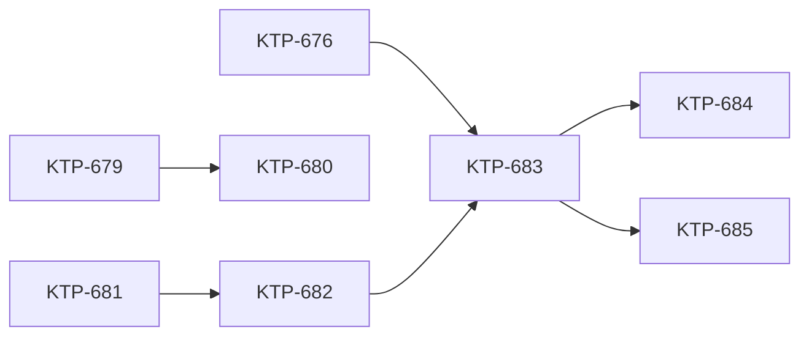

# Canada Map Feature — Execution Pipeline

This plan only has a Mermaid graph and no YAML frontmatter. The Dark Factory should warn that it cannot parse this.

## Ticket List

- KTP-676: Canadian Tilesets (scripts)
- KTP-679: Crosswalk Table (dataform)
- KTP-680: Region Mapping (dataform, depends on KTP-679)
- KTP-681: Proximity Report Backend (app-proximity-report)
- KTP-682: API Endpoints (app-proximity-report, depends on KTP-681)
- KTP-683: Map Component (app-front-portal, depends on KTP-676 and KTP-682)
- KTP-684: Dashboard Integration (app-front-portal, depends on KTP-683)
- KTP-685: Advanced Filters (app-front-portal, depends on KTP-683, optional)
