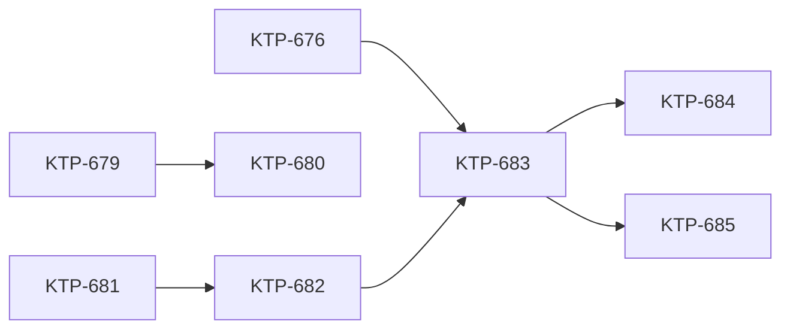

# Canada Map Feature — Execution Pipeline

This is a test fixture for the Dark Factory skill. It contains 8 tickets across 4 tiers with dependencies, an optional ticket, a custom gate check, and integration tests.

