```
spec_version: 0.1.0
status: cemented baseline
derived_from: KTP-939 fault audit (v3 + v4 decisions D1-D10)
```

# Service Factory Spec — the Service Area bug-fix line (B-prime)

This is the full, self-contained specification. `SKILL.md` is the condensed operating
manual that points here for detail; `docs/spec/laws-of-execution.md` is the binding,
terse restatement of the non-negotiable rules; this document is where every mechanism is
specified in full, including the schemas, the effort-governor numbers, and the paper
replays that constitute the acceptance test. Where a passage below is marked `(Dn)`, it
carries a v4 decision folded directly into the v3 baseline — there is no separate
changeset to cross-reference; this is the current, single, authoritative text.

**dark-factory builds the car; the Service Area fixes it.** One design, not two: a
**unified falsification engine** with five mechanisms lifted into the spine (stamp-check
gate, contradiction diff, assumption audit, minimal auto-refute/confirm, sequential hunch
injection) — "B-prime." The router/classify idea survives only as a **board-seeder**
(playbooks are data tool-belts, never a routing gate — see Appendix B for the variant not
built). One variable is optimized: **time to resolution**. The agent flies, the human is
pilot-monitoring. Built on the real harness: a main-loop skill orchestrates, human gates
are turn boundaries, background bursts are gate-free, everything persists to the ticket
folder.

> ### Design fork answers (cemented)
> 1. **Ambition** = spine-first + staged roadmap.
> 2. **Architecture** = ONE primary (B-prime). Router-first is Appendix B, not built.
> 3. **Exit** = same-repro red→green (or proxy vector / tracked handoff) **per env per
>    cause**, AND always a ticket comment.

### Design lineage (why this shape)

The design responds directly to a fully-audited historical session (34 verified faults,
patterns P1–P8) and a companion catalog of 25 failure modes / 17 success modes across 17
incidents. Its headline findings, each answered by a spine mechanism below:

- **"How this runs" is spine law** — orchestrator/turn-boundary/burst mapping, hunch
  mechanics, disk state, resume.
- **Per-env anchors + per-cause dispositions + a closure matrix** — a multi-cause bug can
  no longer close on one cause or deadlock on a handed-off one.
- **Effort governor with numbers** — CLOCK+SPEND on every gate report, a 45-min checkpoint
  pulse, loop cap 3.
- **Intermittency protocol end-to-end** — k/N intake, attempt-budgeted repro, n=1 =
  INCONCLUSIVE, a statistical exit standard.
- **Gate-budget table + express RCA card** — a trivial bug is 2 blocking touches, ≤15–30
  min, printed as an acceptance test.
- **Gate 0 has three outcomes + a ticketless entry path**; Phase 0 lifecycle is spine,
  before intake.
- **Scope field on claims AND verdicts; REFUTE only when scope covers the claim, else
  auto-split.**
- **Concrete artifact contract + named gate substrates**; `attest` split from `/verify`;
  the gate report is the only relay format; a four-stamp vocabulary.
- **Bibliothèque-first env fact sheet; a no-cause WALL package; the plan comment drafted at
  WALL approval; a proxy exit vector; every open design fork resolved with a flippable
  default.**
- **One spec, one flow diagram, one roadmap; paper replays as the acceptance test.**

The v4 decision round (D1–D10, below) closed every remaining open fork from that first
pass. Nothing in this document is provisional; the "Decisions record" section documents
exactly what each decision changed and why, for traceability.

---

## 1. How this runs (spine law — everything else assumes this)

1. **Orchestrator** = the `/service-factory KTP-XXX` main-loop Claude Code skill
   (dark-factory pattern). It alone holds gates.
2. **Every [H] gate = a turn boundary.** Lightweight gates → `AskUserQuestion` (PARK is
   always an option; timeout → park, never a conventional default). WALL + bundled EXIT →
   **crit** on `rca.md` / the gate report, with an auto-regenerated mermaid board-state
   block (the crit+mermaid oversight surface).
3. **Every parallel/background box = a gate-free Agent/Workflow burst** that runs to
   completion and writes results to disk. No human gate inside a burst. No mid-flight
   steering. The orchestrator merges results.
4. **Hunch = a user message at a turn boundary.** Orchestrator appends an undroppable
   board card (`origin: hunch`), it jumps the cheapest-first queue, dispatched next cycle.
   In-flight bursts are unaffected. The card dies only by a REFUTE whose scope covers it.
5. **State lives on disk** under `tickets/{PREFIX}/{EPIC|no-epic}/{ID}/service-area/` (§4).
   `state.yaml` is rewritten at every phase boundary and ledger mutation. Session death →
   `/session:pickup` re-presents the recorded gate from disk.
6. **BOUNCE / PARK** = `/session:handoff` + inbox entry + parked `state.yaml`. The next
   session's intake folds the reporter's answer in.
7. **Every output — human-facing AND inter-agent — goes through `/caveman` register (D3).**
   D3 widens the v3 rule (human-facing only) to every output in the workflow, including
   inter-agent probe dispatch and relay: token-efficiency and clarity apply everywhere, not
   just at the human boundary. Rich content still goes to files, never chat walls. The gate
   report (§4) is the ONLY relay format at gates.

**Ceremony warning:** this line exists to be FAST. The express path is 2 blocking human
stops, ≤15–30 min. Do not let the artifact contract become the disease it was built
against.

## 2. THE FLOW

```mermaid
flowchart TD
    START([Bug reported - ticket or verbal]) --> P0["PHASE 0 LIFECYCLE - auto<br/>session:init + inbox/pickup<br/>scaffold service-area/ + STATUS_SNAPSHOT + ac.yaml<br/>state.yaml resume point, rewritten every boundary"]
    P0 --> INTAKE["PHASE 1 CONCIERGE INTAKE - auto<br/>/jira fetch ticket + ALL comments, raw persisted<br/>checklist: expected / actual / context / envs / rate-if-intermittent<br/>ENV FACT SHEET from bibliotheque lookup<br/>hunch verbatim or none - ticketless: draft a ticket"]
    INTAKE --> G0{"GATE 0<br/>auto-pass on complete checklist<br/>human only on gaps"}
    G0 -->|actionable| REPRO
    G0 -->|env ambiguous| CAND["PROCEED ON CANDIDATES - human picks<br/>reporter question drafted via /post-comment<br/>AND repro starts on all candidate envs"]
    CAND --> REPRO
    G0 -->|not actionable| BOUNCE["BOUNCE + PARK<br/>drafted Jira question, handoff + inbox<br/>resumable state"]
    REPRO["PHASE 2 REPRODUCE - EACH env on the fact sheet<br/>reported symptom on reported surface + tech signature<br/>logs and console FIRST - find WHEN it started<br/>intermittent: N attempts under amplifiers, record k/N"]
    REPRO --> G1{"GATE 1<br/>auto-pass on attested anchor per env<br/>or parked-with-comment per env<br/>human only on override branch"}
    G1 -->|anchored| EXPRESS
    G1 -->|no repro| OVR{"human override?"}
    OVR -->|no| REPRO
    OVR -->|yes - rare| PROXY["PROXY EXIT VECTOR<br/>human names the check the fix must satisfy"]
    PROXY --> SURFACE
    EXPRESS{"EXPRESS LANE - mechanical entry, 1 try max<br/>anchor names the component AND a recent<br/>identified change in hand AND one cause<br/>explains the anchor in EVERY env"}
    EXPRESS -->|yes| ONECARD["ONE-CARD BOARD<br/>one falsify-test, attested<br/>anchor doubles as evidence"]
    ONECARD -->|CONFIRMED| STAMP
    ONECARD -->|REFUTED or INCONCLUSIVE| SURFACE
    EXPRESS -->|no - reason recorded| SURFACE["PHASE 3 SURFACE MAP + SEED - auto<br/>all layers in scope, narrow by elimination<br/>playbooks + recency seed cards - data not code<br/>assumption audit: every load-bearing premise = a card"]
    SURFACE --> BOARD[("HYPOTHESIS BOARD - board.yaml<br/>card: claim + SCOPE + falsify-test + cost + likelihood<br/>REFUTED persists with strength - un-falsify supported")]
    BOARD --> FALS["PHASE 4 FALSIFICATION<br/>serial v1, parallel burst stage 2<br/>scoped-context probes, library-first, attest verdicts<br/>auto refute/confirm on mechanical classes"]
    HUNCH>"HUNCH = user message at turn boundary<br/>undroppable card, dispatched next cycle"] -.-> BOARD
    FALS --> LEDGERS[("observations.yaml append<br/>contradiction diff vs ALL cards incl refuted<br/>REFUTE only if verdict scope covers claim scope<br/>narrower REFUTE auto-splits the card per env")]
    LEDGERS --> COUNT{"COUNT - auto heartbeat, non-blocking<br/>blocks only on genuine ambiguity"}
    COUNT -->|zero survivors| REQ["requeue WEAK-falsified cards FIRST<br/>then brainstorm scouts - new cards required"]
    REQ --> GOV
    COUNT -->|unconfirmed survivors remain| PICK["human picks or reorders<br/>may elect the no-cause path"]
    PICK --> GOV
    PICK -->|no-cause elected| NOCAUSE
    COUNT -->|all resolved and 1+ CONFIRMED| STAMP
    GOV{"GOVERNOR - state.yaml<br/>cap: 3 re-entries without a NEW confirmed obs<br/>45 min without a confirmed cause = pulse"}
    GOV -->|under| BOARD
    GOV -->|hit| PULSE["CAVEMAN PULSE - exactly 4 options<br/>park / ask reporter / shrink scope / new named budget"]
    PULSE -->|continue| BOARD
    PULSE -->|park| BOUNCE
    NOCAUSE["NO-CAUSE PACKAGE<br/>best hypothesis INFERRED under Open Questions<br/>+ eliminated table + risk assessment"]
    NOCAUSE --> WALL
    STAMP{"STAMP CHECK - script gate<br/>every Cause claim cites an OBSERVED ledger row<br/>+ env scope - else reject"}
    STAMP -->|fail| BOARD
    STAMP -->|pass| WALL{{"THE WALL - human, via crit, even for 2-line fix<br/>rca.md + auto board mermaid<br/>narrative + how-introduced + one-cause-per-env check<br/>options: approve / reject / fix-anyway / dig with new budget / park<br/>approve drafts the PLAN comment for 1-click post"}}
    WALL -->|reject / dig with new budget| GOV
    WALL -->|fix-anyway mitigate| ROUTE
    WALL -->|park| BOUNCE
    WALL -->|approve| ROUTE["PHASE 6 PER-CAUSE ROUTE<br/>each confirmed cause gets its own tag:<br/>quick-fix / Leo ticket / owner<br/>and its own closure criterion"]
    ROUTE --> FIX["QUICK-FIX causes - default<br/>worktree, minimal diff<br/>logs + red test over speculative code"]
    ROUTE --> HAND["HANDOFF causes<br/>Leo-gated ticket or owner Jira comment<br/>closure = posted + tracked follow-up"]
    FIX --> XV["PHASE 7 EXIT VERIFY - /verify<br/>same repro or proxy red to green PER env PER fixed cause<br/>flaky: 0/N post-fix vs k/N pre-fix"]
    XV --> EXIT{"BUNDLED EXIT - human, ONE turn via crit<br/>Gate 3 closure matrix + closing-comment draft + MR link<br/>one reply approves all three"}
    EXIT -->|gap| GOV
    EXIT -->|approved| CLOSE["CLOSE<br/>MR via /klever-mr<br/>ONE consolidated ticket comment - all dispositions"]
    HAND --> EXIT
    CLOSE --> POST["POST-MORTEM - auto<br/>drain parking-lot.md to ticket proposals<br/>append/update the matching playbook<br/>learning harvest: knowledge-facts + self-learning + playbook proposal (D4)<br/>no-op line when the lot is empty"]
    POST --> DONE([Resolved])
    PARK[/"parking-lot.md - passive all session, act NEVER mid-run"/]
    FALS -.-> PARK
    FIX -.-> PARK
    PARK -.-> POST
```



## 3. Phase spec

Format per phase: **Runs / Gate (+ absent-human) / Artifacts / Governor.**

**Phase 0 — Lifecycle [A].** `session:init` + inbox/pickup read; scaffold `service-area/`
+ STATUS_SNAPSHOT.yaml + ac.yaml BEFORE intake. All ledgers/board/state are ticket-folder
files rewritten at every phase boundary and ledger mutation. Resume rule: next session
reads `state.yaml` → re-enters at the recorded phase with the on-disk board. *Artifacts:*
scaffold, state.yaml. *Governor:* start clock stamped.

**Phase 1 — Concierge intake [A; H only on gaps] (conditional concierge, D2).** `/jira`
fetch of description + ALL comments; raw output persisted as `jira-raw.json` (the
ticket-read record is the file, not a self-attestation). Checklist (a list, not
hard-coded fields): expected, actual, context, env(s) plural, codebase, documented
behavior, **intermittency rate + correlating conditions + since-when** if reported. Build
**env-fact-sheet.md**: reporter env verbatim → expanded to concrete candidate envs +
shared-backend/shared-data notes from a **mandatory bibliothèque INDEX lookup** (generic
content: confirmed env + one concrete observable of the symptom — URL, entity, error
text/count — confirmed, not inferred). Unknowns become board cards, not blanks. Hunch
captured verbatim or "none — normal." **Ticketless entry:** concierge drafts a
lightweight bug ticket (expected/actual/env); its one-tap creation approval rides the
first human touch (respects no-creation-without-"go"); the created ticket anchors the
closing comment.

**Concierge staffing is conditional, cemented (D2):** the concierge PROCEEDS
autonomously whenever the intake checklist is clean and confidence is high, and STOPS for
the human only when the spec has gaps or confidence is low (Gate 0 outcomes b/c below,
dark-factory-style). This is not a per-bug human-review step; **the WALL remains the one
guaranteed human touch.**

*Gate 0 — three outcomes, auto-pass when checklist mechanically complete:* (a)
**proceed**; (b) **proceed-on-candidates** [H]: env ambiguous but expandable — reporter
question drafted via `/post-comment` AND repro starts across all candidates
simultaneously, answer folded in when it lands (a silent reporter never blocks); (c)
**bounce-and-hold** only when not actionable at all. *Absent-human:* gate-state written,
turn ends; pickup re-presents. *Artifacts:* intake.yaml, jira-raw.json,
env-fact-sheet.md, hunch card, drafted question on (b)/(c).

**Phase 2 — Reproduce [A; Gate 1 auto-pass on attested repro].** Open the failing app in
EACH env on the fact sheet (proxy env only with an explicit flag). **Two-part anchor per
env:** (1) the reported symptom observed on the reported surface, verbatim, with proof
(screenshot); (2) the technical signature (logs, network, first-error timestamp).
Logs/console FIRST (`ui-probe`). Loop until each env has an anchor **or** an explicit
"cannot access — parked with comment" record. **Intermittency sub-path:** N attempts
(default 10, flip) under reporter-stated amplifiers; pass on observed-live ≥1 with
recorded k/N; 0/N → instrumentation-first amplifiers (add-log traps) BEFORE the human
override. *Gate 1:* auto-passes on attested anchors; human enters only on the override
branch — override requires the human to **name a proxy exit vector** (the check the fix
must satisfy; proceeding without one is not allowed). *Artifacts:* anchor observations
(attested, per env), repro recipes (the exit vectors), proxy-exit record on override.

**Extractable repro/verify surface (D8).** The opening repro (this phase, red) and the
exit verification (Phase 7, green) are designed as a SHARED, extractable surface — not a
private step internal to this skill — so a future shared QC-Gate / dark-factory
mechanism can reuse them. The larger shared-gate architecture this could plug into is a
separate design effort tracked outside this skill; v4 only commits to keeping this shape
extractable, and produces no other coupling today.

**Phase 2b — Express lane [A, 1 attempt max].** Mechanical entry, recorded on the board:
the anchor itself names the failing component AND a recent identified change to that
component is in hand (commit/MR/config diff) AND **one cause explains the anchor in
EVERY reported env** (two different signatures mechanically decline). "Every reported
env" is read from the env-fact-sheet's env universe, never from the anchor set alone —
an env that is merely `parked-with-comment` still counts against the express predicate;
anchoring fewer envs than were reported is a decline, not a pass. One card, one
falsify-test; the anchor doubles as evidence (no extra attest ceremony). CONFIRMED →
stamp check → WALL with the **express RCA card** (§4). REFUTED/INCONCLUSIVE → SURFACE,
card persists as the first ledger entry. Lane taken/not + one-line reason goes in the
next gate report.

**Phase 3 — Surface map + board seeding [A].** All layers in scope (data → DB → backend
→ FE → infra), narrow by elimination keyed on the reproduced signature per env, never the
reported symptom. **Playbooks seed cards** (markdown checklists in `playbooks/` — data,
not code; recency-weighted: recently-changed code/data first — capped so no single
playbook origin monopolizes the seed). **Assumption audit:** every load-bearing premise
(including anything handed to a probe) becomes its own card with a falsify-test; probe
handoffs enumerate forbidden assumptions, checked by the stamp gate. Every card's
`scope.component` must be a git reference drawn from the bibliothèque component index —
never a freeform label (D5). The REFUTED cards ARE the elimination log for whatever was
hypothesized — but see the honesty amendment below.

**Surface-completeness is honest, not complete (D10).** Keep the positive per-layer
coverage assertion at the WALL (every in-scope layer maps to ≥1 card or an explicit
`N/A because …`); add to it: reproduce-first plus **trace-following** — follow the real
failing request through the stack, surfacing components not on any existing map;
**unmapped-surface is a first-class finding**, flagged to the librarian, never treated as
a dead end; consult the bibliothèque's system-surface registry (repos including ones not
checked out locally, databases, sheets, external sources) where it exists — the registry
itself, and its scheduled reality-sync, is a separate design effort this skill consumes
but does not build. The residual unknown-unknown risk (a layer nobody thought to map) is
**named as permanent**, never claimed solved by a tidy-looking elimination list.
*Artifacts:* seeded board.yaml.

**Phase 4 — Falsification loop [A probes; H only where routed].**
- *Probes:* cheapest-and-most-likely-first. Serial in v1 (each probe fresh-context);
  parallel gate-free bursts in stage 2. Handoff per probe: mission · why-sent · main
  problem · forbidden assumptions · **library-first**: cite what the bibliothèque says or
  record "library silent". Probes report a narrative, never full context. First-class
  cheap tools: read logs, add-log probe, red failing test (gold standard).
- *Attest (not `/verify`):* every observation/verdict goes through the **attest
  procedure** (§4) — input {claim, falsify-test, evidence, method}, output {verdict,
  strength, verified_against, source} → observations.yaml. `/verify` is reserved for fix
  verification + exit re-repro (its real charter).
- *Scope rule:* a card flips REFUTED only when the verdict's scope ⊇ the claim's scope; a
  narrower REFUTE auto-splits the card per env (demo-prod: REFUTED / demo-dev:
  UNTESTED).
- *Contradiction check:* on every ledger append, diff the new observation against ALL
  standing cards — CONFIRMED and REFUTED including their falsification evidence. v1 =
  orchestrator checklist step (discipline); stage 2 = script.
- *Auto-refute/confirm (v1, mechanical classes only):* red test ran red/green; HTTP
  status probe; grep/read with line citations; attest CONFIRM/REFUTE with evidence.
  Everything else surfaces. A cross-domain refute (evidence whose source domain does not
  match the claim's domain — e.g. a config-file grep offered against a BQ-data claim) is
  capped at `strength: weak` and can never drop a card from the active set; only a
  domain-matched disproof earns a strong REFUTE.
- *Hunch:* per §1 rule 4. Additive, never discards prior cards.
- *Intermittent-flagged cards:* verdicts record {n, k, conditions}; **n=1 is
  INCONCLUSIVE by definition**.
- *Duplicate evidence:* two observations sharing an identical `source` signature (same
  instance/window/traffic) are one signal seen twice, not two independent
  confirmations — they never upgrade a card's strength to `strong` on their own.
- *REVIVE:* un-falsify supported — a human flag OR a contradiction hit on the
  falsification evidence marks a card undermined → REVIVED. Bounded at ≤2 `revive_log`
  entries per card; at the bound, an oscillating pair (A refutes B, B refutes A) escalates
  as "unstable board" to the human rather than looping unbounded.
- *COUNT [A heartbeat]:* non-blocking line in the gate report unless genuinely ambiguous.
  Zero survivors → **auto-requeue weak-falsified cards FIRST**, then brainstorm scouts (new
  cards required, never a blind re-loop). Unconfirmed survivors remain → [H] picks/
  reorders, or elects the no-cause path. All resolved + ≥1 CONFIRMED → stamp check.

**Budget-skipped cards are SHELVED, not REFUTED (D1).** A card the effort budget skips —
never actually disproven, simply not reached — carries `status: SHELVED` (tagged
`shelved: not-refuted, skipped-for-budget`), stays fully revivable, and is **excluded from
the elimination log**. Only genuine disproof earns `status: REFUTED`. This is the
mechanical distinction the RCA's "Eliminated hypotheses" section (§4) must honor.
**Per-cycle verdict budget stays 3** (the v3 open question on this number is resolved by
D1 at its already-shipped default).

*Absent-human:* PICK writes gate-state + ends turn; pre-declared safe read-only probes
may continue while waiting; the WALL is NEVER crossed, no fan-out armed, no code pushed
absent the human. *Governor:* every board re-entry increments `state.yaml` loop counter;
cap/pulse per §6. The loop counter resets ONLY on a MATERIAL new confirmed observation —
one whose ledger append changed ≥1 card's status or created a new scoped card in the same
cycle; a re-confirmed anchor or a zero-information grep-with-citation does not reset it,
so a stream of throwaway "new + confirmed" observations cannot defeat the cap.

**Phase 5 — The WALL [H, via crit — even for a 2-line fix].** Stamp check (script) runs
first: every load-bearing claim (any claim in a Cause block, the Narrative, or an
OBSERVED/RULED-OUT line) must cite a ledger row id; no row → auto-[ASSUMED]; a Cause
whose sole support is non-[OBSERVED] is a mechanical reject. The stamp check also
enforces **claim-type ↔ evidence-method fitness**: a mechanism-class Cause (a data/
topology/config claim) requires ≥1 cited row whose method is a mechanism method
(log-trace / exhaustive-read / red-test) OR a live-probe row whose source component
matches the claimed component — a symptom-method-only row (e.g. `ui-probe` showing "panel
shows 0 results") can establish the symptom but never launder a mechanism claim through
the gate, even though the cited row genuinely resolves and is genuinely OBSERVED.

Then `rca.md` (ONE template, §4) + auto-generated board mermaid is presented via crit.
The WALL asks: (1) compelling narrative, (2) non-far-fetched how-introduced, (3) **does
one cause explain the anchor in every reported env — env-coverage checklist attached**
(the multi-cause check the express lane cannot skip past). **Soft on causation — the
no-cause package:** best surviving hypothesis stamped [INFERRED], filed under Open
Questions (never Cause) + everything eliminated with strength + risk assessment;
electable at PICK. WALL options: approve / reject (→ governor) / **fix-anyway-mitigate**
(→ ROUTE, fix labeled mitigation + mandatory follow-up ticket) / dig under a new named
budget / park. **On approve, the "diagnosis approved, fix plan is X" Jira comment is
drafted and surfaced AT the gate for one-click approval BEFORE any code change.**
*Absent-human:* gate-state persisted; never crossed alone.

**Phase 6 — Per-cause route [H decision at WALL, A execution].** Each confirmed cause
gets its own tag and closure criterion: **quick-fix** (default) → green re-repro;
**Leo-gated ticket** (complex/new-feature/re-implementation — GWT AC, SEPARATE
dark-factory session, never inline) → ticket created + comment posted; **owner**
(data/infra without access) → owner Jira comment posted + tracked follow-up. Multiple
simultaneous dispositions across causes is legal and expected — a bug can have one
quick-fixable cause and one owner-handoff cause at the same time.

**Phase 7 — Fix + exit verify.** Quick fix: minimal change in a worktree
(`superpowers:using-git-worktrees`); prefer logs + red test over speculative code; fix +
log line in one cycle; prod-down dirty hack only with a follow-up ticket. Exit verify via
`/verify`: rerun the SAME repro (or proxy vector) red→green **per env per fixed cause**;
local if possible, else MR to dev and verify there. **Flaky standard, fixed at anchor
time:** the exit standard requires BOTH condition parity (the post-fix trial conditions
must match the pre-fix anchor conditions — a bug measured under cold-load+concurrency is
not cleared by a warm-sequential post-fix run) AND a conservative sample size: N chosen
from the conservative (lower-bound) confidence estimate of p̂, not its point estimate, such
that (1−p̂_lower)^N ≤ 0.05 under the same amplified conditions. The report shows k/N₀ pre
vs 0/N post, both under matching conditions.

**Phase 8 — Bundled EXIT [H, ONE turn via crit].** One touchpoint carries: the **closure
matrix** (every reported env/symptom → green re-repro OR tracked handoff — this is the
matrix, not a boolean), the rendered closing-comment draft, and the MR link. A closure
disposition of `tracked` is legal ONLY when it names a real, existing ticket key; a bare
posted comment with no ticket is recorded as the distinct, non-terminal disposition
`comment-posted`, which blocks a "resolved" close. One reply approves the matrix + post +
merge. Gap → governor.

**Phase 9 — Close + post-mortem [A].** MR via `/klever-mr`; ONE consolidated Jira comment
covering all dispositions via `/post-comment` (the ticketless-entry ticket anchors it).

**Learning loop, enriched (D4).** On close, in addition to the RCA:
- **Emit knowledge-facts with provenance:** each = `{fact, provenance: inferred|verbatim,
  raw-source link, back-link to this RCA}`. Written toward the bibliothèque — the
  provenance ingestion architecture itself is a separate design effort this skill produces
  compatible payloads for, from day one, without implementing the ingestion side.
- **Self-learning phase** (mirrors dark-factory's): the run reflects on its own execution
  and proposes harness/skill improvements → parking-lot → post-mortem.
- **Playbook proposals:** used an existing playbook → `+1 <id>`; invented a new
  signature→checks path → a **playbook proposal** (reviewed, then made official). Tailored
  schema output for this line, not a generic operationalize pass.

Post-mortem also: drain parking-lot.md → ticket proposals (Leo-gated if promoted); assess
hack-debt; route monitoring gaps to proactive tickets; **append/update the matching
playbook entry from this incident's confirmed causes** (the learning loop closes on
itself). Auto-collapses to a no-op line when the lot is empty and there is genuinely
nothing to harvest — but a gate, never the agent's own narration, decides that (§4
`knowledge-facts.yaml`). Final STATUS_SNAPSHOT/ac.yaml update.

## 4. Schemas (the artifact contract)

All files under `tickets/{PREFIX}/{EPIC|no-epic}/{ID}/service-area/`. Two ledgers, one
directory. Enums are fixed (D6): an out-of-enum value is a gate reject, never an LLM
sentiment call. `cost`, `likelihood`, and `strength` each carry a mechanical rubric —
decidable, not vibes:

- `cost` ∈ {S, M, L} — S = one read/probe; M = a trace across a small number of hops; L =
  multi-step or requires a build/deploy to test.
- `likelihood` ∈ {low, med, high} — recency-weighted: `high` = the component was touched
  (code or data) inside the recency window the seeding playbook defines; `low`/`med` scale
  down from there.
- `strength` ∈ {strong, weak} — `strong` = a direct OBSERVED proof/disproof inside the
  claim's OWN scope, via a method that fits the claim's domain; `weak` = inferred,
  cross-env, cross-domain, or single-source (including duplicate-source evidence, which
  never earns `strong` no matter how many times it is cited).

`scope.env` and `scope.component` are drawn from a bibliothèque-maintained index (env
registry, component index). **Index staleness is the Librarian's job** (a scheduled
deterministic reality-sync, a separate design effort) — this skill's default behavior on a
discrepancy between the index and what a live probe finds is to **flag it to the
librarian**, never to self-fix the index.

**board.yaml — hypothesis card:**
```yaml
- id: H3
  claim: "demo DAC dev block missing KTP-863 rewiring"
  scope: {env: demo-dev, component: dac-config}     # mandatory; component MUST be a
                                                     # git reference (repo alias + path)
                                                     # from the bibliothèque component
                                                     # index — never a made-up label (D5)
  falsify_test: "read dev block, diff vs MR!21"
  cost: S            # S / M / L — see rubric above
  likelihood: high    # low / med / high — recency-weighted, see rubric above
  status: CONFIRMED   # UNTESTED|CONFIRMED|REFUTED|INCONCLUSIVE|REVIVED|SHELVED
  strength: strong    # strong / weak — see rubric above
  evidence: [O7, O9]  # observation ids — the obs<->card linkage
  verdict_scope: {env: demo-dev}   # REFUTE legal only if verdict_scope covers scope
  origin: playbook:config-drift    # playbook|hunch|differential|scout|express|library
  layer: infra        # ui|backend|data|db|infra — for the layer-coverage line (§3)
  revive_log: []      # un-falsify: human flag OR contradiction hit on the
                      # falsification evidence marks it undermined -> REVIVED
                      # bounded at <=2 entries; at bound, escalate "unstable board"
  # D1: a card the effort budget skips is status SHELVED
  # (tag: shelved: not-refuted, skipped-for-budget), fully revivable,
  # EXCLUDED from the elimination log. Only genuine disproof = REFUTED.
```

**observations.yaml — attested observation:**
```yaml
- id: O7
  stamp: OBSERVED     # OBSERVED|INFERRED|REPORTED|ASSUMED
  claim: "curl to retired host returns 000"
  source: {env: demo-dev, instance: proxrp-cos, traffic: probe}   # mandatory
  method: live-probe  # live-probe|log-trace|exhaustive-read|red-test|ui-probe
  evidence: gate-reports/probe-O7.md
  verified_against: "dac-gcp-back-proxrp@abc123"
  n_trials: {k: 3, n: 3, conditions: "cold load"}   # required when intermittent-flagged
```

**Method fitness** (enforced at the WALL's stamp check): a mechanism-class cause (scope
component in a data/db/backend/infra/config domain) needs ≥1 evidence row with method in
{log-trace, exhaustive-read, red-test}, OR a live-probe row whose source domain matches the
claim's. `ui-probe` alone is a symptom read and cannot back a mechanism cause.

**Claim stamps** (on every ledger row AND every gate-report claim line): `[OBSERVED Oxx]`
/ `[INFERRED from Oxx]` / `[REPORTED by whom]` / `[ASSUMED]`. Load-bearing is structural,
not self-classified: Cause-block, Narrative, and OBSERVED/RULED-OUT lines must cite a row
id.

**Evidence subfolder (D7):** `tickets/{id}/service-area/evidence/` is a drop zone for BOTH
the agent and the human, supporting images and video. Any `evidence:` id in a ledger row or
gate report may point into it.

**Gate report (the ONLY relay format, ≤12 lines):**
```
GATE: <name>        CLOCK: 38m   SPEND: ~$6   LOOPS: 1/3
STATUS: <one line>
OBSERVED: O7 [OBSERVED] ... · O9 [OBSERVED] ...
RULED OUT: H1 (strong, own-env) · H4 (weak — cross-env)
NEXT: <cheapest act + cost>
NEED FROM YOU: <the question + options; PARK always one>
EXPRESS: taken|declined — <one-line reason>
PARKED: n    LINKS: board.yaml · observations.yaml · rca.md
```

**RCA template** (ONE file, `templates/rca.md`; both fast and slow paths fill the same
file — concrete, not a design placeholder, D9): 1 Symptom + intermittency (section
required whenever the report carries the qualifier; k/N + mechanism); 2 Anchor per env
(symptom-surface proof + signature + first-error time); 3 Confirmed cause(s) — one block
per cause: claim, evidence ids, stamp, env scope (component as a git reference, D5); 4 How
introduced; 5 Eliminated hypotheses (falsification + strength; distinguish REFUTED from
SHELVED, D1; the mandatory layer-coverage line lives here — each in-scope layer maps to
≥1 card or an explicit `N/A because …`); 6 Open Questions / Unverified (the no-cause
package lives here — never "Verdict" without a stamp; unmapped-surface findings from D10
file here too, not as a dead end); 7 Fix + follow-ups + hack-debt. **Express RCA card** =
the same 7 headings, one line each, ≤10 lines via `/caveman` — evidence bar unchanged,
document size collapsed.

**Playbook entry** (`playbooks/<class>.md` — seeders, never gates): signature it matches
→ cheapest checks ranked by likelihood + cost → source incidents. v1 ships the three
already-paid-for classes: **config-drift/wiring**, **data-gap/onboarding**, **FE-state**.

**Parking-lot entry:** `- [type] one-liner (found: phase, clock) | drained:
proposal|ticket|dropped|noted` — the drain disposition is added at Phase 9; entries are
never actioned mid-run.

**knowledge-facts.yaml — Phase 9 harvest (D4):**
```yaml
facts:                       # >=1 REQUIRED when any cause is CONFIRMED
  - fact: "vendor indexes by storefront name, not corporate parent"
    provenance: verbatim     # verbatim | inferred
    raw_source: "observations.yaml#O2"   # or a run-dir file path — must resolve
    rca_link: rca.md
facts_none_reason: null      # legal only for no-cause/parked runs
playbook:
  plus_one: data-gap         # must resolve to playbooks/<id>.md
  proposal: null              # or an id, reviewed then made official
  none_reason: null          # legal only without a confirmed cause
retro:                       # dark-factory-style Retro, minimal
  task_confidence: 92        # int 0-100 — is the BUG resolved?
  factory_fitness: 88        # int 0-100 — did the LINE perform well?
  deductions: [{points: 12, reason: "..."}]
  red_flags: []
  improvements: [{title: "...", detail: "..."}]   # feed the next run
```
A run with ≥1 CONFIRMED cause must emit ≥1 fact and a playbook `plus_one`/`proposal`; the
`none_reason` escape is legal only for no-cause or parked runs. A `factory_fitness` below
100 must be accounted for by at least one deduction, red flag, or improvement — a silent
low score is not allowed.

## 5. Implementation mapping

| Piece | Substrate |
|---|---|
| Orchestrator | `/service-factory` main-loop skill (dark-factory pattern); holds all gates |
| [H] gates | Turn boundaries — AskUserQuestion (light) / crit rounds (WALL, EXIT) per §1 |
| Probes / scouts / fan-out | Gate-free background Agent/Workflow bursts → files on disk → orchestrator merges |
| Stamp check | Script in the skill's `gates/` dir parsing rca.md + board.yaml + observations.yaml; fails the phase transition on unstamped/unscoped/method-mismatched Causes |
| Loop budget | Integer in state.yaml, incremented by the transition step on a MATERIAL observation only, which refuses re-entry at cap |
| Contradiction check | v1 = orchestrator checklist step on every ledger append (discipline); stage 2 = script |
| Gate 0 completeness | Checklist fields non-empty + jira-raw.json exists on disk, AND every load-bearing observable carries `[REPORTED]`/`[OBSERVED]` provenance (an `[INFERRED]`/`[ASSUMED]` observable withholds auto-pass) — not agent self-attestation |
| attest | Procedure of this skill. In: {claim, falsify-test, evidence, method}. Out: {verdict CONFIRM/REFUTE/INCONCLUSIVE, strength, verified_against, source} → observations.yaml. Recipes per claim type: log attribution = trace request id/env; absence claims = exhaustive read + line citations; env topology = live probe |
| Board mutation | Scope-covered REFUTE / auto-split, hunch-guard, cross-domain-refute cap, duplicate-source dedupe, bounded REVIVE — one shared module so every mutation path enforces the same rules |
| Evidence subfolder | `service-area/evidence/` (D7) — drop zone for agent AND human, images/video; ledger `evidence` fields point into it |
| Resume after death | state.yaml records phase + gate-state (gate, question, options, ledger refs); `/session:pickup` re-presents the gate; a resume that crosses the nightly boundary or exceeds the staleness threshold FIRST re-validates every load-bearing anchor and CONFIRMED cause before continuing; mid-burst death → burst outputs are files, orchestrator reconciles |
| Wired skills | `/jira` (raw persisted) · bibliothèque INDEX (fact sheet) · `ui-probe` (repro + symptom-surface proof) · attest + `/verify` (exit only) · `/caveman` · crit (WALL/EXIT) · `/post-comment` (bounce, plan, close — all external posts) · `/klever-mr` · Leo (handoff tickets) · session:init/pickup/handoff · worktrees |

Each gate carries a **policy slot** (`manual-now` default / `auto-approve-later`) — the
bridge to unattended mode without building it (stage 3).

## 6. Effort governor (time-to-resolution, measured)

- **CLOCK + SPEND + LOOPS on every gate report.** Orchestrator timestamps phase boundaries
  in state.yaml.
- **Checkpoint pulse:** 45 min (default — flip) without a CONFIRMED cause → mandatory
  caveman pulse, exactly four options: park / ask reporter / shrink scope / continue with a
  new named budget. A 5th option — "await in-flight decisive burst (ETA)" — is offered
  instead when a burst pre-declared `decisive: true` is due to land within the pulse
  window; choosing to park/shrink anyway while that burst is in flight requires one
  explicit extra confirmation naming the burst, so evidence about to land is never
  silently discarded.
- **Loop cap:** ≤3 board re-entries without a MATERIAL new confirmed observation (default
  — flip; materiality defined in §3/§4) → same pulse. Counts WALL-rejects, Gate-3 gaps, and
  brainstorm re-entries alike.
- **Express-lane criteria** are mechanical and recorded (§3 Phase 2b); 1 attempt per bug.
- **Gate-budget table:**

| Gate | Blocks? |
|---|---|
| Gate 0 | Auto-pass on complete checklist; human only on gaps/bounce (automated intake by default) |
| Gate 1 | Auto-pass on attested repro; human only on override |
| COUNT | Non-blocking heartbeat; blocks only on genuine ambiguity / no-cause election |
| WALL | Always blocks (the point) — plan comment rides it |
| Bundled EXIT | Always blocks — Gate 3 + comment + merge in ONE turn |

- **Acceptance target (tested in Appendix A):** express path = **2 blocking human stops**
  (WALL, EXIT), **≤15–30 min** wall-clock.

## 7. Staged roadmap

**v1 spine (build first):**
- Phase 0 lifecycle + full artifact contract (§4 schemas, templates, 3 seed playbooks).
- Intake: /jira raw persist + env fact sheet (bibliothèque) + Gate 0 three outcomes +
  ticketless branch.
- Repro per env with intermittency sub-path + proxy override; two-part anchor; express
  lane.
- Serial falsification: attest, scope rule, contradiction checklist, mechanical
  auto-refute classes, hunch cards, weak-requeue, governor (clock/loops/pulse).
- Stamp-check script + WALL via crit (incl. no-cause package + plan comment) + per-cause
  route.
- Exit verify + bundled EXIT + close + post-mortem + playbook append.
- Phase 9 learning harvest as a gate, not a narration (D4) — the loop must be
  mechanically forced, not merely described.

**Stage 2:** parallel gate-free bursts + arm-before-fan-out at the human touchpoints;
scripted contradiction diff; auto un-falsify detector; scout-swarm brainstorm; formal
fresh-context falsifier contract on challenge; per-cycle human verdict budget (3, cemented
by D1); the SHELVED board-mutation path wired into the effort-budget skip itself (D1's
schema exists day one; the phase-4 code path that assigns it on a budget skip is a stage-2
completion); playbook seeding proposals materialized end to end; effort-governor SPEND
wiring; cross-run telemetry aggregation.

**Stage 3:** playbook library growth + inflow metrics; deeper auto-refute classes; gate
policy slots flipped to auto-approve for unattended runs; role-switch mode; retro
telemetry; live drills against a seeded local-stack bug.

**Forward compatibility produced from day one (v4, D4/D8):** knowledge-facts with
provenance and playbook proposals are shaped for eventual bibliothèque ingestion even
though the ingestion side is a separate effort; the Phase 2 repro (red) and Phase 7 exit
verify (green) are kept a shared, extractable surface even though the shared-gate
consumer is a separate effort. Both are payload/shape commitments only — this skill does
not implement either external system.

---

## Appendix A — Paper replays (the acceptance test; a failed replay is a blocking defect)

**A1 — Both causes, one ticket.** Real historical session: 2 sessions, many hours, ~8
serial probes, both corrections user-forced, one cause nearly shipped as "solved."

| # | Step | Gate/touch | Fault class blocked |
|---|---|---|---|
| 1 | P0 scaffold + pickup (a loose end from a prior quick session surfaces) | — | untracked-state / silent-loop-closure |
| 2 | Intake: jira raw + fact sheet: "Prod+Demo" → {prod, demo-prod, demo-dev}; bibliothèque says demo-prod shares PROD backend/BQ | — | primary-source-never-fetched, derived-doc-as-fact, library-first breach |
| 3 | Gate 0: env ambiguous → proceed-on-candidates; reporter question drafted+posted; repro starts anyway | **[H]1** | silent-reporter-never-blocks |
| 4 | Repro all 3: demo-dev = 500s to dead host; prod/demo-prod = 200-empty for the demo advertiser. Two signatures | auto | live-look-last, symptom-never-validated |
| 5 | Express declines mechanically: one cause cannot explain both anchors — recorded | — | express-closes-on-one-cause |
| 6 | Seed: config-drift playbook + recency (an in-hand MR) → H1 scope demo-dev; data-gap playbook → H2 scope prod/demo-prod | — | dismissed-lead-never-revived |
| 7 | Falsify: H1 CONFIRMED (attest vs the DAC repo); H2 CONFIRMED (BQ read, advertiser never onboarded). A demo-prod REFUTE cannot kill H1 (scope rule) | auto | cross-boundary-conflation, self-asserted-confidence, absence-claim-unverified |
| 8 | Stamp check → WALL: 2 causes, env-coverage matrix complete; plan comment 1-click | **[H]2** | confidence-laundering, plan-comment-skipped |
| 9 | Route per cause: H1 quick-fix (worktree → MR), H2 owner handoff (comment to data owner) | — | route-cant-split-a-multi-cause-bug |
| 10 | Exit: demo-dev re-repro green; H2 closure = posted+tracked. Closure matrix full → bundled EXIT → consolidated comment | **[H]3** | loop-closure-failure; Gate 3 never loops on the handed-off cause |

**Est. ~2.5–4 h, 3 blocking touches** vs the real multi-session disaster. PASS.

**A2 — Trivial one-liner** (console stack trace names the component; yesterday's commit
touched it). P0+intake auto (Gate 0 auto-pass) → repro observed+attested (Gate 1
auto-pass) → express entry mechanical (component named + commit in hand + one env) → one
card CONFIRMED → **WALL [H]1** with ≤10-line express card + plan comment → worktree fix
→ /verify green → **bundled EXIT [H]2** (matrix + comment + MR, one reply) →
post-mortem no-op line. **2 blocking stops, est. 15–30 min.** PASS (a naive design scored
~6 touches / 35–55 min on the equivalent scenario — FAIL; fixed by the gate-budget table
+ express card + bundled exit).

**A3 — Flaky race (~20% repro).** Intake captures rate+conditions. Gate 1 sub-path: 10
attempts under amplifier → 2/10 observed → pass, k/N recorded (no deadlock, no misroute
to the override branch). Exit standard fixed now: (0.8)^N ≤ 0.05 → N=14 by the naive point
estimate — but §3 Phase 7's condition-parity + conservative-N rule additionally requires
N derived from the CONSERVATIVE lower-confidence-bound estimate of p̂ (for k=2/n=10 that
is materially higher than 14) AND matching pre/post conditions, closing the gap a
point-estimate-only standard would leave open. Board: race card intermittent-flagged; a
single passing load = INCONCLUSIVE by definition (the true hypothesis cannot be
auto-refuted at n=1). Red test = forced-interleaving or m-iteration harness. Fix → 0/N
post vs 2/10 pre, same conditions, in the Gate 3 matrix. **2–3 touches, est. 1–2 h.** PASS
(a naive single-clean-run standard certifies an unfixed flaky bug a large fraction of the
time — FAIL; fixed by the statistical + condition-parity standard).

## Appendix B — Router-first variant (not built; when you'd prefer it)

The alternative shape: classify the reproduced signature FIRST into a stack lane (UI /
backend / data / infra), each lane a tuned cheapest-first playbook line; the board exists
inside the lane. Prefer it if: (1) the playbook library grows rich enough that lane-entry
is nearly always right; (2) most bugs arrive with unambiguous single-env signatures; (3)
you want dark-factory kinship (belts as the primary abstraction) over board discipline.
Costs: misclassification re-routes late; multi-env/multi-cause bugs fight the lane shape;
the library is mandatory day-one instead of a compounding asset. B-prime already gets the
lane benefit via playbook seeding + the express lane, without the gate. Revisit only if
replays show the seeder repeatedly losing to a straight lane.

---

## Decisions record (v4 — D1 through D10, all cemented)

Every open design fork from the first pass of this spec is resolved below. There are no
open forks left in the design itself; only two adjacent architectures are explicitly
parked (not built by this skill — see "Parked to separate efforts").

| # | Decision | Where it's folded in |
|---|---|---|
| D1 | Budget-skipped cards are `SHELVED`, not auto-`REFUTED`; excluded from the elimination log; only genuine disproof earns REFUTED. Per-cycle verdict budget stays 3. | §3 Phase 4, §4 board.yaml `status` enum, §4 RCA template §5 |
| D2 | Concierge is conditional: proceeds autonomously on a clean/high-confidence intake, stops for the human only on gaps/low confidence. The WALL remains the guaranteed touch. | §3 Phase 1 |
| D3 | `/caveman` register applies to ALL outputs, not just human-facing ones — inter-agent probe dispatch and relay included. | §1 rule 7 |
| D4 | Phase 9 learning loop enriched: knowledge-facts with provenance, a self-learning reflection phase, and tailored playbook proposals (not a generic operationalize pass). | §3 Phase 9, §4 knowledge-facts.yaml, §7 roadmap |
| D5 | `scope.component` on every hypothesis card MUST be a git reference (repo alias + path) from the bibliothèque component index — never freeform. | §3 Phase 3, §4 board.yaml |
| D6 | `cost`/`likelihood`/`strength` are fixed enums with a mechanical rubric, not an LLM sentiment call; `scope.env`/`scope.component` are drawn from a bibliothèque-maintained index; index staleness defaults to flag-to-librarian, never self-fix. | §4 (schema preamble + rubric) |
| D7 | `evidence/` subfolder — a drop zone for agent AND human, images/video; ledger `evidence` ids point into it. | §4, §5 |
| D8 | The opening repro (red, Phase 2) and exit verification (green, Phase 7) are designed as a shared, extractable surface for a future shared QC-Gate/dark-factory mechanism — payload-compatible, not a private step. | §3 Phase 2, §7 roadmap |
| D9 | The RCA template is concrete, not a placeholder — it ships as `templates/rca.md`, one file, fast+slow paths, 7 headings, express card ≤10 lines. | §4 RCA template |
| D10 | Surface-completeness is honest, not complete: keep the positive per-layer coverage assertion; add reproduce-first trace-following, first-class unmapped-surface findings (flag to librarian), and a named, permanent residual unknown-unknown risk. | §3 Phase 3 |

**Parked to separate efforts (not built by this skill; it produces compatible payloads
only):**
- **The bibliothèque provenance architecture, system-surface registry, and scheduled
  reality-sync.** This skill is built compatible with it (D4/D6/D10 produce the payloads:
  knowledge-facts with provenance, index-discrepancy flags, unmapped-surface findings) but
  does not implement ingestion, the registry, or the sync job.
- **A shared QC-Gate / Factory-Family triage layer and an RND sandbox environment.** This
  skill exposes the extractable repro/verify surface (D8) but does not build the shared
  gate or the sandbox itself.

## Implementation guard — library-first is load-bearing

Two elements exist because a historical session repeatedly rediscovered mechanisms the
org's own knowledge library already documented, and they MUST survive any future revision
of this skill; treat their removal or dilution as a spec violation, not a simplification:

1. **Phase 1 concierge intake:** `env-fact-sheet.md` is built from a **mandatory
   bibliothèque INDEX lookup** (shared-backend/shared-data notes). Not optional, not "if
   time permits."
2. **Phase 4 probe dispatch:** every mechanism/topology mission carries a `Library:`
   line — cited doc paths + what they establish, or `Library: silent (checked
   INDEX/ALIASES for <topic>)`. What the library establishes is context handed to the
   probe, never a question the probe re-derives.

Harness-level defense-in-depth backs both, independent of what the skill remembers to do:
- A PreToolUse hook on Agent/Task dispatch blocks investigation-shaped dispatches with no
  `Library:` stamp — Phase 4's rule is un-skippable even if an implementation forgets it.
- A UserPromptSubmit hook injects matching library pointers at prompt time, so intake
  starts with library candidates already in context.

Builder checklist: (a) Phase 1's step must fail loudly (gate, not warning) when the INDEX
lookup is skipped; (b) probe-dispatch templates include the `Library:` field as a required
schema key, not prose guidance; (c) this skill's own dispatches are never exempted from
the library-stamp guard — passing it by carrying real stamps IS the design.

**Over-trust caveat (see the threat-model doc, IFM-3/NP2):** the library-first rule
guards against *rediscovering* a documented fact; it does not by itself guard against a
library fact that has gone *stale*. A load-bearing topology claim sourced only from the
library, with no corresponding live-probe observation anywhere in the ledger, is a risk
this design names explicitly and defends against at the falsification layer (§3 Phase 4's
attest procedure), not by skipping the library lookup.
